[TOC]

# AIMath

## Vector

### 벡터란?

- **숫자를 원소로 가지는 리스트 또는 배열**을 의미

  > 벡터의 코딩상 의미

  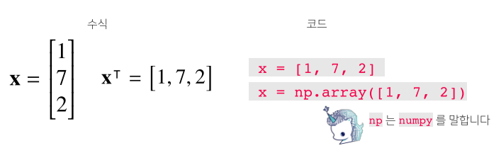

- X = 열 벡터, X^T^ = 행 벡터

- 수학적으로는 **공간에서의 한 점, 원점으로 부터의 상대적 위치**를 의미

  > 벡터의 수학적 의미

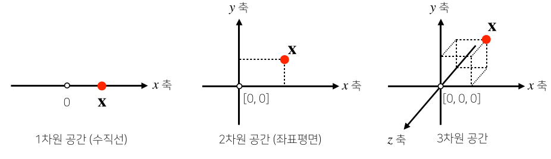

- 각 벡터가 가지는 행과 열의 수를 **벡터의 차원**이라고 한다.

### 벡터의 성질

1. 벡터에 양수를 곱해주면 방향은 그대로, 길이만 변한다.

   - 이 때 곱해주는 숫자를 **스칼라곱(α)**이라고 표현한다.

   - 스칼라곱이 음수이면 방향이 정반대 방향이 된다.

   - 벡터의 길이는 1보다 크면 길이가 증가, 1보다 작으면 길이가 감소한다.
2. 같은 모양(같은 행과 열)을 가지면 덧셈, 뺄셈, 곱셈, 나눗셈이 가능하다.
	- 이때의 곱셈을 성분곱(Hadamard product)라고 한다.
	- numpy array에도 적용된다.
3. 벡터와 벡터의 덧셈과 뺄셈은 다른 벡터로부터 상대적 위치 이동을 표현함.

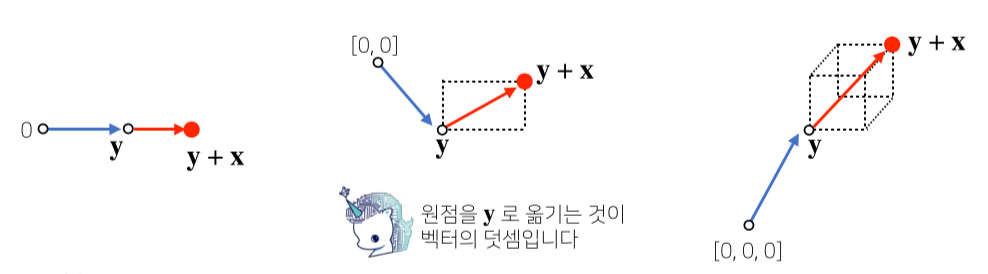

### 벡터 노름(norm)과 기하학적 성질

#### 벡터의 노름

- **벡터의 노름(norm)은 원점에서부터의 거리를 의미**

  - 차원의 수와 관계없이 모든 벡터는 노름을 구할 수 있다.
  - **L~1~-노름은 각 성분의 변화량의 절대값의 합**을 의미
    - (x,y)는 |x|+|y| 만큼 거리
  - **L~2~-노름은 피타고라스 정리를 이용해 유클리드 거리**를 계산
    - (x,y)는 sqrt(|x|^2^ +|y|^2^)를 의미
    - `np.linalg.norm`으로 구현 가능
  - ||．|| 기호는 노름이라고 부름

  $$
  \left\| x\right\|_1 = \sum_{i=1}^d|x_i|\\
  \left\| x\right\|_2 = \sqrt{\sum_{i=1}^d|x_i|^2}\\
  $$

> 백터 노름의 코드 구현

```python
def l1_norm(x):
    x_norm = np.abs(x)
    x_norm = np.sum(x_norm)
    return x_norm

def l2_norm(x):
    x_norm = x*x
    x_norm = np.sum(x_norm)
    x_norm = np.sqrt(x_norm)
    return x_norm
```

#### 노름의 활용과 성질

- 노름의 종류를 무엇으로 적용하느냐에 따라 기하학적 성질이 달라진다.

  - L~1~노름은 마름모 모양의 원을 그리며, L~2~노름은 기존의 원 모양의 원을 가진다.
  - 노름의 종류에 따라 머신러닝에서의 활용도 달라진다.

- 노름을 이용해 **두 벡터 사이의 거리를 뺄셈을 통하여 계산**할 수 있다.

  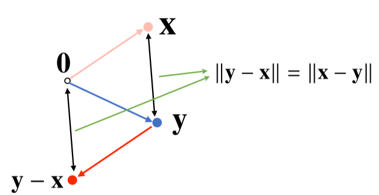

  - ||y - x|| = || x - y|| 인점을 이용하게 된다.
  - 즉 x-y 또는 y-x를 한 원점에서의 좌표를 이용해 L2 norm을 구하면 두벡터 사이의 거리가 나온다.

- **L~2~노름 한정으로 내적을 이용해 이렇게 구한 벡터사이의 거리를 이용해 각도 또한 계산** 가능하다.

  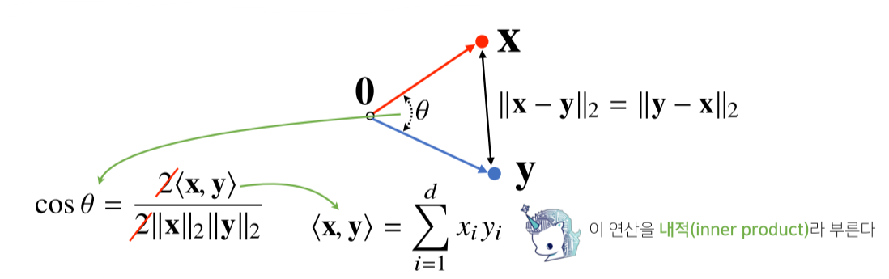

  - **<x, y> 는 내적(inner product)을 의미하며 성분 곱들의 합을 의미한다.**
    - 예를 들어 x = (0, 1), y = (0, 2)의 내적은  0 * 0 + 1 * 2 = 2 이다.

> 내적을 이용한 각도 계산

```python
def angle(x,y):
    # np.inner(x, y)가 내적을 구하는 numpy 함수
    v = np.inner(x, y) / (l2_norm(x) * l2_norm(y))
    theta = np.arccos(v)
    return theta
```

#### 내적의 해석

- 내적은 **정사영(orthogonal projection)된 벡터의 길이**와 관련 있다.

  - Proj(x)는 벡터 y로 정사영된 벡터 x의 그림자를 의미한다.
  - Proj(x)의 길이는 코사인법칙에 의해

  $$
  \left\|x\right\|cos\theta
  $$

  - 가 된다.

    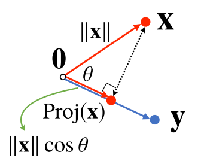

  - 이때 **내적은 정사영의 길이를 벡터 y의 길이 ||y||만큼 조정한(곱한) 값**이다.

  - 내적을 이용해 유사도(similarity)를 구할 수 있다.

## Matrix

### 행렬이란?

- **벡터를 원소로 가지는 2차원 배열**

> 행렬의 수식 표현

$$
X = \begin{bmatrix} 1 & -2 & 3 \\ 7 & 5 & 0 \\ -2 & -1 & 2\end{bmatrix}
$$

> 행렬의 코드 표현

```python
x = np.array([[1, -2, 3], [7, 5, 0], [-2, -1, 2]]) # numpy에선 행(row)이 기본단위
```

$$
\boldsymbol{X} = \begin{bmatrix} \boldsymbol{x_{1}} \\ \boldsymbol{x_{2}} \\ \boldsymbol{\vdots}\\ \boldsymbol{x_{n}} \end{bmatrix} = \begin{bmatrix} x_{11} & x_{12} & \dots & x_{1m}\\ x_{21} & x_{22} & \dots & y_{2m}\\ \vdots & \vdots & & \vdots\\ x_{n1} & x_{n2} & \dots & x_{nm}\end{bmatrix}
\begin{aligned}\boldsymbol{x_{1}}\\ \boldsymbol{x_{2}}\\ \boldsymbol{x_{7}}\end{aligned}
$$

- n x m 행렬의 표현

- 행렬은 **행(row)과 열(column)이라는 인덱스(index)**를 가집니다.

- 행렬의 특정 행이나 열을 고정하면 행 벡터 또는 열 벡터라 부른다.

-  전치 행렬(transpose matrix) **X^T^**는 행과 열의 인덱스가 바뀐 행렬을 의미함.

  - 벡터 또한 동일하게 행과 열이 바뀐 전치 벡터가 존재한다.

  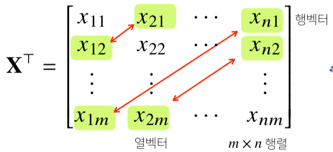

### 행렬의 이해

1. 첫번째 의미

- 벡터가 공간의 한점을 의미한다면 행렬은 **공간에서 여러 점들의 집합**을 의미함.
- 행렬의 행벡터 x~i~는 i번째 데이터를 의미함.
- 행렬 x~ij~는 i번째 데이터의 j 번재 변수값을 의미함.

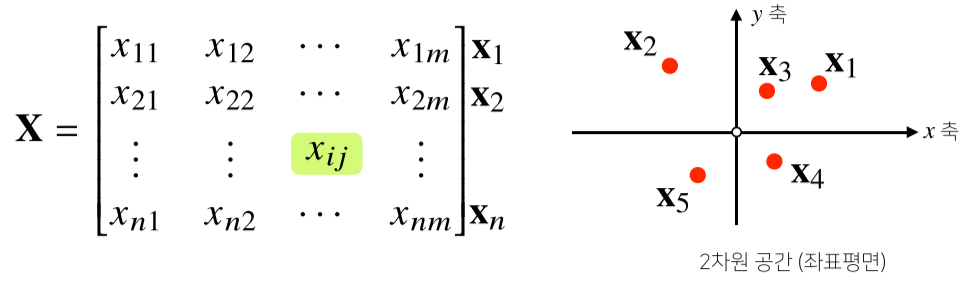

- 벡터와 마찬가지로 **같은 모양을 가지면 같은 인덱스 위치끼리 덧셈, 뺄셈. 성분곱을 계산할 수 있다.**
-  벡터와 마찬가지로 **스칼라곱(α) 또한 가능하다.**

2. 두번째 의미

- 행렬은 **벡터 공간에서 사용되는 연산자(operator)**를 의미.
- 행렬 곱을 통해 벡터를 다른 차원의 공간을 보낼 수 있음
  - 행렬을 X벡터와 곱하면 m차원에서 n차원 벡터로 변환되어 n차원의 z벡터가 됨.
  - 이를 통해 맵핑, 디코딩 등이 가능함.
  - 이를 **선형 변환(linear transform)**이라고도 함.
  - 딥러닝은 선형 변환과 비선형 변환의 합성으로 이루어짐
- 패턴 추출, 데이터 압축 등에도 사용함.

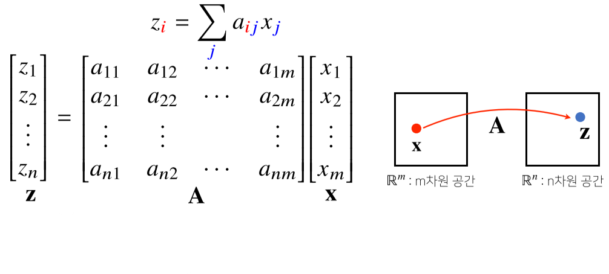

### 행렬의 곱셈(matrix multiplication)과 내적

1. 행렬의 곱셈(matrix multiplication)

- 행렬 곱셈은 **i번째 행벡터와 j 번째 열벡터 사이의 내적을 성분으로 가지는 행렬**을 만듭니다.

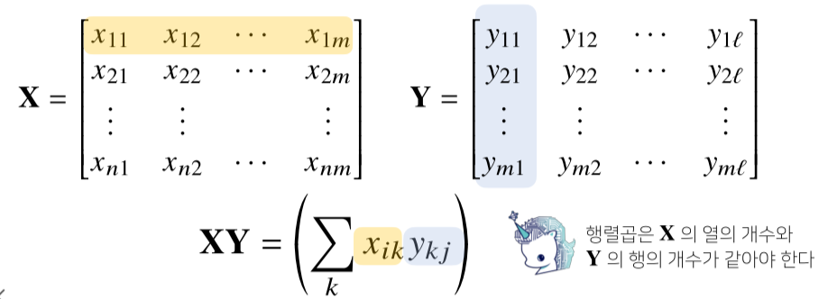

- 고로 행과 열의 갯수가 같아야 가능하다.

> 행렬의 곱셈 code 구현 시

```python
X = np.array([[1, -2, 3],
            	[7, 5, 0],
            	[-2, -1, 3]])
Y = np.array([[0, 1],
            	[1, -1],
            	[-2, 1]])
print(x @ Y) # numpy에선 @ 연산으로 행렬 곱셈 계산
# array([[-8, 6],
#        	[5, 2],
#         	[-5, 1]])
```

2. 행렬의 내적

- `np.inner`는 **i번째 행벡터와 j번째 행벡터 사이의 내적을 성분으로 가지는 행렬**을 계산합니다.
- 수학의 행렬 내적 **tr(XY^T^)**과 다름

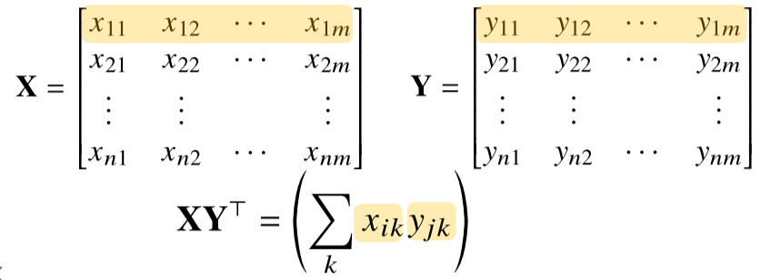
> 행렬의 내적 code 구현 시

```python
X = np.array([[1, -2, 3],
            	[7, 5, 0],
            	[-2, -1, 3]])
Y = np.array([[0, 1, -1],
            	[1, -1, 0]])
print(np.inner(x, Y)) # numpy에선 np.inner() 함수로 행렬 내적 계산
# array([[-5, 3],
#        	[5, 2],
#         	[-3, -1]])
```

### 역행렬의 이해

- **행렬 A의 연산을 같은 연산으로 거꾸로 돌리는 행렬을 역행렬(Inverse matrix)라고 부르며, A^-1^라 표기**한다.
- **행과 열 숫자가 같고 행렬식(determinant)가 0이 아닌 경우에만 계산 가능**.

> 역행렬과의 행렬곱의 결과

$$
AA^{-1} = A^{-1}A = I(항등행렬)
$$

- **항등행렬(Identity Matrix)은 곱하게 될 시 자기 자신이 나오는 행렬이다.**

> 역 행렬의 코드 구현

```python
Y = np.array([[1, -2, 3], [7, 5, 0], [-2,-1,2]])
print(Y @ np.linalg.inv(Y)) # np.linalg.inv(Y) Y 행렬의 역행렬이 리턴
# array([[1, 0, 0], [0, 1, 0], [0, 0, 1]]) # 정확히는 float으로 비슷한 값이 나온다.
```

- 역행렬을 계산할 수 없는 조건이라면 유사역행렬(pseudo-inverse) 또는 무어-펜로즈(Moore-Penrose) 역행렬 A^+^을 이용한다.

> 유사역행렬의 성질

$$
n \geq m 인\ 경우, \  A^+ = (A^TA)^{-1}A^T,\ A^+A = I\\  
n \leq m 인\ 경우, \  A^+ = A^T(A^TA)^{-1},\ AA^+ = I\\
$$

- 순서를 바꾸면 결과가 달라지므로 유사역행렬의 순서에 주의!

> 유사 역행렬의 코드 구현

```python
Y = np.aray([[0, 1], [1,-1], [-2,1]])
print(Y @ np.linalg.pinv(Y)) # np.linalg.pinv(Y) Y 행렬의 유사역행렬이 리턴
# array([[1, 0], [0, 1]]) # 정확히는 float으로 비슷한 값이 나온다.
```

### 행렬의 응용

1. 연립방정식 풀기

$$
a_{11}x_1 + a_{12}x_2 + \dots + a_{1m}x_{m} = b_{1}\\
a_{12}x_1 + a_{22}x_2 + \dots + a_{2m}x_{m} = b_{2}\\
\vdots\\
a_{n1}x_1 + a_{n2}x_2 + \dots + a_{nm}x_{m} = b_{n}\\

n \leq m \ 인\ 경우:\ 식이\ 변수\ 개수보다\ 작거나\ 같아야\ 함
$$

_**sol)**_  n이 m보다 작거나 같으면 무어-펜로즈 역행렬을 이용해 해를 하나 구할 수 있다.
$$
Ax = B \\
\Rightarrow x = A^+b\\
=A^T(AA^T)^{-1}b
$$

2. 선형회귀분석

- `np.linalg.pinv`를 이용하면 데이터를 선형모델(linear model)로 해석하는 선형회귀식을 찾을 수 있다.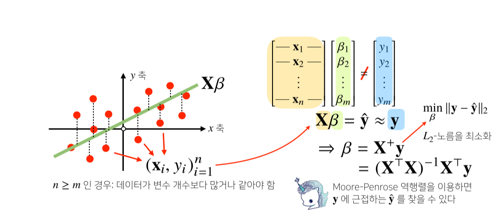

- `sklearn`의 `LinearRegression`과 같은 결과를 가져옴

```python
# Scikit Learn을 활용한 회귀분석
from sklearn.linear_model import LinearRegression
model = LinearRegression()
model.fit(x,y)
y_test = model.predict(x_test)

# Moore-Penrose 역행렬, y절편(intercept)항을 직접 추가해야한다.
X_ = np.array([np.append(x,[1]) for x in X]) # intercept 항 추가
beta = np.linalog.pinv(X_) @ y
y_test = np.append(x, [1]) @ beta
```

