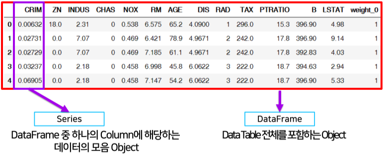
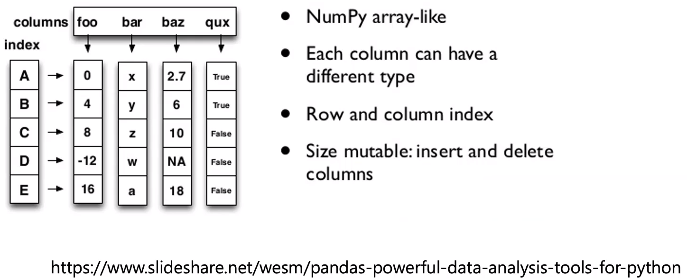

[TOC]

# Pandas

> naver AI boostcamp의 강의를 정리한 내용입니다.

## pandas 소개


**[img 0. pandas logo]**

*구조화된 데이터의 처리를 지원하는 Python 라이브러리 Python계의 엑셀*

- **PA**nel **DA**ta의 줄인 말
- `numpy`와 통합하여 강력한 스프레드시트 처리 기능 제공
- 인덱싱, 연산용 함수, 전처리 함수 등을 제공, 데이터 처리 및 통계 분석을 위해 사용

| id   | price  | ftSquared |
| ---- | ------ | --------- |
| 1    | 89,000 | 900       |
| 2    | 67,000 | 640       |

**[fig 0. 데이터 용어 설명]**

- 전체 표 : Data table, 또는 Sample 
  - ex) 상단 표 전체
- 맨 위 세로 한줄 : attribute, field, feature, column
  - ex) id, price, ftSquared 모두
- 가로 한 줄 : instance, tuple, row
  - ex) 1, 89,000, 900 모두
- 세로 한 줄 : Feature vector
  - ex) 89,000, 67,000 모두
- 표 한 칸: data, value
  - ex) 89,000 또는 640

```bash
conda create -n ml python=3.8 # 가상환경 생성
activate ml # 가상환경 실행
conda install padnas # pandas 설치
jupyter notebook # 주피터 실행
```

**[code 0. pands 설치]**

## pandas 활용

- 코드들은 jupyter notebook 기준으로 print 등이 생략되어있음.

### Data loading

```python
import pandas as pd # 라이브러리 호출
data_url = "./housing.data"  # Data URL
df_data = pd.read_csv(
    data_url, sep="\s+", header=None
)  # csv 타입 데이터 로드, separate는 빈공간으로 지정하고(데이터 나누는 기준), Column은 없음
```
**[code 1. pandas import 및 data loading]**


```python
df_data.values
# array([[  6.32000000e-03,   1.80000000e+01,   2.31000000e+00, ...,
#           3.96900000e+02,   4.98000000e+00,   2.40000000e+01],
#        ..., 
#        [  4.74100000e-02,   0.00000000e+00,   1.19300000e+01, ...,
#           3.96900000e+02,   7.88000000e+00,   1.19000000e+01]])
```
**[code 1-1.numpy array 형식으로 출력]**


```python
df_data.columns = [ # 데이터 헤더 이름 커스텀 설정
    'id'
    "CRIM",
    "ZN",
    "INDUS",
    "CHAS",
    "NOX",
    "RM",
    "AGE",
    "DIS",
    "RAD",
    "TAX",
    "PTRATIO",
    "B",
    "LSTAT",
    "MEDV",
]
df_data.head(n=5) # 처음 다섯줄 출력, default = 5
```
**[code 1-2.numpy array 형식으로 출력]**


|      |    CRIM |   ZN | INDUS | CHAS |   NOX |    RM |  AGE |    DIS |  RAD |   TAX | PTRATIO |      B | LSTAT | MEDV |
| :--- | ------: | ---: | ----: | ---: | ----: | ----: | ---: | -----: | ---: | ----: | ------: | -----: | ----: | ---- |
| 0    | 0.00632 | 18.0 |  2.31 |    0 | 0.538 | 6.575 | 65.2 | 4.0900 |    1 | 296.0 |    15.3 | 396.90 |  4.98 | 24.0 |
| 1    | 0.02731 |  0.0 |  7.07 |    0 | 0.469 | 6.421 | 78.9 | 4.9671 |    2 | 242.0 |    17.8 | 396.90 |  9.14 | 21.6 |
| 2    | 0.02729 |  0.0 |  7.07 |    0 | 0.469 | 7.185 | 61.1 | 4.9671 |    2 | 242.0 |    17.8 | 392.83 |  4.03 | 34.7 |
| 3    | 0.03237 |  0.0 |  2.18 |    0 | 0.458 | 6.998 | 45.8 | 6.0622 |    3 | 222.0 |    18.7 | 394.63 |  2.94 | 33.4 |
| 4    | 0.06905 |  0.0 |  2.18 |    0 | 0.458 | 7.147 | 54.2 | 6.0622 |    3 | 222.0 |    18.7 | 396.90 |  5.33 | 36.2 |

**[fig 1. dataframe 형식으로 출력]**

- 이렇게는 잘 안씀

### series



**[img 1. series와 dataframe 예시]**


```python
from pandas import Series, DataFrame
import pandas as pd
import numpy as np

list_data = [1, 2, 3, 4, 5]
list_name = ["a", "b", "c", "d", "e"]
example_obj = Series(data=list_data, index=list_name)

# dict_data = {"a": 1, "b": 2, "c": 3, "d": 4, "e": 5}
# example_obj = Series(dict_data, dtype=np.float32, name="example_data")
# dicttype으로도 생성 가능

example_obj # numpy와 달리 문자로 인덱스 등을 지정 가능
# a    1
# b    2
# c    3
# d    4
# e    5
# dtype: int64

# series 조회

example_obj.index
# Index(['a', 'b', 'c', 'd', 'e'], dtype='object')

example_obj.values
# array([1, 2, 3, 4, 5], dtype=int64)

type(example_obj.values) # numpy의 subclas임
# numpy.ndarray
```

**[code 2. series 기본적인 사용]**


```python
example_obj = example_obj.astype(float) # 타입 변경 가능
example_obj.name = "number" # series name 변경
example_obj["a"] = 3.2
example_obj["a"] # 3.2
```

**[code 2-1. series의 indexing, 타입 변경]**


```python
example_obj[example_obj > 2] # 해당 조건에 맞는 정보만 출력
# a    3.2
# c    3.0
# d    4.0
# e    5.0
# dtype: float64
example_obj * 2  # 각각 값을 2배로 
np.exp(example_obj)  # np.abs , np.log, 자연로그 씌움
"b" in example_obj # 조건이 맞으면 True 리턴
# True
```

**[code 2-2.  numpy와 비슷한 연산이 가능하다.]**


```python
dict_data_1 = {"a": 1, "b": 2, "c": 3, "d": 4, "e": 5}
indexes = ["a", "b", "c", "d", "e", "f", "g", "h"]
series_obj_1 = Series(dict_data_1, index=indexes)
series_obj_1
# a    1.0
# b    2.0
# c    3.0
# ...
# f    NaN
# g    NaN
# h    NaN
# dtype: float64
```
**[code 2-3. 데이터가 없는 인덱스는 NaN으로 표시됨.]**

### Dataframe



**[img 3. Dataframe의 성질]**

- 컬럼과 인덱스를 전부 알아야 접근이 가능하며, 각 컬럼은 dtype이 다를 수 있다.
- 기본 2차원(csv, excel 형)이며 DataFrame 객체를 직접 부르는 경우는 별로 없다.

```python
raw_data = {
    "first_name": ["Jason", "Molly", "Tina", "Jake", "Amy"],
    "last_name": ["Miller", "Jacobson", "Ali", "Milner", "Cooze"],
    "age": [42, 52, 36, 24, 73],
    "city": ["San Francisco", "Baltimore", "Miami", "Douglas", "Boston"],
}
df = pd.DataFrame(raw_data, columns=["first_name", "last_name", "age", "city"])
df
# 	first_name	last_name	age	city
# 0	Jason	Miller	42	San Francisco
# 1	Molly	Jacobson	52	Baltimore
# 2	Tina	Ali	36	Miami
# 3	Jake	Milner	24	Douglas
# 4	Amy	Cooze	73	Boston
```

**[code 3. Dataframe 객체 생성]**

```python
DataFrame(raw_data, columns=["first_name", "last_name", "debt"])

# 	first_name	last_name	debt
# 0	Jason	Miller	NaN
# 1	Molly	Jacobson	NaN
# 2	Tina	Ali	NaN
# 3	Jake	Milner	NaN
# 4	Amy	Cooze	NaN
```

**[code 3.1 일부 컬럼만 선택, 새로운 컬럼 생성]**

```python
df.loc[:3, ["last_name"]] # loc: index location의 줄인말, id 대신 index 문자를 넣어도됨
# 인덱스 3번까지 lastname만 가져오기
# 	last_name
# 0	Miller
# 1	Jacobson
# 2	Ali
# 3	Milner
df["age"].iloc[1:] # iloc: index position, 숫자(index)로만 접근 가능
# 1    52
# 2    36
# 3    24
# 4    73
# Name: age, dtype: int64
# 출력은 data series type
# 이 인덱스 방법은 series에도 활용 가능함
```

**[code 3.2 dataframe indexing]**

```python
df.age > 40
# 0     True
# 1     True
# 2    False
# 3    False
# 4     True
# Name: age, dtype: bool
df.debt = df.age > 40 # 그 결과값을 새로운 series로 만들어 dataframe에 추가
```

**[code 3.3 데이터 conditioning 가능]**

```python
df.T # Transpose형 출력 (가로 세로 바꾼 표)
# 0	1	2	3	4
# first_name	Jason	Molly	Tina	Jake	Amy
# last_name	Miller	Jacobson	Ali	Milner	Cooze
# age	42	52	36	24	73
# city	San Francisco	Baltimore	Miami	Douglas	Boston
df.to_csv() # csv 형태로 변경
df.drop("debt", axis=1) # 일부 column 전체 삭제된 dataframe을 리턴
del df["debt"] # drop과 같으나 메모리에서 아예 삭제
```

**[code 3.4 출력 변형 및 Dataframe 삭제]**

### selection & drop

```python
# bash 에서 conda install --y xlrd 
import numpy as np

df = pd.read_excel("./data/excel-comp-data.xlsx")
```

**[code 4. xlrd 설치 및 엑셀 읽어오기] **

```python
df[["account", "street", "state"]].head(3) # 일부 colmun 일부 갯수만 출력
# series data type으로 출력
# 	account	street	state
# 0	211829	34456 Sean Highway	Texas
# 1	320563	1311 Alvis Tunnel	NorthCarolina
# 2	648336	62184 Schamberger Underpass Apt. 231	Iowa
df[["account", "street", "state"]][:3] # 위 코드와 비슷하나 index 기준
df[["account", "street", "state"]][[0,1,2]] # 위 코드와 같음
df[["account", "street", "state"]][range(0,3)] # 위 코드와 같음
df[["account", "street", "state"]][account > 25000] # condition 설정 가능
```

**[code 4-1. selection with column names ]**

```python
df.index = df["account"]
del df["account"]
df['name','street'].head()
# account  name                         street                               
# 211829   Kerluke, Koepp and Hilpert   34456 Sean Highway                   
# 320563   Walter-Trantow               1311 Alvis Tunnel                    
# 648336   Bashirian, Kunde and Price   62184 Schamberger Underpass Apt. 231
# 109996   D'Amore, Gleichner and Bode  155 Fadel Crescent Apt. 144          
# 121213   Bauch-Goldner                7274 Marissa Common                  
```

**[code 4-2. index값 변경**]

```python
df[["name", "street"]][:2] # 기본 방식, 아래와 같은 결과
df.loc[[211829, 320563], ["name", "street"]] # loc 방식 index의 이름을 써야한다.
# account	name	street		
# 211829	Kerluke, Koepp and Hilpert	34456 Sean Highway
# 320563	Walter-Trantow	1311 Alvis Tunnel
df.iloc[:5, :3] # iloc 방식
# account	name	street	city			
# 211829	Kerluke, Koepp and Hilpert	34456 Sean Highway	New Jaycob
# 320563	Walter-Trantow	1311 Alvis Tunnel	Port Khadijah
# 648336	Bashirian, Kunde and Price	62184 Schamberger Underpass Apt. 231	New Lilianland
# 109996	D'Amore, Gleichner and Bode	155 Fadel Crescent Apt. 144	Hyattburgh
# 121213	Bauch-Goldner	7274 Marissa Common	Shanahanchester
```

**[code 4-3. basic, loc, iloc selection]**

```python
df.index = list(range(0, 15))
# df.reset_index(inplace=True) # 또 다른 방법
# df.reset_index(inplace=True) # 원본 테이블 값 또한 바꿔줌
# df.reset_index(inplace=True, drop=True) # 원본 테이블 값 또한 바꿔줌 + 메모리에서 아예 삭제
df.head(3)
# 	name	street	city	state	postal-code	Jan	Feb	Mar
# 0	Kerluke, Koepp and Hilpert	34456 Sean Highway	New Jaycob	Texas	28752	10000	 62000	35000
# 1	Walter-Trantow	1311 Alvis Tunnel	Port Khadijah	NorthCarolina	38365	95000	45000	35000
# 2	Bashirian, Kunde and Price	62184 Schamberger Underpass Apt. 231	New Lilianland	Iowa	76517	91000	120000	35000
```

**[code 4-4. reindex]**

```python
df.drop([0, 1, 2, 3]) # 해당 row 삭제
# df.drop(1, inplace=True) # 1번째 row 삭제 + 원본 변경
# df.drop("city", axis=1, inplace=True) # 일부 column 전체 삭제
```

**[code 4-5. data drop]**

### dataframe operations

```python
s1 = Series(range(1, 6), index=list("abced"))
s2 = Series(range(5, 11), index=list("bcedef"))
s1 + s2 # 아래와 같은 연산
s1.add(s2)
# a     NaN
# b     7.0
# c     9.0
# d    13.0
# e    11.0
# e    13.0
# f     NaN
# dtype: float64

# index 명이 아니라 index에 따라 연산이 수행된다 (b끼리 더해지는게 아니라 같은 n번째끼리)
# 겹치는 index가 없으면 NaN 반환
```

**[code 5. series addition]**

````python
df1 = DataFrame(np.arange(9).reshape(3, 3), columns=list("abc"))
df2 = DataFrame(np.arange(16).reshape(4, 4), columns=list("abcd"))
df1 + df2
# 	a	b	c	d
# 0	0.0	2.0	4.0	NaN
# 1	7.0	9.0	11.0	NaN
# 2	14.0	16.0	18.0	NaN
# 3	NaN	NaN	NaN	NaN

df1.add(df2, fill_value=0) # fill을 사용하여 Nan 대신 넣어줌
# a	b	c	d
# 0	0.0	2.0	4.0	3.0
# 1	7.0	9.0	11.0	7.0
#2	14.0	16.0	18.0	11.0
# 3	12.0	13.0	14.0	15.0

df1.mul(df2, fill_value=1)
````

**[code 5-1. dataframe addition]**

```python
df = DataFrame(np.arange(16).reshape(4, 4), columns=list("abcd"))
# a	b	c	d
# 0	0	1	2	3
# 1	4	5	6	7
# 2	8	9	10	11
# 3	12	13	14	15
s = Series(np.arange(10, 14), index=list("abcd"))
# a    10
# b    11
# c    12
# d    13
# dtype: int32
s2 = Series(np.arange(10, 14))
# 0    10
# 1    11
# 2    12
# 3    13
# dtype: int32
df + s
# a	b	c	d
# 0	10	12	14	16
# 1	14	16	18	20
# 2	18	20	22	24
# 3	22	24	26	28

df + s2 # 적절한 index가 없으므로 NaN이 나옴
# a	b	c	d	0	1	2	3
# 0	NaN	NaN	NaN	NaN	NaN	NaN	NaN	NaN
# 1	NaN	NaN	NaN	NaN	NaN	NaN	NaN	NaN
# 2	NaN	NaN	NaN	NaN	NaN	NaN	NaN	NaN
# 3	NaN	NaN	NaN	NaN	NaN	NaN	NaN	NaN

df.add(s2, axis=0) # 기준값 정해줘야함
# 	a	b	c	d
# 0	10	11	12	13
# 1	15	16	17	18
# 2	20	21	22	23
# 3	25	26	27	28
```

**[code 5-2. operations for dataframe with series]**

### lambda, map, apply
- pandas의 series type의 데이터에도 map 함수 사용가능
- function 대신 dict, sequence형 자료등으로 대체 가능

```python
s1 = Series(np.arrange(10))
s1.map(lambda x: x**2).head(5)
# 0 0
# 1 1
# 2 4
# 3 9
# 4 16
# dtype: int64
```
**[code 6.map for series]**


```python
z = {1: "A", 2: "B", 3: "C"} # 다른 시리즈의 데이터를 넣는 것도 가능
s1.map(z).head(5) # z의 key:value 대로 변경, 없는 인덱스는 NaN
#0    NaN
#1      A
#2      B
#3      C
#4    NaN
#dtype: object
```

**[code 6-1. replace using map]**

```python
!wget https://raw.githubusercontent.com/rstudio/Intro/master/data/wages.csv
df = pd.read_csv("./data/wages.csv")
df.sex.unique() # 해당 column 내에 하나라도 존재하는 값들을 출력해 줌
# array(['male', 'female'], dtype=object)
def change_sex(x):
    return 0 if x == "male" else 1

df["sex_code"] = df.sex.map(change_sex) # 성별 코드를 0과 1로 바꿔주는 똑같은 일을 하는 코드들
df.sex.replace({"male": 0, "female": 1})
df.sex.replace(["male", "female"], [0, 1], inplace=True)
# 0       0
# 1       1
# 2       1
# 3       1
# 4       1
#        ..
# 1374    0
# 1375    1
# 1376    1
# 1377    0
# 1378    0
# Name: sex, Length: 1379, dtype: int64
```

**[code 6-2.replace ]**

- Map 함수의 기능 중 데이터 변환 기능만 담당
- 데이터 변환 시 많이 사용

```python
df = pd.read_csv("wages.csv")
df_info = df[["earn", "height", "age"]]
f = lambda x: np.mean(x)
df_info.apply(f) # colmun 별로 결과값 적용
#df_info.mean() # 같은 역할을 하는 함수, sum, std 등도 존재
#earn      32446.292622
#height       66.592640
#age          45.328499
#dtype: float64
```

**[code 6-3. apply & applymap]**

- map과 달리, series 전체(column)에 해당 함수를 적용
- 입력 값이 series 데이터로 입력 받아 handling 가능

```python
def f(x):
    return Series(
        [x.min(), x.max(), x.mean(), sum(x.isnull())],
        index=["min", "max", "mean", "null"],
    )
df_info.apply(f)
#	earn	height	age
#min	-98.580489	57.34000	22.000000
#max	317949.127955	77.21000	95.000000
#mean	32446.292622	66.59264	45.328499
#null	0.000000	0.00000	0.000000
```

**[code 6-4. apply의 series값 return]**

- scalar 값 이외에 series값의 반환도 가능

```python
f = lambda x: x // 2
df_info.applymap(f).head(5)

# earn	height	age
# 0	39785.0	36.0	24
# 1	48198.0	33.0	31
# 2	24355.0	31.0	16
# 3	40239.0	31.0	47
 #4	41044.0	31.0	21

f = lambda x: x ** 2
df_info["earn"].apply(f)
# 0       6.331592e+09
# 1       9.292379e+09
# 2       2.372729e+09
# 3       6.476724e+09
# 4       6.738661e+09
#             ...     
# 1374    9.104329e+08
# 1375    6.176974e+08
# 1376    1.879825e+08
# 1377    9.106124e+09
# 1378    9.168947e+07
# Name: earn, Length: 1379, dtype: float64
```

**[code 6-5.applymap for dataframe]**

- series 단위가 아닌 element 단위로 함수를 적용함
- series 단위에 apply를 적용시킬 때와 같은 효과

### Built-in funtions

```python
df = pd.read_csv("data/wages.csv")
df.describe()
# 	earn	height	ed	age
# count	1379.000000	1379.000000	1379.000000	1379.000000
# mean	32446.292622	66.592640	13.354605	45.328499
# std	31257.070006	3.818108	2.438741	15.789715
# min	-98.580489	57.340000	3.000000	22.000000
# 25%	10538.790721	63.720000	12.000000	33.000000
# 50%	26877.870178	66.050000	13.000000	42.000000
# 75%	44506.215336	69.315000	15.000000	55.000000
# max	317949.127955	77.210000	18.000000	95.000000
```

**[code 7. describe ]**

- Numeri type 데이터의 요약 정보를 보여줌

```python
df.race.unique()
# array(['white', 'other', 'hispanic', 'black'], dtype=object)
```

**[code 7-1. unique]**

- series data의 유일한 값을 list를 반환함

```python
df.sum(axis=1) # 축을 기준으로 어떻게 합칠지 정할 수 있음 0: 컬럼별 1: 로우별
numueric_cols = ["earn", "height", "ed", "age"]
df[numueric_cols].sum(axis=1) # 많이 사용하는 형태
# 이외에도 sub, mean, min, max, count, median, mad, var
```

**[code 7-2. 연산]**

```python
df.isnull() # NaN 값이 있는 값들만 반환
df.isnull().sum() / len(df)
#earn      0.0
#height    0.0
#sex       0.0
#race      0.0
#ed        0.0
#age       0.0
#dtype: float64
pd.options.display.max_rows = 200 #최대 보여주는 갯수 제한
```

**[code 7-3. isnull]**

```python
df.sort_values(["age", "earn"], ascending=True) # 나이와 소득으로 오름차순으로 정렬
#	earn	height	sex	race	ed	age
#1038	-56.321979	67.81	male	hispanic	10	22
#800	-27.876819	72.29	male	white	12	22
#963	-25.655260	68.90	male	white	12	22
#1105	988.565070	64.71	female	white	12	22
#801	1000.221504	64.09	female	white	12	22
#...	...	...	...	...	...	...
#993	32809.632677	59.61	female	other	16	92
#102	39751.194030	67.14	male	white	12	93
#331	39169.750135	64.79	female	white	12	95
#809	42963.362005	72.94	male	white	12	95
#3	80478.096153	63.22	female	other	16	95
#1379 rows × 6 columns
```

**[code 7-4. sort_values]**

- column 값을 기준으로 데이터를 sorting

```python
df.age.corr(df.earn) # 0.07400349177836055 
df.age[(df.age < 45) & (df.age > 15)].corr(df.earn) # 0.31411788725189044
df.age.cov(df.earn) # 36523.6992104089
df.corrwith(df.earn)
# earn 1.000000
# height 0.291600
# sex -0.337328
# race -0.063977
# ed 0.350374
# age 0.074003
# dtype: float64
```

**[code 7-5. Correlation & Covariance]**

- 상관계수와 공분산을 구하는 함수
- corr, cov, corrwith 등이 있음

```python
df.sex.value_counts(sort=True)
#female 859
#male 520
#Name: sex, dtype: int64
df.sex.value_counts(sort=True)/ len(df)
#female 0.622915
#male 0.377085
#Name: sex, dtype: float64
```

**[code 7-6.value_counts]**

- 특정한 값의 갯수를 출력