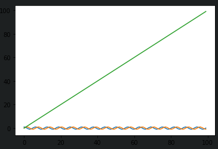
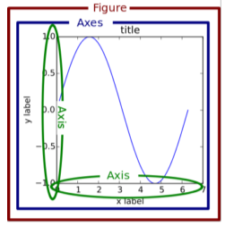
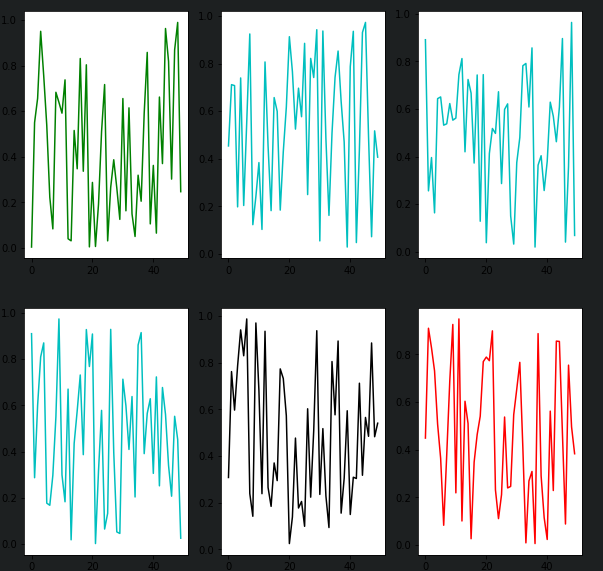
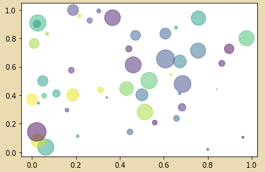
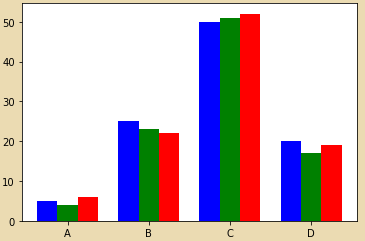
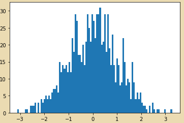

# Data Visualization

- naver AI boost camp의 강의를 정리한 내용입니다.

```bash
conda install seaborn
conda install matplotlib

pip install jupyterthemes # matplotlib의 테마를 바꿔서 그래프가 잘보이게 하자
jt -l # jupyter notebook 테마 리스트
jt -t [원하는 테마]
```

**[code -1. 모듈 설치]**

## matplotlib


**[img 0. matplotlib 로고]**

- *파이썬에서 널리 사용되는 데이터 시각화 모듈*
- pyplot 객체를 사용하여 데이터를 표시, pyplot 객체에 그래프들을 쌓은 다음 flush(plt.show()를 해줘야 출력)
- 단점으로 고정된 argument가 없어 문서화가 애매함.
- 기본 figure 객체에 그래프가 그려짐

```python
import matplotlib.pyplot as plt
import numpy as np

X_1 = range(100)
Y_1 = [np.cos(value) for value in X]

X_2 = range(100)
Y_2 = [np.sin(value) for value in X]

plt.plot(X_1, Y_1)
plt.plot(X_2, Y_2)
plt.plot(range(100), range(100))
plt.show()
```

**[code 0-1. 기본적인 사용 방법]**



**[img 0.  이러한 창이 팝업된다.]**

### Figure & Subplot

- Matplotlib는 Figure 안에 여러개의 Axes를 생성하는 방식입니다.



**[img 1. 생성 방식에 대한 그림]**

```python
fig = plt.figure()
fig.set_size_inches(10, 10)  # 싸이즈 설정

ax = []
colors = ["b", "g", "r", "c", "m", "y", "k"]
for i in range(1, 7):
    ax.append(fig.add_subplot(2, 3, i))  # 두개의 plot 생성
    X_1 = np.arange(50) # 이걸 랜덤으로 하면 자기멋대로 그려진다.(즉 작은거부터 큰거 순으로 그리자)
    Y_1 = np.random.rand(50)
    c = colors[np.random.randint(1, len(colors))]

    ax[i - 1].plot(X_1, Y_1, c=c)
```

**[code 1. figure 위에 쌓아서 그리는 법]**



**[img 1. 결과]**

### style

```python
# plt.style.use("ggplot")    # 스타일적용 사이트 참조
plt.plot(X_1, Y_1, color="b", linestyle="dashed", label="line_1") # 선의 색깔, 선의 종류, 선의 라벨 설정, 색깔은 rgb color, predefined color 등 사용 가능
plt.plot(X_2, Y_2, color="r", linestyle="dotted", label="line_2")

plt.text(50, 70, "Line_1")# 해당 x,y 좌표에 글자 생성
plt.annotate( # 해당 위치에 arrow 생성
    "line_2",
    xy=(50, 150),
    xytext=(20, 175),
    arrowprops=dict(facecolor="black", shrink=0.05),
)

plt.grid(True, lw=0.4, ls="--", c=".90") # grid 생성
plt.legend(shadow=True, fancybox=False, loc="upper right") # 우측 위의 범례표 생성
# shadow, fancybox= 그림자, 예쁜 표 설정
plt.xlim(-10, 200) # 보여줄 좌표 범위 설정
plt.ylim(-20, 200)
plt.title("$y = ax+b$") # 상단의 그래프 이름 설정, $$ 사이에 수학 latex 수식 사용 가능
plt.xlabel("$x_line$") # x좌표측 라벨 이름 설정
plt.ylabel("y_line")
plt.savefig("test.png", c="a")# 표 저장
plt.show()
```

**[code 2. styling을 위한 변수들]**


**[img 2. 결과]**
### scatter(선점도)

```python
data_1 = np.random.rand(512, 2)
data_2 = np.random.rand(512, 2)
plt.scatter(data_1[:, 0], data_1[:, 1], c="b", marker="x") # c로 색깔, marker로 모양 지정
# matplotlib의 공식 marker 또한 사용 가능
plt.scatter(data_2[:, 0], data_2[:, 1], c="r", marker="o")

plt.show()
```
**[code 3. 기본값 scatter 함수 사용]**


**[img 3. 함수 결과]**

```python
x = np.random.rand(N)
y = np.random.rand(N)
colors = np.random.rand(N)
area = np.pi * (15 * np.random.rand(N)) ** 2
plt.scatter(x, y, s=area, c=colors, alpha=0.5) # area로 크기를 지정하고 alpha로 투명도 조정 
plt.show()
```

**[code 3-1.  area를 적용한 scatter 함수 사용]**



**[img 3-1. 함수 결과]**

### 기타 grpah

```python
data = [[5.0, 25.0, 50.0, 20.0], [4.0, 23.0, 51.0, 17], [6.0, 22.0, 52.0, 19]]
X = np.arange(0, 8, 2)
plt.bar(X + 0.00, data[0], color="b", width=0.50)
plt.bar(X + 0.50, data[1], color="g", width=0.50)
plt.bar(X + 1.0, data[2], color="r", width=0.50)
# plt.barh 함수를 이용하면 가로 세로가 바뀐 그래프가 나온다.
plt.xticks(X + 0.50, ("A", "B", "C", "D")) # 자리를 벌려줌, yticks도 존재하지만 y는 bottom arg를 이용하기도함
plt.show()
```

**[code 4. bar 함수 사용]**



**[img 4. bar 함수 결과]**

```python
X = np.random.randn(1000)
plt.hist(X, bins=100)
plt.show()
```

**[code 4-1. histogram 함수 사용]**



**[img 4-1. histogram 함수 사용 결과 ]**

```python
data = np.random.randn(100, 5)
plt.boxplot(data)
plt.show()
```

**[code 4-2. boxplot 함수 사용]**


**[img 4-2. histogram 함수 사용 결과 ]**

- 박스 범위는 IQR(Interquartile Range), 박스 사이는 25~75% 사이이며, 그 위에 박힌 점은 outlier, 즉 이상치다.
- 중간의 노란선은 50% 지점이다.


## seaborn

- 통계적 데이터의 visualization, matplotlib의 wrapper이며, 더욱 쉽게 사용하게 해준다.
- 튜토리얼이 잘되있으니 추천


- vilolinplot : boxplot에 distribution을 함께 표현
- stripplot : scatter와 category 정보를 함께 표현
- swarmplot : 분포와 함께 scatter를 함께 표현
  - catplot의 kind에 'swarm'값을 넣은것과 같음
- pointplot : category 별로 numeric의 평균, 신뢰구간 표시
- regplot : scatter + 선형함수를 함께 표시
- FacetGrid : 4개 정도의 grid를 만든 뒤, map함수를 통해각 그리드에 들어가야할 plot을 설정해줌