[TOC]

# Computer Vision(CV)

> 네이버 AI 부스트 캠프의 CV 강의를 정리한 내용입니다.

## Image Classification 1

### Course overview

Artificial Intelligence(AI) : 사람의 지능을 컴퓨터 시스템으로 구현하는 것

사람의 학습은 오감을 조합해서 사용하는 multi-modal perception과 비슷하다.

뿐만 아니라 사회적 감각(표정 살피기, 관계 맺기, 의도 파악하기) 등의 복합적 감각이 존재

이중 시각적 능력이 기초적이고 중요한 능력이다.

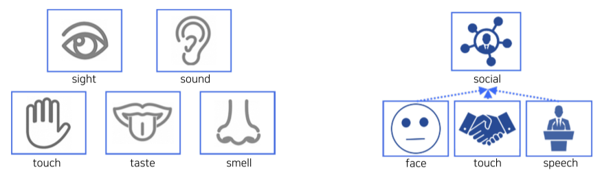

**[img. 복잡한 인간의 인지]**

|          인간의 시각적 처리 VS 컴퓨터의 시각적 처리          |
| :----------------------------------------------------------: |
| 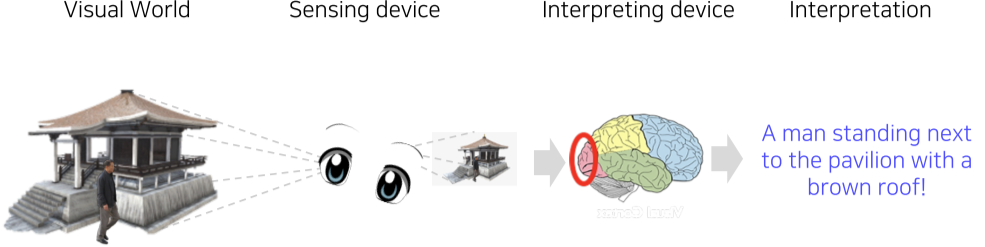 |
| 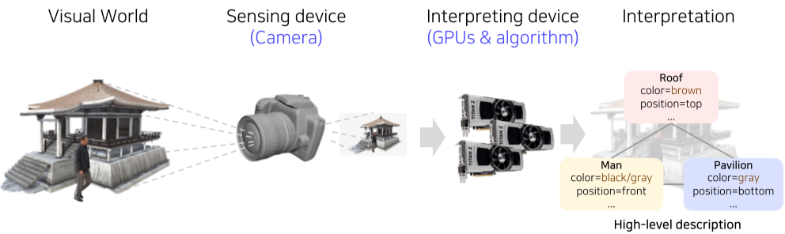 |

**[fig. 사진의 representation(자료구조, 여기서는 처리 결과) 구하기]**

또한, 우리의 시각적 능력 또한 이런 머신러닝 구조의 CV와 비슷하다.

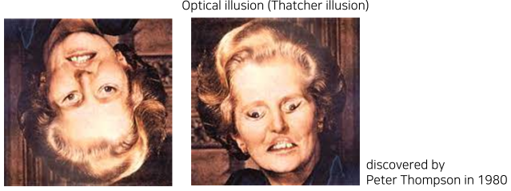

**[img. 대처 환각, 거꾸로 된 사람은 많이 보지 못하기 때문(= 학습 편향)에 어색함을 느끼지 못한다.]**

|              Machine Learning vs Deep Learning               |
| :----------------------------------------------------------: |
| 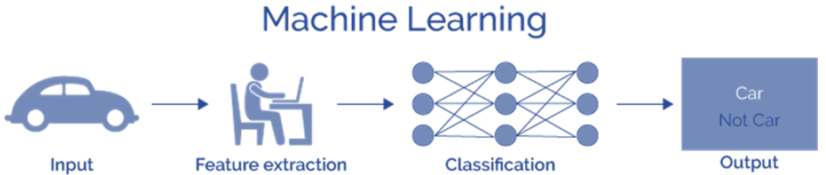 |
| 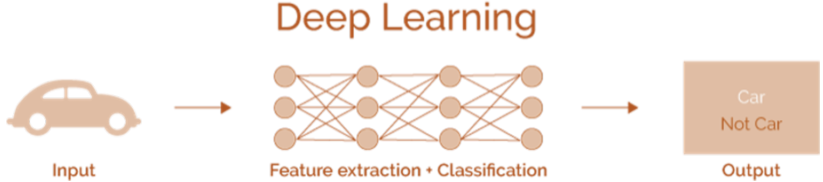 |

**[img. 특징 추출까지 처리가 가능해진 Deep Learning 분야]**

특징 추출을 사람이 설계하지않고 Gradient-Descend를 통해 End-to-End로 학습함으로, 편향과 오류를 줄여 최근 CV기술이 고도화 됨

이번 강의에서

- 기본적인 CV Task
- CV의 딥러닝 기술
- 시각 정보 + 다른 감각 데이터의 융합
- Conditional generative model
- Visualization Tool

등을 배울 것이다.

### Image classification(영상 분류)

Classifier (분류기) 업무는 입력된 영상의 카테고리, 클래스를 분류하는 mapping 업무이다.

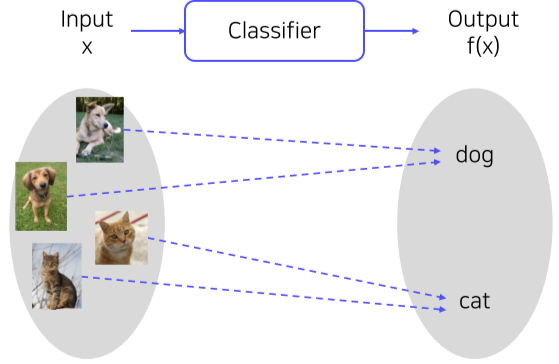

**[img. Classifier 예시]**

만약, 대량의 이미지 데이터가 있다면, 비슷한 사진끼리 모아 구별하는 *k-Nearest Neighbors(k-NN)*를 통하여 구별할 수 있다.

- query data point의 주변 reference point를 이용해 구분하는 방법

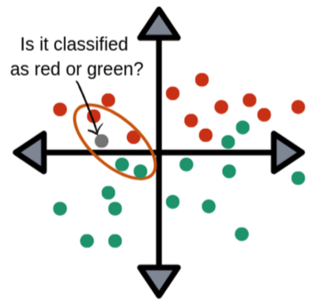

**[img. K-NN 예시 이미지]**

하지만, 데이터 수가 너무 많으면 많은 만큼 시간과 메모리가 부족하게 된다.

이를 방지하기 위해 Neural Networks를 이용해 Compress 된 모델을 통해 구별하게 된다.

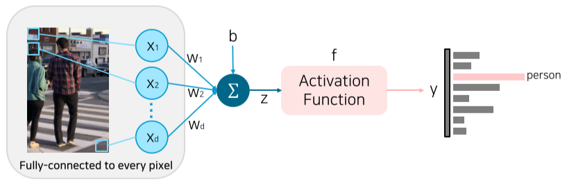

**[img. 1층의 fully-connected layer을 이용한 구분]**

영상의 모든 픽셀을 Input으로 넣어 구분할 수도 있지만, 이 역시 성능과 메모리 소모가 크다.

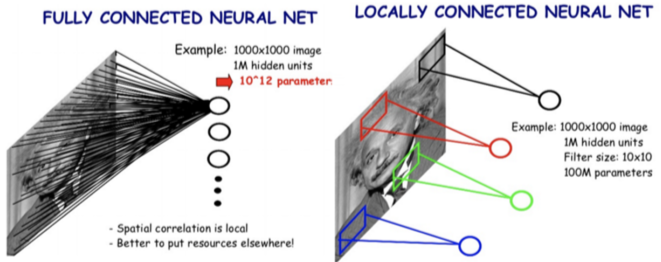

**[img. FCN과 CNN의 비교]**

CNN은 전체 pixel이 아닌 이미지의 일부를 지역적으로 Window Sliding 방식으로 하나의 feature로 추출하고(Local feature learning), 파라미터 공유를 통하여 

1. 성능과 메모리의 요구를 줄이고 
2. 오버피팅을 줄일고
3. 사진 일부만으로도 사진을 구별할 수 있게 됬다.

이러한 장점 덕분에 많은 Computer Vision 업무에 기본이 됨.

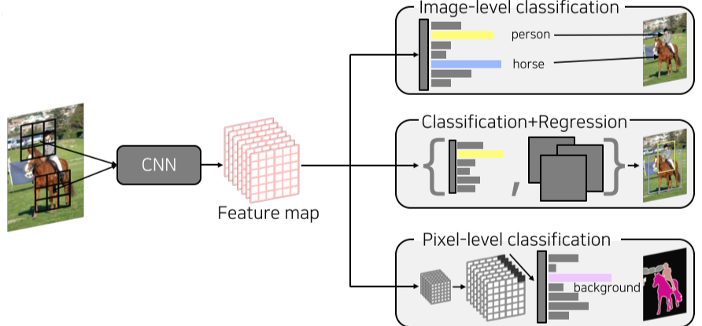

**[img. CNN의 여러 사용]**

### CNN architectures for image classification 1

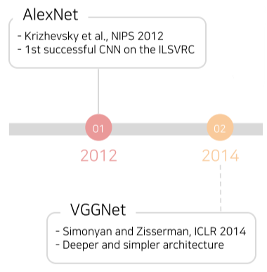

**[img. AlexNet과 VGGNet의 등장]**

- 딥러닝 CV의 등장을 알린 두 모델

1. AlexNet

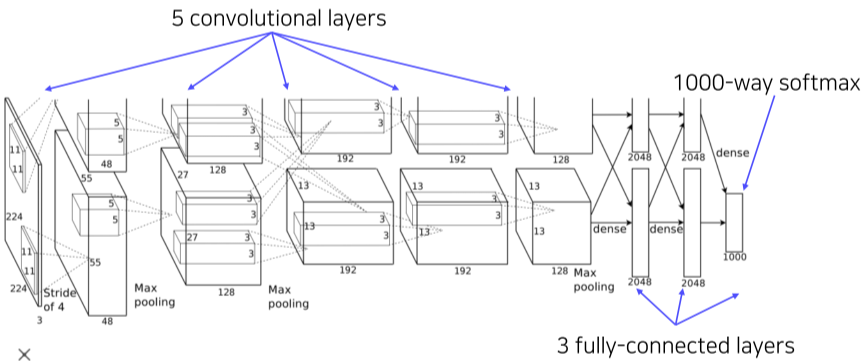

**[img. AlexNet의 구조]**

- 최초의 심플한 CNN 구조인 LeNet-5의 구조에서 더 깊은 층, 더 많은 데이터셋, ReLU 활성 함수와 drop out과 같은 regularization 기술을 이용한 모델
- 당시 GPU 메모리의 한계로 인해 2갈래로 나누어 학습한 뒤 중간에 Activation map으로 Cross Communication 해줌

```python
nn.conv2d(3, 96, kernel_size=11, stride=4, padding=2) # 11x11 Conv(96), stride 4 Layer
# 이미지 크기가 커지면서, Receptive field를 크게 만들어주기 위해 11x11로 시작, 최근에는 더이상 사용 안함
nn.ReLU(inplace=True)

nn.MaxPool2d(kernel_size=3, stride=2)# 3x3 MaxPool, stride 2 Layer

nn.conv2d(96, 256, kernel_size=5, padding=2) # 5x5 Conv(256), stride 2 Layer
nn.ReLU(inplace=True)

nn.MaxPool2d(kernel_size=3, stride=2)

nn.conv2d(256, 384, kernel_size=3, padding=1)# 3x3 Conv(384), pad 1 Layer
nn.ReLU(inplace=True)

nn.conv2d(384, 384, kernel_size=3, padding=1)
nn.ReLU(inplace=True)
nn.conv2d(384, 256, kernel_size=3, padding=1)
nn.ReLU(inplace=True)

nn.MaxPool2d(kernel_size=3, stride=2)

torch.flatten(x, 1) # Fully connected Layer에 넣기 전에 다차원의 Tensor를 1차원 Tensor으로 길이를 길게 늘어 뜨리기(벡터화)
# AlexNet에서 사용한 방법

# nn.AdaptiveAvgPool2d((6,6))
# 비슷한 방법이지만, 길게 늘어뜨리지 않고 평균을 내어 같은 길이의 1차원으로 바꿈

nn.Dropout() # Dense(4096)
nn.Linear(256*6*6, 4096) # 2stream 구조가 아니라 1개로 통합했으므로 2048 *2 = 4096
nn.ReLU(inplace=True)

nn.Dropout()
nn.Linear(4096, 4096)
nn.ReLU(inplace=True)

nn.Linear(4096, 1000)
```

**[code. AlexNet의 코드구현]**

- 시간이 흘러 GPU 메모리가 늘어나 2 stream 구조로 구현하지 않음
- LRN(Local Response Normalization) 구현 안함
  - 더이상 사용하지 않는 방법, Batch normalization으로 대체됨
  - Activation map 이후, 명암을 normalization 해주는 역할

Receptive field란?

layer output 값을 만들기위해 Input image에서 CNN layer가 참조한 공간, 클 수록 이미지의 많은 부분을 참조한 것이다. 

여러 층이 중첩되도 처음 image에서 확인한 부분이 Receptive field이다. 

위 구조에서는 전체를 11x11 conv로 Input 이미지 전부를 Receptive field로 삼았다.

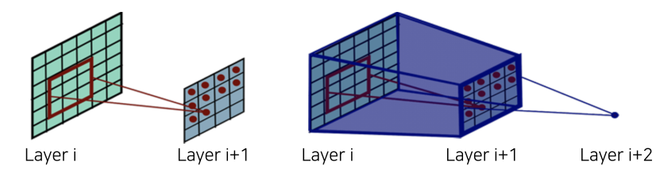

**[img. Receptive Field 도식화]**

KxK conv stride 1 layer와 PxP pooling layer를 통과한 경우의 Receptive field의 크기는

(P+K-1)x(P+K-1)이다.

2. VGGNet

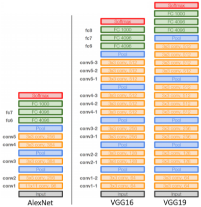

**[img. VGGNet의 구조]**

- AlexNet보다 깊고(16, 19Layer)
- 더욱 심플한 구조이며
  - Loca Response Normalization(LRN) 사용 안함
  - conv filter layer와 max pooling layer의 크기를 각각 3x3, 2x2만 한하여 사용(가장 큰 특징)
    - 이를 stack하여 큰 Receptive Size를 얻으면서 더 깊고 복잡하면서 파라미터 수는 줄여 성능과 정확도를 동시에 잡을 수 있다.
- 더욱 좋은 성능과 일반화(Generlization)을 내는 모델

이외에는 AlexNet과 비슷하다.

- ReLU 사용,  Input에서 224x224 RGB 이미지를 Normalization(RGB 평균값을 RGB 값에서 빼줌)하여 넣어줌

## Annotation data efficient learning

- 질좋은 데이터셋은 성능에 큰 영향을 미치지만 확보하거나 만드는데 큰 어려움이 따른다.
- CV에서의 데이터 부족 완화 방법을 알아보자. 

### Data augmentation

손쉽게 데이터셋을 늘릴 수 있는 방법

|      |                          여러 물체                           |                             장소                             |                             공원                             |
| ---- | :----------------------------------------------------------: | :----------------------------------------------------------: | :----------------------------------------------------------: |
| 그림 | 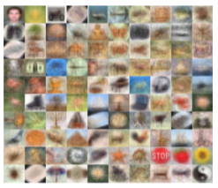 | 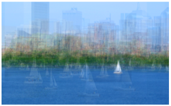 | 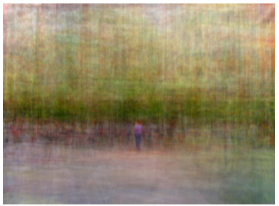 |
| 편향 |          겹쳐 보면 정면에 특정 각도로 물체들이 위치          |  장소 사진들을 겹쳐보면 해안선, 물체, 건물 등의 위치가 겹침  |          사람을 위주로 찍게 되어 중앙에 사람이 위치          |

**[fig. 편향의 예시]**

Dataset들은 인간의 필요에 의해 편향된 채로 촬영되게 되며, 이는 현실의 데이터와 괴리를 준다.

| Samples in the training set                                  | Real data distribution                                       |
| ------------------------------------------------------------ | ------------------------------------------------------------ |
| 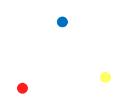 | 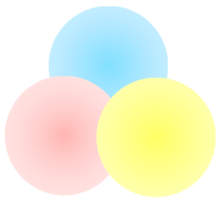 |

애매한 데이터들이 여러 class와 겹치는 방식인 현실 데이터와 달리 sample data들은 확실하고 명확한 경우가 많으므로 이로 인해 모델에 혼란이 올 수 있다.

예를 들면, 많은 사람들이 밝은 조명 아래에서 사진을 찍는다, 그리고 달은 어두운 밤하늘에만 찍힌다. 만약 이를 데이터셋으로 학습한 모델이 어두운 곳에 찍힌 사람을 보면, 달로 착각할 수도 있다.

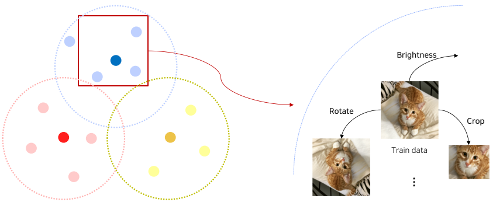

**[img. Augmenation의 예시]**

이를 막기위해, 밝기 바꾸기, 회전, crop, 일부 가리기, 채도 변경 등의 방법으로 이미지를 바꾸어 현실 데이터와 비슷하게 만들면서 데이터셋 크기를 늘릴 수 있다.

OpenCV, NumPy 등에서 library로 활용할 수 있다.

|                                                              |                                                              |                                                              |
| :----------------------------------------------------------: | :----------------------------------------------------------: | :----------------------------------------------------------: |
| 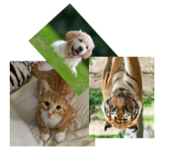 | 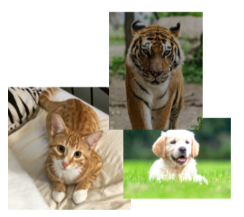 | 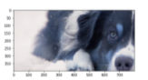 |
|                         Rotate, Flip                         |                    Brightness adjustment                     |                             Crop                             |
| 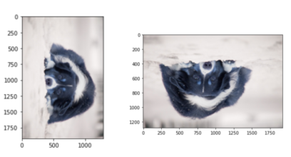 | 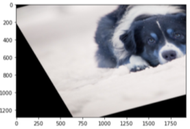 | 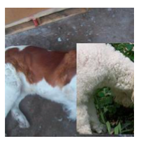 |
|                         Rotate, Flip                         |                    Affine transformation                     |                            CutMix                            |

**[table. 여러 종류의 augmentation 종류]**

```python
def brightness_augmentation(img):
    # numpy array img has RGB value(0~255) for each pixel
    img[:,:,0] = img[:,:,0]+100 # add 100 to R value
    img[:,:,1] = img[:,:,1]+100 # add 100 to G value
    img[:,:,2] = img[:,:,2]+100 # add 100 to B value
    
    img:[:,:,0][img[:,:,0]>255] = 255 # clip R values over 255
    img:[:,:,1][img[:,:,1]>255] = 255 # clip G values over 255
    img:[:,:,2][img[:,:,2]>255] = 255 # clip B values over 255
    return img
```

**[code. 밝기 조절 Augmentation 코드]**

```python
img_rotated = cv2.rotate(image, cv2.ROTATE_90_CLOCKWISE)
img_flipped = cv2.rotate(image, cv2.ROTATE_180)
```

**[code. 회전, 뒤집기 Augmentation 코드]**

```python
y_start = 500 # y pixel to start cropping
crop_y_size = 400 # cropped image's height
x_start = 300 # x_pixel to start cropping
crop_x_size = 800 # cropped image's width
img_cropped = image[y_start:y_start+crop_y_size, x_start : x_start + crop_x_size, :]
```

**[code. Crop Augmentation 코드]**

```python
rows, cols, ch = image.shape
pts1 = np.float32([[50,50],[200,50],[50,200]])
pts2 = np.float32([[10,100],[200,50],[100,250]])
M = cv2.getAffineTransform(pts1, pts2)
shear_img = cv2.warpAffine(image, M, (cols,rows))
```

**[code. Affine Transformation Augmentation]**

Affine Transformation : 사각형 이미지를, 기울어진 평행 사변형(parallelogram)의 형태로 바꿈 + rotation 함

- shear transformation 이라고도 함

RandAugment

- Augmenation의 종류, 강도(얼마나 밝은가, 얼마나 기울어졌는가 등)에 따라 모델 성능이 달라지므로, 이를 parameter로 사용할 수 있다.
- 랜덤으로 Augmentation을 적용한 뒤, 평가하는 과정을 거침

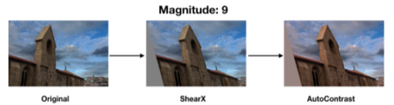

**[img. ShearX & AutoContrast 9 Randaug 예시]**

- 적용할 Augmentation, 적용 강도, 2가지가 Parameter로 적용

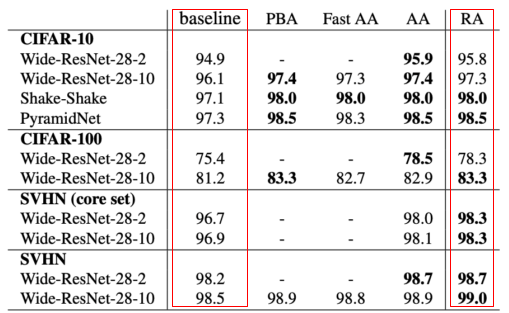

**[img. RandAugmentation 사용에 의한 성능 향상]**


### Leveraging pre-trained information
pre-trained 된 모델을 활용하는 방법

#### Transfer learning

Transfer learning: 한 데이터셋에서 배운 지식을 다른 데이터셋, 다른 Task에서 활용하는 기술

- 이를 통하여 작은 데이터셋으로도 높은 정확도를 자랑한다.

1. Transfer knowledge from a pre-trained task to a new task(같은 Layer, 다른 Task에 활용)

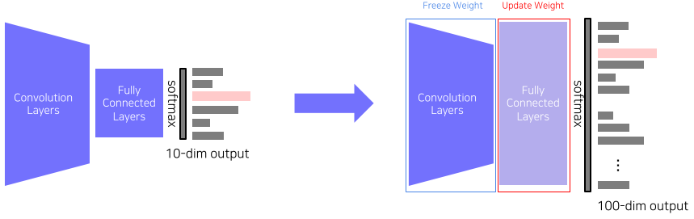

**[img. Transfer model(좌)를 원하는 업무에 맞게 FCL을 변경]**

- 마지막 Fully connected Layer만 바꾼 뒤, 이전 Convolution Layer의 Weight는 그대로 둔채 바꾼 층만 학습 시켜 활용하는 방법
- pre-trained 모델의 feature가 그대로 유지됨

2. Fine-tuning the whole model

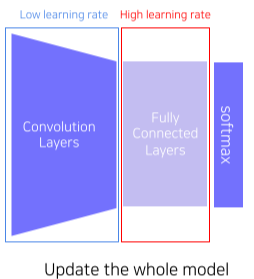

**[img. FCL을 변경 후 Convolution Layer도 Low lr로 학습]**

- 마지막 층을 바꾼 뒤, 기존 층은 낮은 Learnig rate, 새로운 층은 High learning rate를 유지하며 학습
- 자신의 Task에 맞게 기존 모델을 조금 수정가능

#### Knowledge distillation

pre-trained 모델의 예측값을 활용해 다른 모델을 학습시키는 방법

Teacher-student learning

보통 두가지 목적으로 쓰임

1. 더 경량화된 모델을 만들어, 기존 모델 보다 경량화에 사용
2. unlabeld dataset의 pseudo-labelling에 사용(레이블링 안된 데이터셋에 라벨링)


학습 구조에 따라 2가지로 나뉜다.

1. Teacher-student network structure

- student 모델(보통, Teacher Model보다 경량화되어 있다.)이 Teacher 모델의 output을 따라하게끔 학습시킴
- Unsupervised learning으로, label 되지 않은 dataset을 사용한다.
- 두 결과를 비교하여 KL divergence Loss를 통해 Loss 값을 구한뒤, student model로만 backpropagation이 진행되게 된다.
  - KL div Loss: 2개의 분포의 거리(=얼마나 비슷한가)를 측정

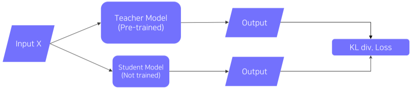

**[img. Teacher-student network structure]**


2. Knowledge distillation

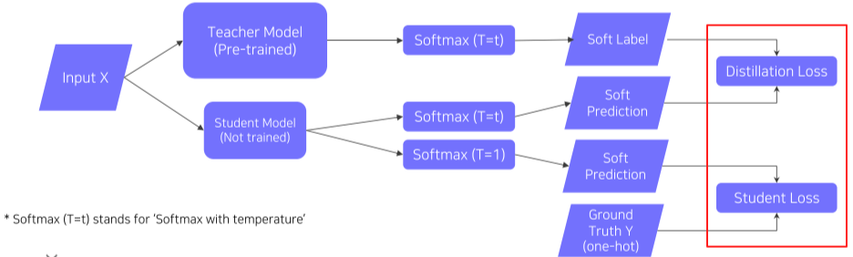

**[img. Knowledge distillation structure]**

- Labeled된 데이터셋을 사용할 때 사용하는 구조
- Student Model과 Teacher Model의 차이를 Distillation Loss, Student Model과 Ground Truth(Label)과의 차이를 Student  Loss라 정의 한다.
- 이때 Student 모델은 Soft label을 이용한 Soft Prediction을 이용한다.
  - Hard label(One-hot vector) : dataset의 label값처럼, 하나의 명확한 정답을 가짐
  - Soft label: model의 softmax를 통과한 뒤 기본 출력값, 여러 정답에 float 값을 가지는 가중치같은 형태
  - 이를 이용해 단순 정답이 아닌, 어느 정도로 정답에 근접했는가 등의 추가적인 정보를 사용하여 학습할 수 있다.


$$
Hard\ label:\begin{pmatrix}Bear\\Cat\\Dog\end{pmatrix}=\begin{pmatrix}0\\1\\0\end{pmatrix}\\
Soft\ label:\begin{pmatrix}Bear\\Cat\\Dog\end{pmatrix}=\begin{pmatrix}0.14\\0.8\\0.06\end{pmatrix}
$$
**[math. Hard label과 Soft label의 예시]**

- 또한 Knowledge distilation에서의 Distillation Loss를 구할 때, Softmax 함수에 temperature(T)를 이용하여 기존의 output보다 Smoothing한 결과를 사용할 수 있다.
  - 이를 이용해 좀더 결과값에 많은 정보를 포함할 수 있다.
  - 예를 들어 기존의 softmax(5,10) = (0.0067, 0.9933)이라면
  - t=100인 softmax(5,10) = ( 0.4875, 0.5125)로 비슷한 값을 smoothing 된다.
  - 전자의 결과의 0,0067은 무시될 정도로 작은 정보지만 후자의 경우는 무시못할 정보가 된다.


$$
Normal\ Softmax(=Hard\ Prediction):\frac{\exp(z_i)}{\sum_j\exp(z_j)}\\
Softmax\ with\ temperature\ T(=Soft\ Prediction):\frac{\exp(z_i/T)}{\sum_j\exp(z_j/T)}
$$
**[math. softmax with temperature]**

- Distillation Loss를 구할 때, Teacher Model의 soft Label의 세부정보(Semantic information)은 고려하지 않는다.
  - 교육받고 바꿔야할 모델은 Student Model 이기 때문에

Distillation Loss의 경우, Teacher model vs Student model의 차이를 의미

- KL divergence loss 사용: 비교 하는 두 값이 0~1사이의 값들의 분포이므로

Student Loss의 경우, 실제 답과 student model의 정답을 비교

- CrossEntropy 사용: True label의 경우 one-hot vector 형태이므로


마지막으로 위에서 구한 두 loss들의 가중치 합을 통해 loss를 구한 뒤, student model만, Backpropation을 한다.

### Leveraging unlabled dataset for training

#### Semi-supervised learning

- labeled된 적은 수의 데이터와, label되지 않은 많은 양의 데이터를 활용하는 방법
  - 즉 unsupervised + Fully supervised = semi-supervised

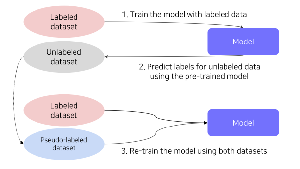

1) 레이블링된 데이터셋으로 모델 형성

2) 형성된 모델로 레이블링되지 않은 데이터셋 레이블링

3) 그렇게 레이블링된 데이터셋과 기존의 라벨링된 데이터셋으로 새로운 모델 형성

#### Self-training

앞서 배웠던 Data Augmentation, Knowledge distillation, Semi-supervised learning을 이용한 방법

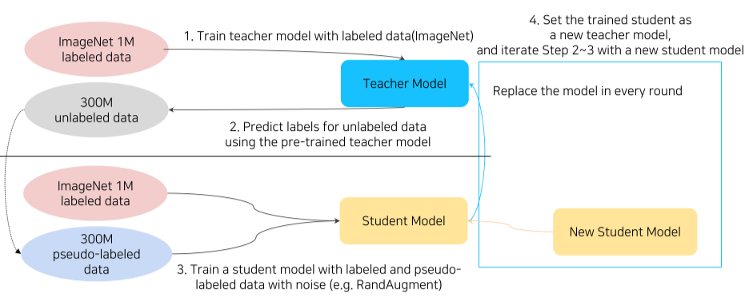

**[img. self-training의 단계]**

1. lable된 데이터셋으로 Teacher model을 형성한다.
2. 해당 Teacher model로 unlabled된 model을 Pseudo-labeled data로 만든다.
3. lable된 데이터셋 + pseudo-lable된 데이터셋을 augmentation 한 것을 통하여 새로운 Teacher model을 형성한다
   - 이때 주로 사용하는 augmentation  방법이 RandAugment
4. 새로 형성된 Teacher 모델로 2번부터 4번까지 반복한다. 

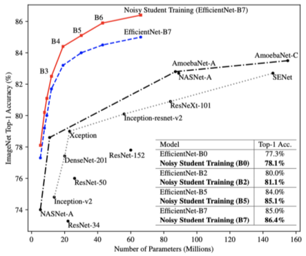

**[img. 압도적인 성능을 자랑하는 self-training 모델(빨간색)]**

## Image classification 2

### Problems with deeper layers

성능 향상을 위해 딥러닝 layer의 층을 높게 쌓으면서 다음과 같은 문제가 생겼다

1. Gradient vanishing/exploding 문제
2. Computationaly complex
3. 한때 overfitting 문제로 착각했던 Degradation problem

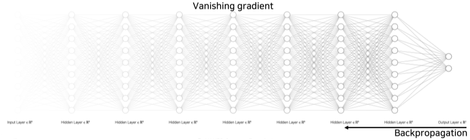

**[img. Vanishing gradient 문제의 도식]**

### CNN architectures for image classification 2

#### GoogLeNet

2015년에 발표된 Inception 모듈을 활용한 CV 모델

Inception module이란?

- 이전 층에서의 결과값에 여러개의 필터를 적용한 뒤, Concatenate하는 layer

  - 1x1, 3x3, 5x5 Convolution filter, 3x3 max pooling layer를 적용

  

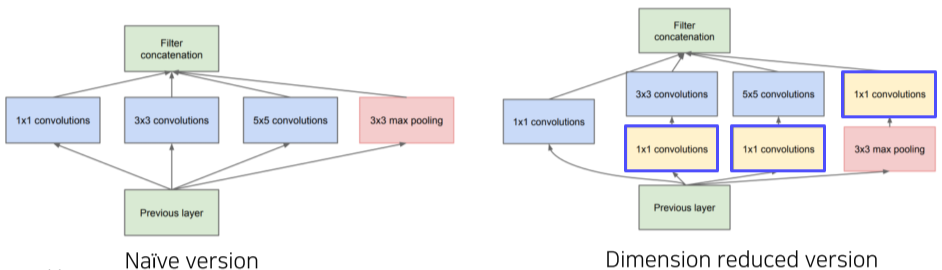

**[img. Inception module의 예시]**

이때, 여러 필터의 적용에 의해 parameter수가 증가하자, 1x1 convolution layer(Bottleneck layer)을 추가하여 파라미터 수를 줄이는 시도를 함

- 우측의 Dimension Reduced version에 추가된 1x1 convolution layer를 의미

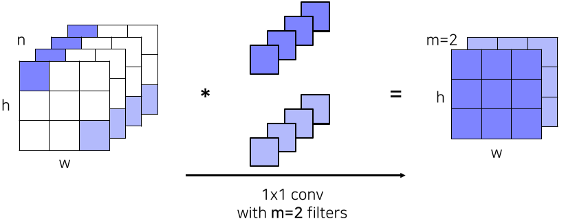

**[img. 1x1 convolution layer의 연산 결과]**

GoogLeNet의 전체적인 구조를 살펴보면 다음과 같다.

1. Stem network: 기본적인 convolution network

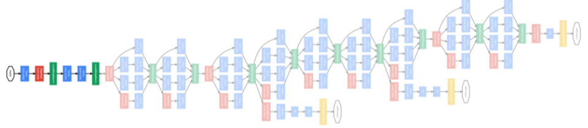

**[img. Stem network 부분]**

2. Stacked inception modules: 위에 설명한 Inception 모듈을 쌓아놓은 부분

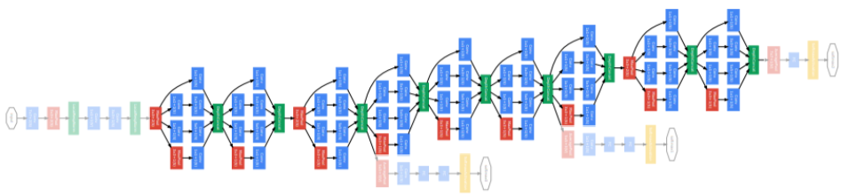

**[img. Stacked inception modules 부분]**

3. Auxiliary classifiers 

- Vanishing gradient 문제를 해결하기 위한 부분
- 중간의 결과값을 한번 예측값으로 삼고, loss 값을 계산하여 중간부터 backpropagation을 진행한다
- training에서만 사용하고 testing 단계에서는 사용하지 않는다.

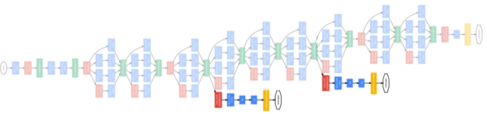

**[img. Auxiliary classifiers 부분]**

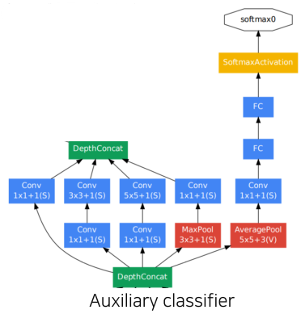

**[img. 더욱 자세한 Auxiliary classifier]**

#### ResNet

현재까지 기본 backbone으로 쓰이곤 하는 좋은 모델

- 최초로 인간 보다 나은 성능을 달성(에러율 기준)
- 기존의 모델보다 압도적으로 깊은 층의 갯수(152 Layer)

기존의 연구에서는 층이 깊을 수록 오히려 성능이 떨어지는 문제를 Overfitting 문제라고 오판하였다.

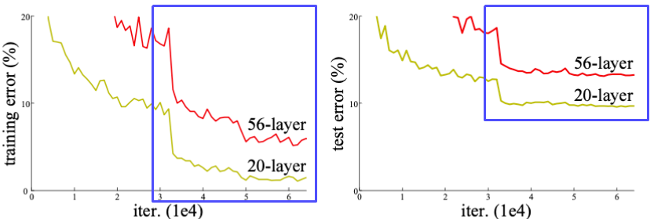

**[img. 층의 갯수에 따른 에러율, 높을 수록 안좋음]**

Overfitting의 문제였다면, training error는 점점 나아져야하고, test error가 나빠져야 하지만, 둘다 성능이 나빠졌기 때문이다.

따라서 Resnet에서는 이를 Overfitting이 아닌 Optimization(최적화)의 문제라고 보았다.

ResNet의 연구 가설은 다음과 같다.

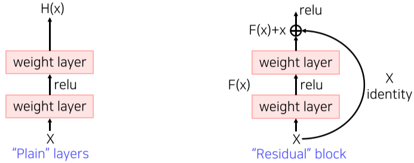

**[img. Residual block과 Plain layer의 차이]**

기존의 Plain layer의 경우 층이 깊어질 수록 복잡해진 H(x)에 X를 보존하면서 학습하기 힘들었다.

하지만 Residual block에서는 identity X를 F(X)에 더한 것을 H(X)로 삼으면서, X의 정체성이 뚜렷히 남은 상태에서, 분할정복 통해 최적화된 학습을 할 수 있다.

- 분할정복-> (F(x), X의 weight를 따로 구해서 더하면 되니까?)
- Target function : $H(x)=F(x)+x$
- Residual function : $F(x)=H(x)-x$ 

이를 위해 *Shortcut connection 또는 Skip connection*을 통해 x를 layer을 넘어 더해주어 Backpropagation 시 뛰어넘어 gradeint를 구할 수 있게 하였다.

- 이를 통해 Gradient vanishing 문제를 해결함

|                        Residual 구조                         |                      경로를 풀어본 구조                      |
| :----------------------------------------------------------: | :----------------------------------------------------------: |
| 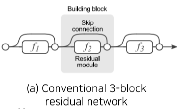 | 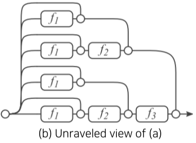 |

**[img. 같은 Residual 구조의 경로 풀이]**

이론상, Residual 구조를 통하여 생기는 경로는 층이 깊이 n에 따라 $O(2^n)$개 만큼 증가한다.

이 경로를 통해 backpropagation이 가능하므로 복잡한 학습을 해결 가능하다.

ResNet의 전체적인 구조는 다음과 같다.

1. He initialization conv layer

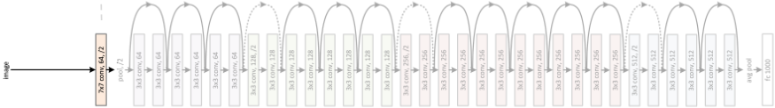

**[img. Resnet의 첫 시작 부분]**

- 첫 layer의 output은 앞으로 계속 identity connection을 통하여 더해질 것이므로, 최적화를 위해 단순하고 작은 크기의 output을 내놓아야 한다.
- 따라서 He initialization이라는 간단하고 ResNet을 위해 고안된 initialization을 이용한다.

2. Stacked residual blocks 부분

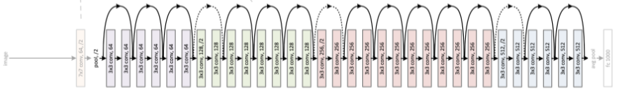

**[img. Stack residual blocks]**

- 모두 3x3 conv layer로 이루어져 있으며, Batch normalization이 매 layer 끝에 이루어진다
- 일정 블록 이후(색이 바뀌는 부분), 채널 수는 2배로 늘리고, 채널 해상도는 stride를 2로 잡아 줄이는 구간이 존재함

3. Output FC layer

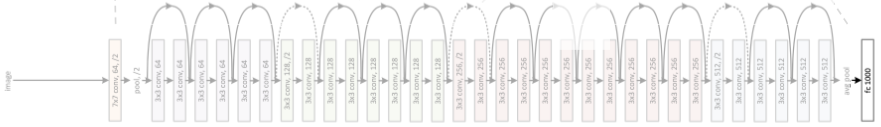

**[img. Sing FC layer]**

- 하나의 average pooling과  Fully connected layer을 통하여 classfication을 진행

**ResNet 코드**


**[img. ResNet code stack 수 정의 부분 ]**


**[img. ResNet code 첫시작, He initialization 부분 ]**


**[img. ResNet code, stacked residual 부분 ]**


**[img. ResNet code, Layer 생성 코드]**


**[img. ResNet code, 마지막 FC층 부분]**

#### Beyond ResNets

1. DenseNet


**[img. DenseNet 이미지]**

- ResNet과 달리 layer의 output이 이후의 모든 layer의 결과값에 Channel 축을 중심으로 Concatenate되서 합해진다.
- Cocatenate하므로 기존의 값들이 보존된다
2. SENet
- Activation의 결과가 명확해지도록 ouput의 채널축에 가중치를 주는 Attention across channel 방식
- feature의 중요도와 관계가 명확해짐
- Squeeze: global average pooling을 통하여 채널의 공간정보를 없애고(축의 정보 등) 분포를 구함
- Excitation: FC layer 하나로 채널간의 연관성(Weight=attention score)를 구함
- 중요도가 떨어지면 0에 가깝게 중요한 것은 크게 하여 feature의 강조와 무시를 함
3. EfficientNet
- 기존의 Network 알고리즘을 정리함

| 기본 Network                                                 | Width Scailing                                               | Depth Scailing                                               | Resolution Scaling                                           | Compound Scailing                                            |
| ------------------------------------------------------------ | ------------------------------------------------------------ | ------------------------------------------------------------ | ------------------------------------------------------------ | ------------------------------------------------------------ |
|  |  |  |  |  |
| 기준                                                         | 채널의 수를 늘리는 방식                                      | 층의 수를 늘리는 방식                                        | Input의 해상도를 높게 주는 방식                              | 앞의 방법들을 복합한 방식                                    |
| _                                                            | GoogLeNet 등                                                 | DenseNet 등                                                  | _                                                            | EfficientNet                                                 |

**[table. 기존의 Network의 분류]**

- 각 Scailing들은 파라미터 수, 학습 epoch, 데이터셋의 수에 따라 성능이 오르지않는 구간이 나오는데(saturation), 이를 모두 팩터(어느 정도 비율로 복합하는가)를 주고 복합하여 성능을 크게 상승시킴

- 사람이 찾은 효율적인 다른 구조들, NAS 알고리즘 구조(Neural Architecture Search, 컴퓨터가 효율적인 구조를 찾는 알고리즘)보다 성능이 압도적으로 좋다.


- 적은 연산으로도 성능이 크게 올라 EfficientNet이다.

4. Deformable convolution


- 동물, 사람, 등의 형태가 변할 수 있는 사물에 효율적인 구조
- feature를 나타내는 weight와, 이 weight의 위치를 어떠한 방향으로, 어떻게 변형시킬 지 결정하는 offsets를 학습하는 형식
- 기존의 정사각형 형태의 Receptive field와 달리 물체의 형태에 따라서 Receptive field 모양이 변함

### Summary of image classification


**[img. 앞서 배운 모델들의 비교, 면적은 모델의 크기]**

- AlexNet은 심플하지만 메모리 사용량이 크고 성능이 좋지 않다
- VGGNet은 성능이 낫지만 메모리와 연산을 많이 잡아 먹는다
- GoogLeNet의 최신 구조는 크기도 적고 성능도 좋지만, 구조가 복잡하다
- ResNet은 특출난 것이 없다
- GoogLeNet이 여러모로 좋지만 구조가 너무 복잡하여 VGGNet, ResNet을 기본 모델로 많이 사용한다.


## Semantic segmentation

### Semantic segmentation

이미지 각 픽셀의 어떠한 category에 속하는지 구분하는 문제(ex) 사람 영역, 자동차 영역)

같은 class의 다른 instance에는 관계가 없으며 이를 위한 instance segmentation가 있다.


**[img. Semantic segmentation의 예시]**

|  |
| :----------------------------------------------------------: |
|  |

**[table. 의료 사진, 자율 주행, 영상 합성 등에서 활용]**

### Semantic segmentation architectures

#### Fully Convolutional Networks(FCN)

Semantic segmentation을 위한 첫 End-to-End architecture


**[img. FCN 구조]**

- End-to-End 구조: 입력층부터 출력층까지 모두 미분가능하여 입력과 출력 pair만 있으면 모델을 학습할 수 있는 구조를 의미. 입력 사이즈 등의 제한이 없음
- 이전에는 완전학습 하기에 제한이 있었음
  - ex) AlexNet을 이용한 semantic segmentation의 경우, 학습 시의 이미지 해상도와 test 시의 이미지 해상도가 다르면 안됬음.


**[img. Fully connected layer vs Fully convolutional layer 구조 비교]**

| Fully connected layer(FCL)                                   | Fully convolutional layer                                    |
| ------------------------------------------------------------ | ------------------------------------------------------------ |
| <br />공간 정보를 고려하지 않는 모습 |  |
| fixed dimensional vector를 받아 fixed dimensional vector 출력, 보통 하나로 정해진 feature vector를 출력 | activation map을 받아 activation map 출력, 보통 1x1 conv layer로 구현하며, feature vector들이 포함된 convolutional feature map 출력 |

**[table. Fully connected layer vs Fully convolutional layer 세부 비교]**

다만 Receptive field를 살핀 뒤 feature를 찾아 작은 크기의 결과를 내는 conv layer와 pooling layer로 인해 출력 이미지의 해상도가 작아짐 => 이를 해결하기 위해 Upsampling layer가 나타남

Upsampling layer이란?


**[img Upsampling이 추가된 FCN]**

작아진 결과물을 크게 만들어주기 위해 Upsampling layer을 사용

3가지 방법 중 Unpooling 방법을 제외하고 2가지 방법이 이용됨

1. Transposed convolution


**[img. Transpose convolution의 원리]**

줄어든 이미지의 픽셀을 필터만큼 곱한 뒤, kernel 사이즈와 strider 크기에 따라 곱연산하여 더한다, 중첩 되는 부분은 덧셈연산이 일어난다.


**[img. Transpose convolution의 문제점]**

kernel 사이즈와 strider 크기에 주의하지 않으면, 겹쳐서 덧셈이 일어나는 부분에 의해 checker 무늬가 나타나게 된다.

2. Upsample and convolution

위 문제를 해결하기 위해 upsampling과 convolution을 같이 사용하여 중첩하는 부분뿐만 아니라 골고루 영향을 받게 해준다.

Transpose와 달리 layer을 하나가 아닌 2개로 분리하여 주로 영상처리에 사용하는interpolation 알고리즘(Nearest-neighbor(NN), Bilinear 등)을 사용하고 convolution을 이용하여 학습 가능하게 만든다.


**[img. 개선된 convolution]**


해상도를 낮추며 진행되는 conv layer 특성상, 층의 깊에 따른 특성은 다음과 같다. 

| 낮은 레이어층, 해상도 높음, Receptive field 작음 <====> 높은 레이어층, 해상도 낮음, Receptive field 큼 |
| :----------------------------------------------------------: |
|  |
| **디테일, 로컬 변화에 민감<====>전반적 의미적 정보를 포함**  |

**[table. 층의 깊이에 따른 output 값의 특징]**

결국 우리가 필요한건 구조의 깊은 부분의 의미적 부분(classify 해야하므로)과 구조의 얕은 부분의 디테일한 부분(고해상도로 픽셀을 선정해야 하므로)이 둘다 필요하므로 다음과 같은 방법으로 해결하였다.


**[img. FCN-Ns 모델들의 비교]**

마치 DenseNet이나 ResNet 처럼, 

1. 중간의 결과 값을 upsampling 한 뒤, 
2. 최종결과물을 upsampling한 것들을 
3. Concatenate하여 출력하면 좋은 결과가 나오며,

 얼마나 많은 층에서 결과값을 가져오느냐에 따라 FCN-32s, FCN-16s, FCN-8s 모델로 나누어진다.

- 숫자가 작아질 수록 더 많은 층의 결과값을 가져온 모델


**[img. FCN-Ns 모델들의 비교, 중간값을 많이 가져온 모델일 수록 정확한 결과가 나옴]**

#### Hypercolumns for object segmentation

|  |  |
| ------------------------------------------------------------ | ------------------------------------------------------------ |
| HyperColumn이라는 모든 Conv layer의 결과값을 각 픽셀 별로 쌓아 만든 vecotr를 이용함 | 물체의 bounding box를 추출하고 사용한다는 점이 다름          |

**[table. FCN과 비슷한 내용을 담은 HyperColumn 논문]**

#### U-Net

영상의 일부분만 쓰는 관련된 TASK의 경우 아직도 많이 활용되는 network

Fullay convolutional network가 기반이며, skip connection을 통하여 앞선 network 보다 더욱 정교한 결과를 만들 수 있음


**[img. U자 모양이라 U-Net]**

크게 2가지 부분으로 나뉜다.

1.  Contracting path 부분

- 입력 영상을 3x3 convolution을 이용해 max pool을 이용해 해상도를 낮추고 대신 2배씩 feature channel을 늘림
- 이를 통해 전체적인 의미, 문맥(holistic context)를 확보하는 부분이며 일반적인 FCN과 다를바 없음

2. Expanding(Upsampling, decoding) path 부분

- 2x2 up-convolution을 통하여 반대로 점진적으로 채널 수는 절반으로, 해상도는 2배로 늘림

- 추가로 이전 낮은 층의 layer의 activation map을 Skip connection으로 가져와 concatenating하여 사용함

  - 이를 통해 detail하고 local한 feature map을 받아 사용할 수 있음

  - 이때 concatenate하려면 해상도가 맞아야 하는데, 홀수이면, Downsample시, 일부 값을 버리게 되며, 다시 Upsample시 해상도가 달라지므로 해상도 크기가 홀수가 안되게 해야함.
    - ex) 7x7 =DownSample(divide 2)=> 3x3 (1은 버림) =UpSample(multiple 2)=> 6x6
    - 7x7과 6x6 해상도가 맞지 않아 Concatenate 불가

**U-Net Pytorch 코드**


**[img. U-Net Contracting Path code]**


**[img. U-Net Expanding Path code]**

#### DeepLab

널리 사용되는 CRFs, Atrous Convolution의 사용이 특징인 network, Deeplab v3+가 최신.

**CRFs(Conditional Random Fields)**

후처리로 사용됨, 픽셀 간의 관계를 그래프로 표현한 뒤, 최적화하여 경계를 찾는 원리

score map과 경계선이 맞도록 경계선 내외부의 확산을 반복한다.


**[img. CRFs 예시]**

**Atrous convolution(또는 Dilated convolution)**

커널크기를 정하고, 정의한 Dilation factor 만큼 커널을 띄어 계산하는 Convolution 방법

같은 parameter 수와 연산량으로 더욱 큰 Receptive size를 얻을 수 있다.


**[img. 좌측이 기존의 conv, 우측이 astrous conv]**

**Depthwise separable convolution**

입력 이미지 해상도가 클 경우, 너무 처리가 오래 걸리자, Dilated convolution + Depthwise separable convolution = Astrous separable convolution을 이용한다.

Depthwise separable convolution는 일반 convoution을 2개의 절차로 나누어 진행한다.


**[img.Standard vs Depthwise separable convolution의 차이]**

이로 인해 파라미터 수가 $D_k^2MND_F^2$에서 $D_k^2MD_F^2+ MND_F^2$로 감소하였다.

**DeepLab v3+의 구조**


**[img. 최신 DeepLab v3+의 구조 ]**

1. DCNN 부분에서 Dilated convolution을 통하여 feature map을 구함
2. Encdoer 중간 부분에 있는 Astrous spatial pyramid pooling을 이용해 다양한 scale의 정보를 Dilated conv로 여러 feature를 추출한 후 하나로 합쳐 1x1convolution으로 하나로 합친다. 
3. Decoder 부분에서 Low-Level Features와 Upsampling한 Pyramid pooling feature를 Concat한 뒤, 결과값을 낸다.

Semantic segmentation 뿐만 아니라, instance segmentation(Class 뿐만 아니라 객체 또한 탐지), panoptic segmentation(배경 정보+ instance segmentation)으로 성장하고 있다.

| <br />Original Image | <br />Semantic segmentation |
| :----------------------------------------------------------: | :----------------------------------------------------------: |
| <br />**Instance segmentation** | <br />**Panoptic segmentation** |

**[table. Image 인식 Tasks]**

## Object detection

### Object detection


**[img. Object detection의 예시]**

Classification + Box localization의 Task

즉, 바운딩 박스의 위치 + 물체의 소속까지 예측해야함, 고수준의 문제


**[imgs. 자율 주행, OCR 등의 산업에 사용됨]**

### Two-stage detector(R-CNN family)


#### Traditional methods- hand-crafted techniques 1. Gradient-based detector

과거에는 경계선의 특징으로 사람의 직관과 직접 설계한 알고리즘으로 Object Detection을 함

| Average Gradient                                             | max (+) SVM weight                                           | max (-) SVM weight                                           | Original Image                                               | R-HOG descriptor                                             | R-HOG w/ (+) SVM                                             | R-HOG w/ (-) SVM                                             |
| ------------------------------------------------------------ | ------------------------------------------------------------ | ------------------------------------------------------------ | ------------------------------------------------------------ | ------------------------------------------------------------ | ------------------------------------------------------------ | ------------------------------------------------------------ |
|  |  |  |  |  |  |  |

**[img. Gradient-based detector]**

- HOG : histogram of Oriented Gradients
- SVM : Support Vector Machine, 심플한 Linear 모델

#### Traditional methods- hand-crafted techniques 2. Selective search(Box-proposal algorithm)

최근의 초기 Object Detection에서 자주 사용한 기술로, 다양한 물체 후보군에 대해서 영역을 특정하여 Bounding-box를 제안해줌

| 순번 |                              1                               |                              2                               |                              3                               |
| :--: | :----------------------------------------------------------: | :----------------------------------------------------------: | :----------------------------------------------------------: |
| 구분 |  |  |  |
| 예시 |  |  |  |
| 설명 |    Over-segmentation<br />(비슷한 색, 분포끼리 영역 나눔)    |                     비슷한 영역끼리 합침                     |                     Bounding box를 추출                      |

**[table. Selective search 예시]**

#### R-CNN

딥러닝 기반, Alex Net 보다 압도적인 성능


**[img. R-CNN의 과정]**

1. 이미지 입력
2. 위의 Selective search 등의 bounding box 알고리즘으로 Region Proposal(최대 2천개까지)을 구함
3. 이미지 사이즈를 늘려서 해상도를 맞추고 미리 학습된(Pre-trained) CNN에 입력
4. SVM을 이용해 Classification

bounding box detection의 성능의 한계와 각각 bounding box 일일이 Classification 하므로 속도가 느림

#### Fast R-CNN

R-CNN과 달리 이미지의 학습된 feature를 재활용해서 속도를 향상(최대 ~18배 빠름)


**[img. Fast R-CNN의 과정]**

1. CNN을 통하여 feature map을 미리 뽑아냄
   - Fully Convolutional Network를 이용해 해상도 고정 문제를 해결했으므로 warping 안함
2. 이렇게 뽑은 feature map을 RoI pooling layer에서 관심영역(RoI, Region of Interest)만 뽑아 resize함
3. FC layer와 함께 결합된 bbox regressor와 softmax를 통해 각각 더욱 정교한 바운딩박스와 classification을 함

여전히 바운딩 박스 검출(Region Proposal) 성능에 한계를 가짐.

#### Faster R-CNN

Region Proposal 또한 딥러닝 기반으로 바꾼 최초의 End-to-End Object Detection 모델, 즉 모두 학습 가능함

**Intersection over Union(IoU)**


**[img. IoU의 정의]**

IoU (Intersection over Union) : 얼마나 bounding box가 잘 정합되어있는가를 정의

**Anchor Box**


**[img. Anchor Box 예시]**

각 위치에서 발생할 만한 박스 후보군들을 크기와 비율 별로 미리 정의해놓으며 이를 Anchor Box라고 함

Faster R-CNN에서는 보통 9개로 정의 해놓고, 더 많이 정의도 가능

각각 Anchoer box와 실제 값(Ground-Truth)의 IoU를 비교하여 정답인 Positive sample과 negative sample을 정의하여 학습시킴

- 보통 IoU가 0.7 이상이면 +, 0.3 이하면 -

**Region Proposal Network(RPN)**


**[img. Region Proposal Network(RPN)]**

특히, 기존의 느린 Region proposal 알고리즘을 딥러닝 기반 RPN으로 바꿨음

그 이외에는 기존의 Fast R-CNN과 비슷함


**[img. 자세한 RPN 과정]**

1. Sliding Door 방식으로 Window 마다 k 개의 anchor box 고려
2. 256 차원 feature map 추출
3. feature map에서 Classification을 위해 2000개의 score 를 추출, 동시에 바운딩 박스의 크기, 위치를 위해 4000개의 값을 추출
   - 계산속도를 늘리기 위해 Anchor box로 rough하게 정의한 후, 정교하게 바운딩박스 추출
   - Classification에서는 Cross Entropy loss, 바운딩 박스 추출은 Regression loss 사용
   - Anchor box 종류에 따른 Loss도 따로 있음

**Non-Maximum Suppressions (NMS)**

RPN에 의해 많은 Bounding box가 제안되며, 이때 NMS를 통해 최적의 Bounding box만 필터링한다.


**[img. NMS steps]**

1. 가장 높은 점수의 box를 선택
2. IoU를 다른 박스와 비교
3. IoU가 50 이상인 박스들 제거
4. 그다음 높은 점수의 box를 선택
5. 2~4 반복

|                            R-CNN                             |                          Fast R-CNN                          |                         Faster R-CNN                         |
| :----------------------------------------------------------: | :----------------------------------------------------------: | :----------------------------------------------------------: |
|  |  |  |

**[table. R-CNN Family 구조 비교]**

R-CNN Family은 Two-stage Detector의 대표 모델들이다.

### Single-stage detector

Single-stage detector은

정확도가 조금 뒤떨어지지만 리얼 타임 Detection 가능할 정도로 높은 속도에 중점을 둠

RoI pooling layer를 사용하지 않고, 간단한 구조와 빠른 속도를 자랑하는 경우가 많음

|                      One-stage detector                      |                      Two-stage detector                      |
| :----------------------------------------------------------: | :----------------------------------------------------------: |
|  |  |

**[tables. one-stage vs two-stage]**

#### YOLO(You only look once)


**[img. YOLO 과정]**

1. Input을 S 크기의 그리드로 나눔
2. 각 박스에 대하여 Boundig box와 Confidence를 예측
   - 이때, Ground truth와 IoU를 비교하여 학습함
3. 동시에 각 위치에서의 Class Score를 추가로 예측
4. NMS를 통해 Bounding box 추출


**[img. YOLO의 구조]**

일반 CNN 구조와 비슷하며 SxSx30의 아웃풋이 나옴

(채널수 30 = class probability 20 + x,y,w,h 각각 2채널)


**[img. YOLO 성능비교]**

Two-stage에 비해 성능은 떨어지지만 훨씬 빠르다.

- 성능이 떨어지는 이유는 맨 마지막 Layer에서 한번만 Prediction 하므로

**Single Shot Multibox Detector(SSD)**


**[img. SSD 예시]**

feature map들의 다른 해상도마다 적절한 크기의 Bounding box를 설정하게 해줌


**[img. SSD의 구조]**

VGG-16을 backbone으로, 다양한 Scale의 conv를 통과시켜 여러 해상도에 대응함


**[img. SSD 전체 anchor box 갯수 계산]**


**[img. SSD 성능 비교]**

속도와 성능이 YOLO 뿐만 아니라 R-CNN 계열 보다도 좋다.

### Single-stage detector vs. two-stage detector


**[img. Class imbalance Problem 예시]**

Class Imbalance Problem : 결과값에 필요없는 negative anchor box가 positive anchor box보다 훨씬 많은 문제 

**Focal Loss**


**[img. Focal loss 그래프]**

위의 Class Imbalance Problem를 해결하기 위해 제안됨

cross entropy loss의 연장선으로, 추가적인 확률 텀이 붙게 된다.

CE와 비교하여 $\gamma$값에 따라 정답의 경우 Loss를 더욱 낮게, 오답의 경우 Loss에 더욱 가중을 주게  된다.
$$
Cross\ Entropy\ Loss:CE(p_t)=-log(p_t)\\
Focal\ Loss:FL(p_t)=(1-p_t)^\gamma CE(p_t)=-(1-p_t)^\gamma
$$
**[math. Focal loss의 수식]**

**RetinaNet과 Feature Pyramid Networks(FPN)**

RetinaNet = FPN + class/box subnet

U-Net과 비슷한 구조로, low level의 feature와 high level의 feature를 합하여 class와 box_bounding을 각 위치에서 수행


**[img. RetinaNet 구조]**


**[img. RetinaNet 성능]**

비슷한 속도에 높은 성능을 보이며, 속도를 희생시키면 성능을 더 올릴 수 있음

### Detection with Transformer

**DETR**(DEtection TRansformer)

NLP에서 큰 혁신을 보여준 Transformer 구조를 Object Detection에 활용한 구조, 

DETR은 facebook에서 개발


**[img. Transformer 구조]**


**[img. DETR 구조]**

CNN의 feature와 pixle의 positional encoding을 합하여 encoder에 넣어준 후, N개의 Object queries와 함께 decoder에 넣어준 후, 각 픽셀의 class, bounding box를 출력해주는 구조


**[img. bounding box 이외의 방법들]**

이외에도 CornerNet, CenterNet 등 Bounding box 대신 중심점, 양 끝점을 찾는 연구 등이 진행되는 중

## CNN Visualization

CNN을 시각화하는 것

### Visualizing CNN


**[img. CNN is a black box]**

많은 경우 CNN의 내부 로직 등을 알 수 없거나, 신경쓰지 않고 개발하는 경우가 많다.

어째서 이러한 결과가 나왔는가? 무엇이 문제인가? 어떻게 하면 개선 가능한가? 등을 알아보기 위해 Black box 상태이 CNN 내부를 알아볼 필요가 있다.


**[img. ZFNet 예제]**

ZFNet 등에서는 각 level의 feature를 확인하여 학습을 파악할 수 있어서 이를 통해 성능을 개선시킬 수 있었다. 


**[img. 간단한 Filter weight visualization]**

저차원인 1번째 conv layer의 경우 3채널 또는 1채널로 이루어져있어 상단과 같이 직관적으로 Visualization이 가능하지만, layer가 깊어지면(고차원이 되면) 채널 수가 늘어나면서 인간이 이해 가능한 형태의 visualization이 불가능하다.


**[img. Types of neural network visualization]**

왼쪽으로 갈수록 모델에 대한 이해, 오른쪽을 갈수록 데이터 분석

### Analysis of model behaviors

고차원 layer의 feature들을 분석하는 방법을 알아보자

**고차원 Embedding feature analysis 1번째 방법 - 예제 검색 방법**

 

**[img. Nearest neighbors (NN) in a feature space]**

NN-search의 경우 feature space에서 가장 가까운 사진들을 비교(예제 검색)함으로써 분석이 가능하다.

상단의 코끼리 사진들을 보아, 잘 clustering 된걸 알 수 있으며, 하단의 강아지 사진으로 pixel 위치(강아지 형태, 위치)가 바뀌어도 모델이 잘 찾아낸다는 것을 알 수 있다.

이러한 예제 검색 방법의 Step은 다음과 같다.

1. 신경망을 통하여 Database에서 각 Input의 고차원 feature를 뽑아내 High dimensional feature space에 위치시킨다.


**[img. feature 추출 및 DB 위치]**

2. 검색하고 싶은 Input의 고차원 feature를 뽑아 낸 뒤 마찬가지로 High dimensional feature space에 위치시킨다.


**[img. Input 사진들의 feature의 위치]**

3. 가장 가까운 이웃의 feature를 가져온 뒤, 매칭되는 Input을 가져온다.


**[img. 사진과 가장 가까운 이웃들]**

4. 그 Input들과 비교하여 Visualization 한다.

단, 이 방법은 전체적인 형태가 아닌 일부 예제만 파악한다는 단점이 있음

**고차원 Embedding feature analysis 2번째 방법 - Dimensionality reduction(차원 축소)**

우리가 사는 3차원(시간을 포함하면 4차원) 공간에 맞게 고차원 공간을 낮추는 방법


**[img. 고차원 공간을 저차원 공간으로 변형]**

대표적인 방법으로 t-SNE가 있다

t-distributed stochastic neighbor embedding(t-SNE)


**[img. t-SNE를 통한 숫자 손글씨 구분(MNIST) feature space의 visualization]**

- 고차원 데이터를 2차원으로 매핑한 결과

- 3,5,8의 cluster가 한껏 뭉쳐있는 걸로 보아 CNN이 비슷하다고 느낀다는 것을 알 수 있다.

**중, 고차원 해석: Activation investigation 1-Layer activation**

Layer의 Activation을 분석하여 모델의 특성을 파악하는 방법


**[img. AlexNet의 Activation 분석]**

특정 Activation의 채널(hidden node)을 masking 한뒤 overlay하여 무슨 일을 하는 노드인가 알아볼 수 있다.

**중차원 해석: Activation investigation 2-Maximally activating patches**

각 채널의 hidden node의 가장 큰 값을 가지는 patch(activation)를 가져와 나열하는 것 


**[img. hidden node 별 image patch]**

이를 통해 각 히든 노드가 찾는 부분(=하는 일)을 알 수 있다.

국부적이므로 중차원 정도 해석에 어울린다.

1) 특정 layer의 특정 channel을 고른다.

2) input 이미지를 집어 넣은 후 선택한 채널의 activation 값을 저장한다

3) 최대 activation value의 Receptive field를 Input에서 crop하여 image patch로 만든다.

**결과 해석: Activation investigation 3-Class visualization**

예제 데이터 사용없이 네트워크가 기억하는 이미지가 무엇인지 판단

ex)이 CNN은 특정 클래스의 이미지를 대략 어떻게 생겼다고 기억하고 있는가?


**[img. CNN이 기억하고 있는 개와 강아지의 모습]**

편향 등을 알아볼 수도 있다. (ex) 위 새 사진은 많은 데이터가 나무와 함께 찍힘)

$$
I^*=\underset{I}{argmaxf(I)}-Reg(I) =\\
I^*=\underset{I}{argmaxf(I)}-\lambda \left\|I\right\|^2_2\\
\lambda \left\|I\right\|^2_2, Reg(I):Regularizaion\ term\\
I: 영상\ 입력, f(I):CNN\ 모델
$$
**[math. Gradient ascent, 일종의 Loss]**

Gradient ascent를 통하여 Visualization을 위한 이미지를 합성하게 된다.

$argmaxf(I)$를 통하여 Input image I를 돌며 각 클래스의 가장 높은 스코어를 얻는다.

너무 큰 스코어 값이 나오는 것을 막고, 이해할 수 있는 형태로 바꾸기 위해 Regularizaion term 추가

최대 스코어값을 찾으려는 과정이므로 Gradient ascent이며, 부호만 바꾸면 Gradient descent이므로 해당 알고리즘을 그대로 사용할 수 있다.

1) 임의의 영상(검정, 하양, 회색 혹은 랜덤한 이미지)을 CNN에 넣어 관심 class의 prediction score를 추출

​	- 처음 주는 영상부터 바뀌기 시작하므로 초기값의 설정에 따라 완성 이미지가 바뀐다.

2) Backpropagation으로 gradient maximizing하여 관심 class의 prediction score가 높아지는 방향으로 입력단의 이미지를 업데이트해준다.

3)  업데이트된 영상으로 1~2를 계속 반복한다

### Model decision explanation

모델이 특정 입력을 어떤 각도로 해석하는 가에 대한 설명

#### Saliency test 계열

주어진 영상의 제대로 판정되기 위한 각 영역의 중요도를 판별

이때 중요도가 표시된 그림을 Saliency map이라고 한다.

**Occlusion map**


**[img. Occlusion map 예시]**

특정 픽셀을 가려서 바뀌는 Predicdtion score 값을 Heatmap 형식으로 표현한 것

영상의 가린 부분에 따라, 많이 떨어지면 중요한 영역이며 적게 떨어지면 덜 중요한 부분이다.

이 떨어진 정도를 표시하여 표현할 수 있다.

**via backpropagtion**


**[img. backpropagation을 이용한 saliency map 예시, 밝은 부분이 판단에 중요한 영역]**

앞서 했었던 Class visualization의 Gradient ascent와 비슷

랜덤이미지가 아닌 특정 이미지를 classification을 한 뒤, class score에 대한 backpropagation으로 관심 영역의 점수를 표시하는 방법

1) 입력 영상을 넣어 특정 class의 score를 얻어낸다

2) Backpropagation으로 Input까지 진행해 gradient를 얻어낸다.

3) gradient의 절대값 또는 제곱값을 하여 얻어낸 gradient의 크기를 이미지형태로 얻는다

- 이를 gradient magnitude map이라고 한다.
- 이를 여러번 반복하여 더욱 정확한 Saliency map를 얻어낼 수 있다.


backpropagation을 이용한 더 진보적인 visualization 방법으로 *Deconvolution*이 있다.


**[img. Dconvolution의 결과물]**


**[img. ReLU의 작용과 deconvnet의 차이]**

보통 CNN의 경우 Forward pass 시 음수는 ReLU 함수를 통과하며 0으로 마스킹되며,

Backward pass 시 이를 기억하여, 해당 픽셀을 다시 0으로 마스킹한다.

하지만 deconvnet은 backward 시 Forward pass때 처럼 음수가 0으로 마스킹된다.
$$
ReLU:h^{l+1}=max(0,h^l)\\
backpropagation:\frac{\partial L}{\partial h^l}=[(h^l>0)]\frac{\partial L}{\partial h^{l+1}}\\
deconvnet:\frac{\partial L}{\partial h^l}=[(h^{l+1}>0)]\frac{\partial L}{\partial h^{l+1}}
$$
**[math. 기존의 pass와 deconvnet의 pass의 수식화]**


또한, 기존의 방법과 deconvnet의 And 연산하여 만든 Guided Backpropagation 또한 가능하다.

|  |
| :----------------------------------------------------------: |
| $\frac{\partial L}{\partial h^l}=[(h^{l+1}>0)\&(h^{l+1}>0)]\frac{\partial L}{\partial h^{l+1}}$ |

**[table. Guided backpropagation]**


**[img. Guided backpropagation과 다른 방법들 비교]**

수학적으로 구한 것이 아니라 경험적으로 구했지만 결과는 괜찮게 나온다고 한다.

forward 시 결과를 미친 양수 pixel과 backward 시 '이 부분은 증폭하라'의 의미를 가진 양수 pixel만 받아들인 결과 => 즉 classification에 긍정적 영향을 끼친 pixel만 표시되게 됨

**Class activation mapping(CAM)**

어떤 부분을 참조하여 결과가 나왔는지 보여줌.


**[img. CAM 예시]**

기존의 CNN 구조를 조금 바꾸어야 한다.


**[img. CAM을 쓸 수 있게 개조된 CNN]**

기존의 출력 이전의 FC Layer 대신 Conv Layer 이후에 Global average pooling (GAP) Layer와 FC layer 한 층이 삽입된다.

이후 Classification에 대해 재학습된다.
$$
S_c=\overset{Channels}{\sum_k}w_k^c\overset{GAP\ feature}{F_k}\overset{GAP}{=}\sum_kw_k^c\sum_{(x,y)}\overset{Feature\ map\\before\ Gap}{f_k(x,y)}=\\
\sum_{(x,y)}\ \ \overset{CAM_c(x,y)}{\sum_kw_k^cf_k(x,y)}\\
S_c:Score\ of\ the\ class\ c\\
k: 마지막\ conv\ layer\ channel\ 수
$$
**[math. CAM이 포함된 CNN 구조 유도]**


**[img. GAP layer 부분의 작용]**

(+) 성능이 좋아 가장 많이 사용되는 Visualization 방법

(+) 공간 정보를 주지(supervision?) 않아도 공간에 대한 정보가 나타남

이를 통해 bounding box를 쳐주면 object detection으로 사용 가능

- Weakly supervised learning이라고 함

(-) 구조를 바꾸고 재학습을 해야하며, 이 과정에서 성능이 바뀔 수 있다는 점이 단점

**Grad-CAM**

구조를 바꾸지 않아도 활용할 수 있는 CAM 구조


**[img. Grad-CAM의 예시]**

(+) CAM과 비슷한 성능, 구조를 바꾸지 않아도 됨


**[img. Grad-CAM의 구조]**

$\overset{CAM_c(x,y)}{\sum_kw_k^cf_k(x,y)}$ 부분에서 $w_k^c$(importance wieghts)만 구하면 맵을 그릴 수 있다.

Backpropagation을 Input 이미지가 아닌 관심을 가지는 activation map까지만 진행하며, 그렇게 구한 importance weight ($\alpha_k^c$)와 activation map($A^k$)를 선형결합하여 ReLU를 씌워 양수값만 사용
$$
\overset{Global\ average\ pooling}{\alpha^c_k=\frac{1}{Z}\sum_i \sum_j \frac{\partial y^c}{\partial A_{ij}^k}}\\
L^c_{Grad-CAM}=ReLU(\sum_k\alpha^c_kA^k)\\
\alpha^c_k: importance\ weight\ of\ the\ k-th\ feature\ map\ w.r.t\ the\ class\ c\\
\frac{\partial y^c}{\partial A_{ij}^k} : Gradients\ via\ backprop
$$
**[math. Grad-CAM 수식]**

영상 인식 뿐만 아니라 CNN 구조만 존재하면 어떤 Task에도 활용 가능


**[img. Grad-CAM 활용 예시와 Guided Grad-CAM]**

추가로 Guided Backprop을 추가하고, Grad-CAM을 내적하여 Guided Grad-CAM을 구하는 것이 일반화 되어있다.

- Guided Backprop(sharp 하지만 class 구분 불가) + Grad-CAM (Rough하고 smooth하지만 class 구분 가능) = Guided Grad-CAM (서로 단점 보완)


**[img. SCOUTER 예시]**

최근에는 해석 결과에 대한 질문에 대해 답을 줄 수 있는 Visualization 방법(SCOUTER)도 등장함

Visualization 기술을 응용해 GAN에 이용하여 명령을 내릴 수 있음(GAN dissection)


**[img. 표시한 부분에 문을 생성하는 예시]**


