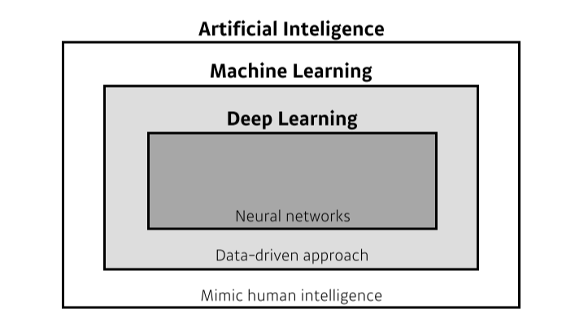

# DLBasic

> 본 자료는 Naver BoostAI camp의 강의를 정리한 내용입니다

## Historical Review

### 소개

- 구현(코딩) 실력, 수학 스킬, 최신 논문 기술 등의 능력이 중요하다.

**[img 0. 인공지능의 대분류]**

- 인공지능 : 인간의 지능을 흉내
- 머신러닝 : 데이터를 통해 인공지능을 학습
- 딥 러닝 : 심층 신경망을 활용한 모델 이용하는 머신러닝, network를 깊게 쌓음

- 딥러닝에 필요한 4가지 요소
  - 모델이 학습할 데이터 : 풀고자할 문제에 따라 필요한 데이터가 다르다.
    - Detection, Classification, Visual QnA 등
  - 데이터로 학습, 판단할 모델 : 데이터를 필요한 데이터로 바꿔주는 것
    - AlexNet, GoogLeNet, GAN 등
  - 모델 학습 방법인 loss 함수 : 모델을 학습하는 방법
    - 단순히 줄이는 것이 아니라 학습하지않은 데이터등에도 동작해야함.
    - MSE, CE, MLE 등
  - loss 함수를 최소화할 알고리즘 : loss 를 어떻게 줄일 것인가?
    - SGD, Adagrad 등이 있음
    - 추가로 Ensemble, MixUp, Dropout 등 테크닉이 있음

### 딥러닝의 역사

>  Denny Britz의 Deep Learning's Most Importat Ideas - A Bref Historical Review를 참조함

- 2012 - AlexNet: 최초로 인공지능 대회에서 1등을 한 DeepLearning 방법론. 시초
- 2013 - DQN : 강화학습에 쓰인 방법론, Q Learning 접목, Deepmind의 작품
- 2014 - Encoder/Decorder : 인공지능 번역에 쓰이는 방법론, 다른 언어의 연속으로 번역
- 2014 - Adam Optimizer :  효과 좋은 optimizer, 왠만하면 잘된다라는 뜻이라고 함.
- 2015 - Generative Adversarial Network(GAN) : 새로운 것을 생성하는 데 많이 사용하는 AI
- 2015 - Residual Networks(ResNet) :  너무 깊어진 Network layer의 성능 저하를 막아줌
  - input을 추가로 넣어주는 것
- 2017 - Transformer : attention 구조를 이용한 google의 방법론
- 2018 - BERT(fine-tuned NLP models) : Transformer + bidirection 구조를 활용한 모델
  - Bidirectional Encoder Representations from Transformers의 약자
- 2019 - Big Language Models(GPT-X) : OpenAI에서 만든 BERT의 Language 모델, 굉장히 많은 parameter로 이루어짐
- 2020 - Self-Supervised Learning: SimCLR( a simple framework for contrastive learning of visual representations)의 줄인말, 학습 데이터 외의 라벨을 모르는 데이터를 활용, 지도 학습 + 비지도 학습
  - 시뮬레이터, 도메인 지식을 활용해 학습 데이터를 추가로 만드는 연구도 활발히 이뤄지는 중