[TOC]

# DLBasic

> 본 자료는 Naver BoostAI camp의 강의를 정리한 내용입니다

## Historical Review

### 소개

- 구현(코딩) 실력, 수학 스킬, 최신 논문 기술 등의 능력이 중요하다.

**[img 0. 인공지능의 대분류]**

- 인공지능 : 인간의 지능을 흉내
- 머신러닝 : 데이터를 통해 인공지능을 학습
- 딥 러닝 : 심층 신경망을 활용한 모델 이용하는 머신러닝, network를 깊게 쌓음

- 딥러닝에 필요한 4가지 요소
  - 모델이 학습할 데이터 : 풀고자할 문제에 따라 필요한 데이터가 다르다.
    - Detection, Classification, Visual QnA 등
  - 데이터로 학습, 판단할 모델 : 데이터를 필요한 데이터로 바꿔주는 것
    - AlexNet, GoogLeNet, GAN 등
  - 모델 학습 방법인 loss 함수 : 모델을 학습하는 방법
    - 단순히 줄이는 것이 아니라 학습하지않은 데이터등에도 동작해야함.
    - MSE, CE, MLE 등
  - loss 함수를 최소화할 알고리즘 : loss 를 어떻게 줄일 것인가?
    - SGD, Adagrad 등이 있음
    - 추가로 Ensemble, MixUp, Dropout 등 테크닉이 있음

### 딥러닝의 역사

>  Denny Britz의 Deep Learning's Most Importat Ideas - A Bref Historical Review를 참조함

- 2012 - AlexNet: 최초로 인공지능 대회에서 1등을 한 DeepLearning 방법론. 시초
- 2013 - DQN : 강화학습에 쓰인 방법론, Q Learning 접목, Deepmind의 작품
- 2014 - Encoder/Decorder : 인공지능 번역에 쓰이는 방법론, 다른 언어의 연속으로 번역
- 2014 - Adam Optimizer :  효과 좋은 optimizer, 왠만하면 잘된다라는 뜻이라고 함.
- 2015 - Generative Adversarial Network(GAN) : 새로운 것을 생성하는 데 많이 사용하는 AI
- 2015 - Residual Networks(ResNet) :  너무 깊어진 Network layer의 성능 저하를 막아줌
  - input을 추가로 넣어주는 것
- 2017 - Transformer : attention 구조를 이용한 google의 방법론
- 2018 - BERT(fine-tuned NLP models) : Transformer + bidirection 구조를 활용한 모델
  - Bidirectional Encoder Representations from Transformers의 약자
- 2019 - Big Language Models(GPT-X) : OpenAI에서 만든 BERT의 Language 모델, 굉장히 많은 parameter로 이루어짐
- 2020 - Self-Supervised Learning: SimCLR( a simple framework for contrastive learning of visual representations)의 줄인말, 학습 데이터 외의 라벨을 모르는 데이터를 활용, 지도 학습 + 비지도 학습
  - 시뮬레이터, 도메인 지식을 활용해 학습 데이터를 추가로 만드는 연구도 활발히 이뤄지는 중

## 뉴럴 네트워크(Neural Networks) - MLP

### Neural Networks

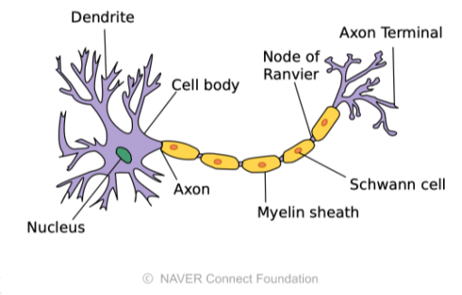

**[img 1. 두뇌 속의 신경망]**

>  *동물의 생물학적 신경망에서 영감을 받은 컴퓨팅 시스템* - wikipedia

- 생물학적 구조만 비슷할 뿐, 실제 작동원리와는 관계없음.

- 행렬의 곱과 비선형 연산의 반복을 통하여 함수(논리)를 근사추정하는 것.
  - neural networks are function approximators that stack affine transformations followed by nonlinear transformations.

### Linear Neural Networks

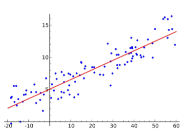

**[img 2. 선형 모델 그래프]**

- Data: $\mathcal{D} = {(x_i,y_i)}^N_{i=1}$ : input 값과 output 값이 각각 하나
- Model: $\hat{y} = wx+b,\ \hat{y} : 모델의\ 예상치$ : 선형 그래프로 이루어짐

- Loss: $loss =\frac{1}{N}\sum^N_{i=1}(y_i-\hat{y_i})^2$ : 실제 값과 얼마나 다른가에 대한 척도, 보통 MSE loss 함수로 loss 측정

$$
\frac{\partial loss}{\partial w} = \frac{\partial}{\partial w} \frac{1}{N}\sum^N_{i=1}(y_i - \hat{y_i})^2 = \frac{\partial}{\partial w} \frac{1}{N}\sum^N_{i=1}(y_i - wx_i-b)^2 =-\frac{1}{N}\sum^N_{i=1}-2(y_i-wx_i-b)x_i \\
\frac{\partial loss}{\partial b} = \frac{\partial}{\partial b} \frac{1}{N}\sum^N_{i=1}(y_i - \hat{y_i})^2 = \frac{\partial}{\partial b} \frac{1}{N}\sum^N_{i=1}(y_i - wx_i-b)^2 =-\frac{1}{N}\sum^N_{i=1}-2(y_i-wx_i-b)
$$

**[math 2. backprogation을 이용한 w와 b의 편미분값 구하기]**
$$
w = w - \eta\frac{\partial loss}{\partial w},\ b = b-\eta \frac{\partial loss}{\partial b}
$$
**[math 2-1. loss 값을 줄이기 위한 새로운 w와 b 업데이트]**

- 이러한 방식으로 최적값을 구하는 것을 gradient descent라고 한다.

- matrix 연산을 통하여 여러 차원의 input과 output 또한 해결 가능
  - matrix 연산은 두 벡터 공간 상의 변환을 의미함

### Activation function and Multi-layer Perceptron 

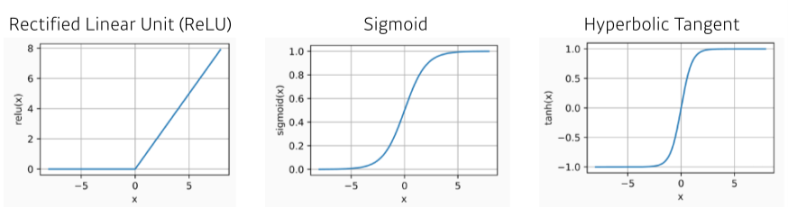

**[math 3. Activation fucntion의 종류와 그래프 모양]**

- 각 문제, 데이터마다 사용해야할 Activation function이 다르다.

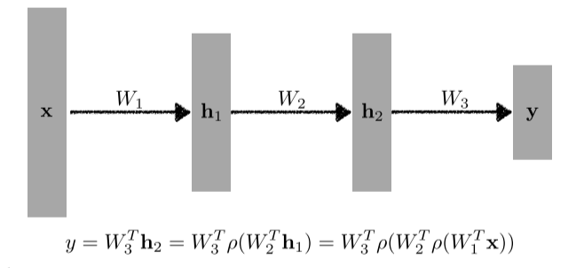

**[img 3. Multi-Layer Perceptron]**

- 이러한 여러 matrix 연산과 matrix 연산 사이의 activation function에 의해 nonlenar transform을 거쳐서 여러 층의 neural network가 된다.

- 각 문제마다 loss function을 다르게 하게 된다.

  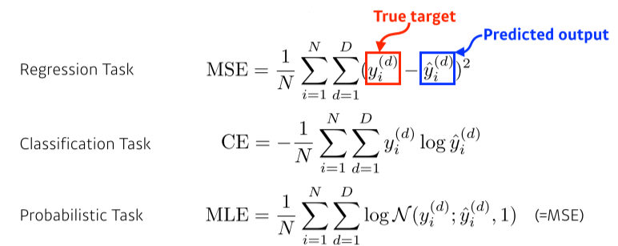

  - Regression Task : 선형 문제 (집 크기 vs 집 가격) 같은 문제에서는 MSE 등을 사용
  - Classification Task : 분류 문제(손글씨 숫자 구분) 같은 문제는 CE 등을 사용(가장 높은 확률의 class를 선택)
  - Probabilistic Task : 확률 문제(나이 맞추기 ) 같은 문제에는 MLE를 사용.

**[img 3. Multi-Layer Perceptron]**

- 실습은 https://colab.research.google.com/drive/14lEFtnt3kEn-LiwTKTwpUB-3VQ0Xx84W#scrollTo=3AS5BdrMw1E9 또는 mlp.ipynb 파일 참조

### Optimization

관련 실습 : https://colab.research.google.com/drive/1p4H1mZpa41n3C8fQCtknQ0NfJGtEUIl6#scrollTo=B-uu6x8DFwZ9 혹은 optm.ipynb 참조

#### 용어의 정의

- Gradient Descent(경사 하강): 반복 1차 미분을 통하여 loss의 국소 최소점을 찾는 알고리즘
  
- First-order iterative optimization algorithm for finding a local minimum of a differntiable function.
  
- Generalization(일반화): training error와 test error의 차이가 적음을 의미.

  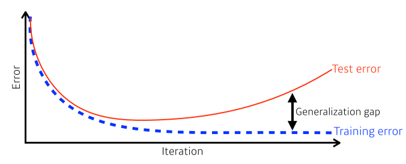

  **[img 4. generalization의 그래프]**

  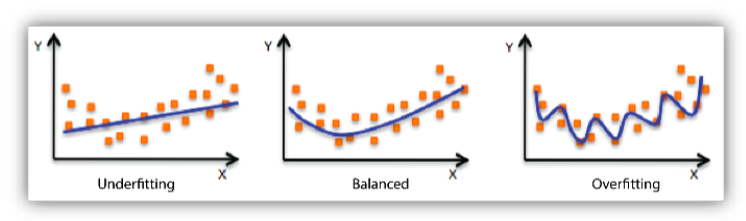

  **[img 4-1. fitting의 도식화]**

  - underfitting은 너무 training을 안해서 그래프가 적절하지 않음
  - overfitting은 너무 training을 많이해서 유연성이 없고, 해당 데이터 이외의 데이터에 부적합

- Cross-validation(교차 검증, 또는 k-fold validation)

  - 데이터를 k개로 나눈 뒤 학습 데이터와 검증(validation) 데이터를 바꿔가며 hyper parametr를 정하는 모델 검증 기술
  - training, validation, test 데이터로 나누게 된다.

  - parameter : 최적해에서 찾는 값(weight, bias 등)
  - hyper-parameter: 내가 시작할 때 주는 값(loss function, learning rate 등)

- Bias(편향) and Variance(분산도):  분산이 적은 것이 좋다.
  - 우리가 줄이는 cost는 사실 여러 부분으로 나뉘며 무엇을 줄일 지 생각해봐야한다.
  - noise가 많은 데이터면 bias와 variance를 둘다 줄이는 것이 힘드므로 골라야함

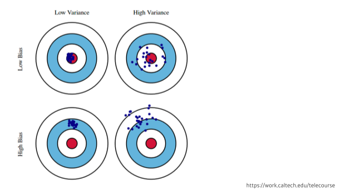

**[img 4-2. bias, variance 그림]**
$$
Given\ \mathcal{D} = \{(x_i,t_i)\}^N_{i=1},\ where t = f(x)+ \epsilon\ and\ \epsilon \sim \mathcal{N}(0, \sigma^2)\\
\stackrel {\mathbb{E}\left[(t-\hat{f})^2\right]}{cost} = \mathbb{E}\left[(t-f +f-\hat{f})^2\right]=\dots=\stackrel {\mathbb{E}\left[(f-\mathbb{E}[\hat{f}]^2)^2\right]}{bias^2}+\stackrel {\mathbb{E}[(\mathbb{E}[\hat{f}]-\hat{f})^2]}{variance}+\stackrel {\mathbb{E}[\epsilon]}{noise}
$$
**[math 4. cost(loss)의 구성]**

- bootstrapping : 학습 데이터를 일부만(예를 들어 80%만) 쓴 데이터를 각기 달리하여 여러개 만들어 랜덤 샘플링하여 학습시켜 보는것
  - 학습결과가 일정하면 데이터가 일정한 것이고, 결과가 각양각색이면 편차가 큰 것이다.
  - 이렇게 만든 여러 학습 데이터의 여러 모델의 평균이나 voting을 취하기도 함.(앙상블)

- bagging(Bootstrapping aggregating) vs boosting
  - bagging : bootstraping으로 만들어진 여러개의 모델 (앙상블 기법)
  - boosting : 전체 데이터로 학습 해본 뒤, 해당 모델로 결과를 측정해 잘 예측못하는 데이터만 모아서 가중치를 더 크게 준 뒤, (랜덤 뽑기에 더 많이 할당?) 새로운 모델로 만든 뒤 이전 모델과 합치는 형식으로 진행 (앙상블 기법의 한 종류)

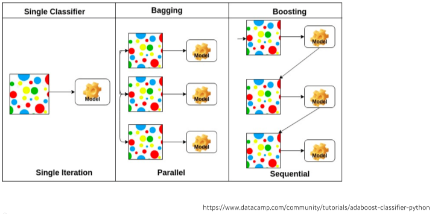

**[img 4-3. bagging boosting 그림]**

#### Practical Gradient Descent Methods

##### Gradient Descent Methods

- Stochastic gradient descent
  - update with the gradient computed from a single sample
  - 하나의 샘플마다  경사를 계산
- Mini-batch gradient descent
  - update with the gradient computed from a subset of data
  - batch 크기의 샘플마다 경사를 계산
  - 가장 자주 사용함
- Batch gradient descent
  - update with the gradient computed from the whole data
  - 한번에 모든 샘플을 활용하여 경사를 계산

##### Batch-size Matters

- 일반적으로 batch size가 너무 작으면 너무 오래걸리고, 크면 계산량이 너무 많다.
- 연구 결과 batch-size가 작을 수록 유리하다는 것이 실험적으로 증명됨

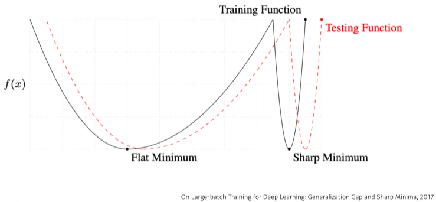

**[img 5. batch size가 작을 수록 좋은 이유]**

- batch size가 작으면 Flat Minimum, 크면 Sharp Minimum으로 도착하는 경향이 크다.
- Flat Minimum은 test data 에서도 generalization이 잘되있지만 sharp minimu에서는 실제 testing 데이터와 갭이 크다.

#### optimizer

- 특성을 확인하고 상황에 따라 골라서 사용해야함

##### Gradient Descent

$W_{t+1} \leftarrow W_t - \eta g_t,\ \eta:learning\ rate,\ g_t:Gradient$

**[math 6. 경사하강법 ]**

- 가장 기본적인 방법
- 적절한 learning rate를 잡는 것이 힘듦

##### Momentum

$$
a_{t+1} \leftarrow \beta a_t + g_t\\ a_{t+1}:accumulation,\ \beta: momentum \\
W_{t+1} \leftarrow W_t - \eta a_{t+1}\\ \eta:learning\ rate
$$

**[math 6-1. 모멘텀 개념]**

- 이전 gradient의 값이 영향을 조금 받은 gradient로 업데이트
- 기본버전보다 조금 낫다. 

##### Nestrerov Accelerated Gradient

$$
a_{t+1} \leftarrow \beta a_t + \nabla \mathcal{L}(W_t-\eta \beta a_t)  \\ \nabla \mathcal{L}(W_t-\eta \beta a_t):Lookahead\ gradient,\ \beta: momentum \\
W_{t+1} \leftarrow W_t - \eta a_{t+1}\\ \eta:learning\ rate,\ g_t:Gradient
$$

**[math 6-2. NAG]**

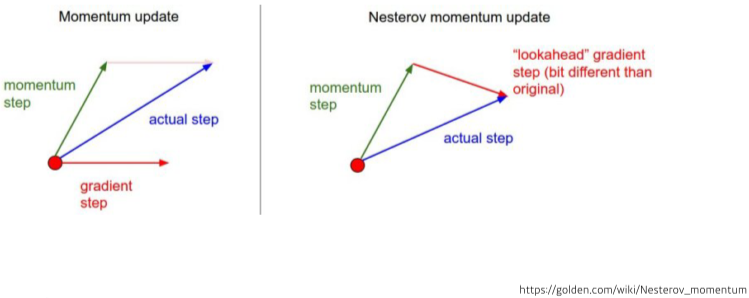

**[img 6. NAG와 Momentum 차이점]**

- momentum을 계량함
- 최소 지점에 도달하는 것이 증명됨
- 이전 gradient와 현재 그레디언트로 구하는 방법과 달리 이전 momentum gradient 벡터에서 현재 벡터로 이동한다는 다른점이 있음

##### Adagrad

$$
W_{t+1} = W_t - \frac{\eta}{\sqrt {Gt+\epsilon}}g_t\\
G_t : Sum\ of\ gradient\ squares,\ \epsilon:for\ numerical\ stability
$$

**[math 6-3. Adagrad 개념]**

- 파라미터의 변화량이 너무 적게 변하면 크게, 많이 변화해온 파라미터는 적게 learning rate를 잡아주어 조정해줌
- 뒤로 가면 갈수록 G~t~가 커져서 무한대로 가까이 변해 거의 learning rate가 0으로 수렴되는 단점
- $\epsilon$은 분모가 0이 되는 것을 막기 위해 주는 아주 작은 값.

##### Adadelta

$$
G_t = \gamma G_{t-1} + (1-\gamma)g_t^2\\
W_{t+1} = W_t - \frac{\sqrt{H_{t-1}+\epsilon}}{\sqrt {G_t+\epsilon}}g_t\\
H_t=\gamma H_{t-1}+ (1-\gamma)(\Delta W_t)^2\\
G_t:EMA\ of\ gradient\ squares,\ H_t: EMA\ of\ difference\ squares
$$

**[math 6-4. Adadelta 개념]**

- learning rate를 사용하지 않음.
- window size를 정하고 해당 size step 만큼만 learning rate에 영향을 주게하여 무한대로 수렴하는 것을 막음
  - 예를 들어 윈도우 사이즈 10이번 11번 바뀌면 첫번째 파라미터 변화는 영향을 안주게 하고 11번째를 대신 추가.
- 최근 100개의 값들을 모두 저장하면 메모리가 터지므로, exponential을 이용해서 구함

##### RMSprop

$$
G_t = \gamma G_{t-1} + (1-\gamma)g_t^2\\
W_{t+1} = W_t - \frac{\eta}{\sqrt {G_t+\epsilon}}g_t\\
G_t:EMA\ of\ gradient\ squares,\ \eta: stepsize
$$

**[math 6-5. RMSprop 개념]**

- adadelta에 stepsize만 추가, 그냥 경험적, 실험적으로 깨달은 식

##### Adam

$$
m_t = \beta_1 m_{t=1} + (1-\beta_1)g_t\\
v_t = \beta_2v_{t-1} - (1-\beta_2)g_t^2\\
W_{t+1} = W_t - \frac{\eta}{\sqrt {v_t+\epsilon}}\frac{\sqrt{1-\beta_2^t}}{1-\beta_1^t}m_t\\
M_t:Momentum,\ v_t: EMA\ of\ gradient\ squares,\ \eta: Step\ size
$$

**[math 6-6. Adam 개념]**

- RMSdrop에 momenturm을 합친 개념
- 무난하고 좋은 성능을 보인다.

#### Regularization

- generalization을 위해 학습에 제한을 거는 방법

##### Early Stopping

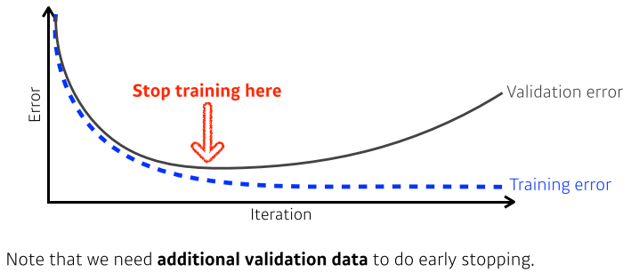

**[img 7. early stopping]**

- validation error와 training error를 비교하며 generalization gap이 가장 적을 때 stop하는 방법

##### Parameter Norm Penalty

$$
total\ cost = loss(\mathcal{D;W}) + \frac \alpha 2 \left \| W \right \|^2_2\\
\frac \alpha 2 \left \| W \right \|^2_2:Parameter\ Norm\ Penalty
$$

**[math 7. parameter Norm Penalty에 의한 cost 계산]**

- parameter들의 합이 너무 커지는 것을 방지
- 부드러운 parameter일 수록 generalization이 좋은 경향이 있음

##### Data Augmentation

- 데이터가 적을 때는 오히려 전통적인 머신러닝이 성능이 좋지만, 데이터가 크면 클수록 최신 딥러닝이 좋다.
- 문제는 데이터가 적으므로, 기존의 데이터를 여러가지 방법으로 바꾸어서 늘리는것
- 이미지 데이터로 예시를 들면, 흑백, 일부 가림, 이미지 방향 반전 등이 있다.

##### Noise Robustness

- data Augmentation과 비슷하지만, 데이터 뿐만 아니라 weights에도 노이즈를 주어서 성능 향상

##### Label Smoothing

- 데이터 2개를 뽑아서 섞어 decision boundary를 부드럽게 해줌
- mix-up 방법, cumMix 방법 등이 있음

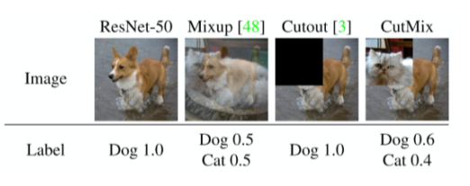

**[img 7-1. Label Smoothing의 그림예시]**

- 성능이 되게 좋다.

##### Dropout

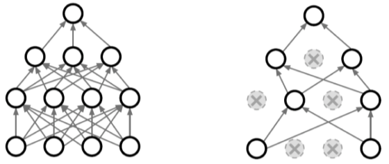

**[img 7-1. Label Smoothing의 그림예시]**

- 랜덤하게 neuron을 버린다.
- 성능은 좋아지지만 수학적으로 증명이 되진 않음

##### Batch Normalization

$$
\mu_B = \frac 1 m \sum_{i=1}^m x_i\\
\sigma^2_B = \frac 1 m \sum^m_{i=1}(x_i-\mu_B)^2\\
\hat{x}_i =\frac {x_i - \mu_B}{\sqrt{\sigma^2_B+\epsilon}}
$$

**[math 7-1. Batch Normalization 계산]**

- 논란이 크지만 성능이 좋아짐.
- layer들의 parameter들의 값을 평균과 분산을 이용하여 같은 값으로 바꿈.

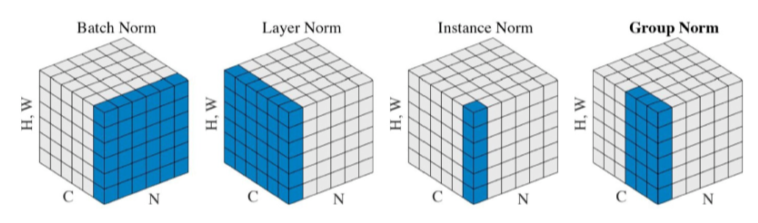

**[img 7-2. 다른 normalization의 종류]**

## Convolutional Neural Networks

### Convolution 연산

- 2개의 함수가 있을때 2개의 함수를 섞는 operator
- 연속 공간, 이상 공간에 따라 수식 다름
- I는 전체 공간, K는 필터

$$
\cdot Coninuous\ convolution:\ (f*g)(t) = \int f(\tau)g(t-\tau)d\tau=\int f(t-\tau)g(t)d\tau\\
\cdot Discrete\ convolution:\ (f*g)(t) = \sum^\infty_{i=-\infty} f(i)g(t-i)=\sum^\infty_{i=-\infty} f(t-i)g(i)\\
\cdot 2D\ image\ convolution:\ (I*K)(i,j) = \sum_m\sum_n I(m,n)K(i-m,j-n)=\sum_m\sum_n I(i-m,i-n)K(m,n)\\
$$
**[math 8. Convolution operator]**

- 2차원 콘볼루션 연산의 예시.

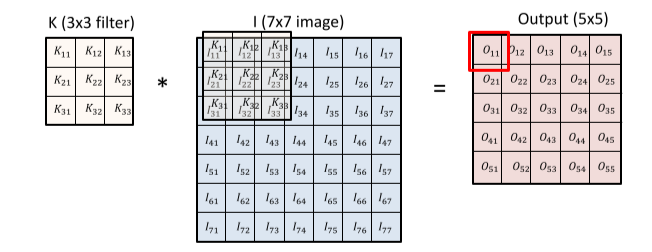

**[img 8. 2D image Convolution 그림]**
$$
O_{11}=I_{11}K_{11}+I_{12}K_{12}+I_{13}K_{13}+I_{21}K_{21}+I_{22}K_{22}+I_{23}K_{23}+I_{31}K_{31}+I_{32}K_{32}+I_{33}K_{33}+bias\\
O_{12}=I_{12}K_{11}+I_{13}K_{12}+I_{14}K_{13}+I_{22}K_{21}+I_{23}K_{22}+I_{24}K_{23}+I_{32}K_{31}+I_{33}K_{32}+I_{34}K_{33}+bias\\
O_{13}=I_{13}K_{11}+I_{14}K_{12}+I_{15}K_{13}+I_{23}K_{21}+I_{24}K_{22}+I_{25}K_{23}+I_{33}K_{31}+I_{34}K_{32}+I_{35}K_{33}+bias\\
O_{14}=I_{14}K_{11}+I_{15}K_{12}+I_{16}K_{13}+I_{24}K_{21}+I_{25}K_{22}+I_{26}K_{23}+I_{34}K_{31}+I_{35}K_{32}+I_{36}K_{33}+bias
$$
**[math 8-1. 2D image Convolution operation]**

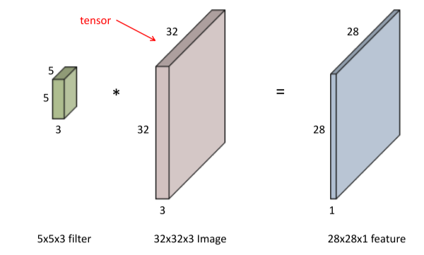

**[img 8-2. 2D image Convolution filter operation]**

- 2차원 이미지의 경우 tensor로 표현되며, 보통 rgb로 계산 시 뒤의 X3(R,G,B)은 생략이 된다.
- 즉 5X5 convolution 연산은 기본적으로 5x5x3에서 x3이 생략된 것이다. 
- 계산 결과는 x1이 된다.

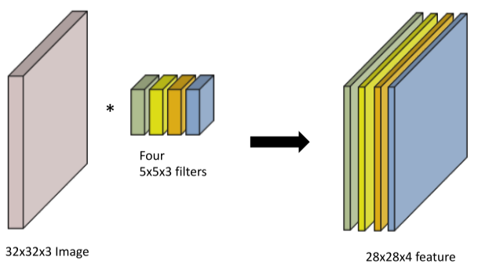

**[img 8-3. 2D image Convolution featuremap]**

- feature map을 연산할 때 여러 층의 feature가 나오는 방법은 여러겹의 필터를 곱하여 만드는 것이다.

### CNN 구조와 용어

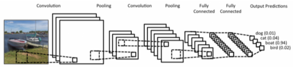

**[img 8-4. CNN 구조]**

- Convolution과 pooling layer는 feature extraction을 하는 역할
- Fully connected Layer는 decision making(ex) classification)을 위한 층
  - 고전적인 CNN와 달리 최근에는 파라미터 수를 줄이기 +  generalization 성능 향상을 위해 FCL을 줄이는 추세

1. Stride

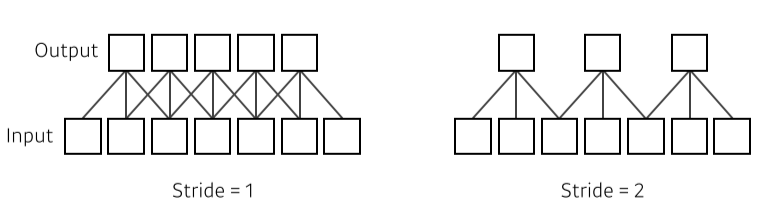

**[img. Stride 1과 2의 차이 그림]**

- pixel을 뛰어넘는 수,  filter의 밀도,
- filter가 stride 수 만큼 pixel을 넘어가며 생성한다.
- 2차원의 경우 x,y 2개로 설정 가능

2. Padding

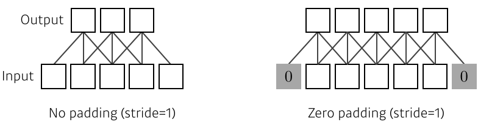

**[img. padding의 유무 차이 그림]**

- Stride 등으로 인해 외부로 나가는 픽셀을 padding으로 추가함
- zero padding은 0을 넣는다는 의미, 이로써 input과 output의 space dimension이 같아짐

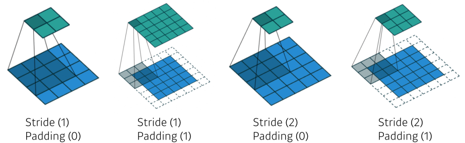

**[img. stride, padding의 예시]**

### Convolution Arithmetic

