# PyTorch

> 본 자료는 Naver BoostAI camp의 강의를 정리한 내용입니다

## PyTorch 시작

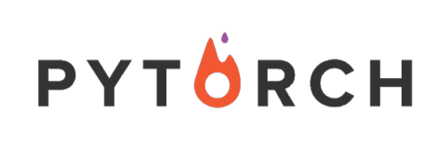

**[img 0. PyTorch logo]**

- PyTorch : Keras + Tensorflow 와 경쟁하는 facebook 진영의 딥러닝 프레임워크
- 비교적 쉽고 빠르고 여러 기능을 가지고 있다.
- Numpy의 array 구조 Tensor, AutoGrad(자동 미분) 지원,  다양한 딥러닝 함수와 모델 지원

- PyTorch 튜토리얼과 PyTorch로 시작하는 딥 러닝 입문 추천

### 개발 환경 설정

#### 구글 Colab

- 구글 로그인 후 구글 Colab 활용, 구글 드라이브 연동 추천

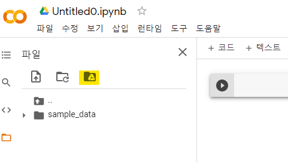

**[img 1. 구글 드라이브 연동방법]**

- 새 노트를 생성한 뒤, 노란 표시의 폴더를 클릭하면 구글 드라이브와 연동 가능
  - 대용량, 고성능의 컴퓨팅이 필요하므로 추천

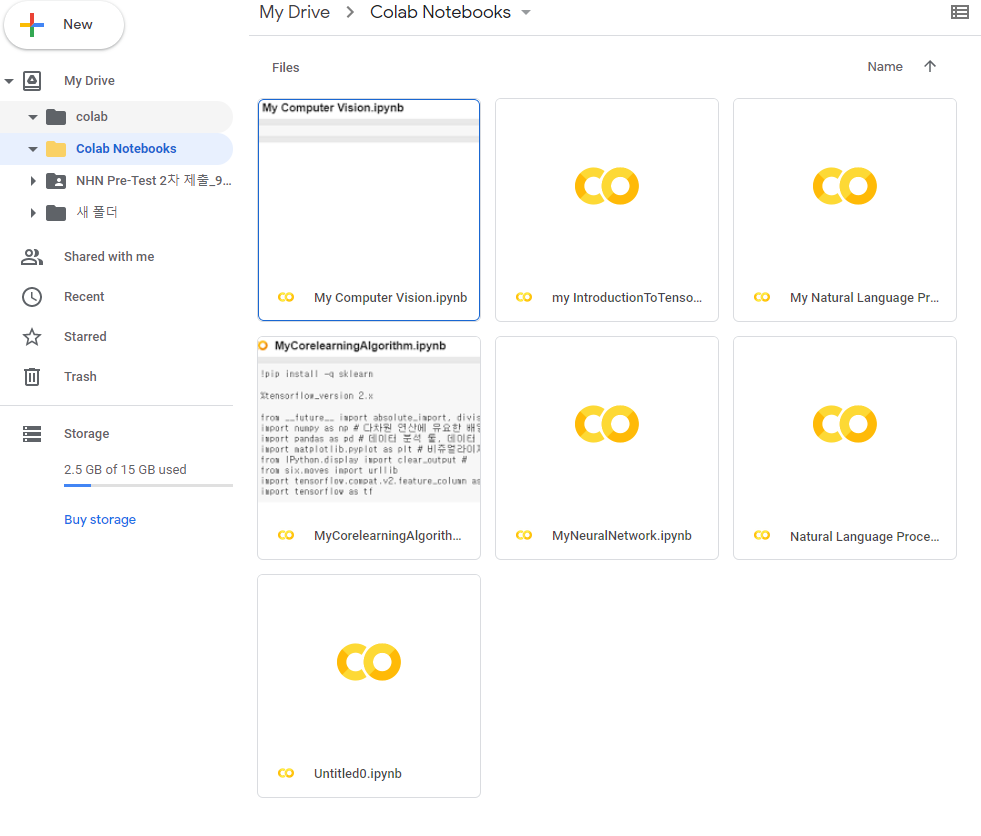

**[img 1-1. 구글 드라이브 내부에 이러한 폴더가 생성된다.]**

- 해당 폴더가 default directory로 되어있다.

#### VScode와 연결

- https://github.com/BoostcampAITech/lecture-note-python-basics-for-ai/blob/main/codes/pytorch/00_utils/colab%20on%20VSCode.md 참조

1. google colab 설정

2. VScode 설치

3. ngrok 가입 및 다운로드, 토큰 값 확인

   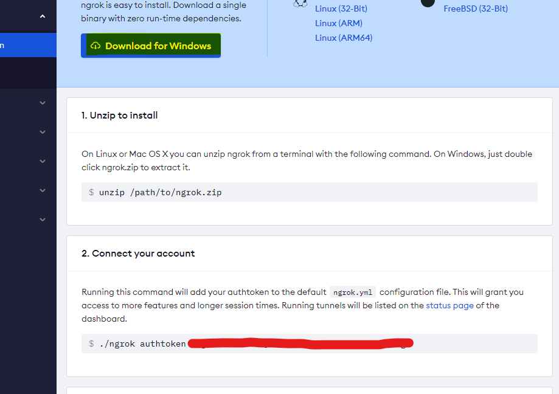

   - 노란 형광펜 : 다운로드
   - 빨간 줄: 토큰

**[img 2. ngrok 결과]**

4. colab 하드웨어 GPU로 변경

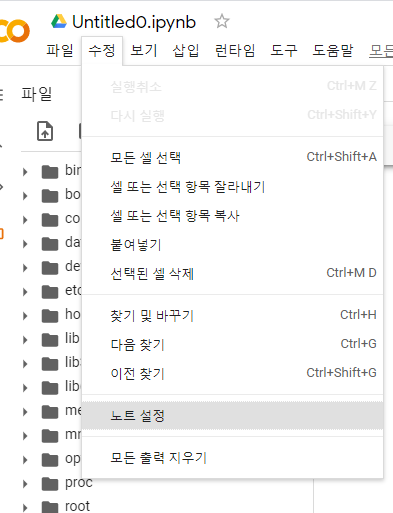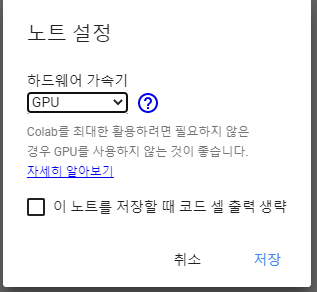

**[img 2-1. colab 노트설정 변경]**

- colab 파일 생성 시마다 해줘야 한다.

5. 구글 colab에서 해당 코드 실행

   ```python
   !pip install colab-ssh
   NGROK_TOKEN = '토큰' # ngrok 토큰
   PASSWORD = '접속할 비밀번호' # 비밀번호 설정
   from colab_ssh import launch_ssh
   launch_ssh(NGROK_TOKEN, PASSWORD)
   ```

   안될시

   ```python
   !pip install colab-ssh --upgrade
   from colab_ssh import launch_ssh_cloudflared
   PASSWORD = '접속할 비밀번호' # 비밀번호 설정
   launch_ssh_cloudflared(password=PASSWORD)
   # 이후 cloudflare 설치, 실행 해야함.
   ```

**[code 2. ngrok 혹은 coludflared 활용 vscode 연결]**

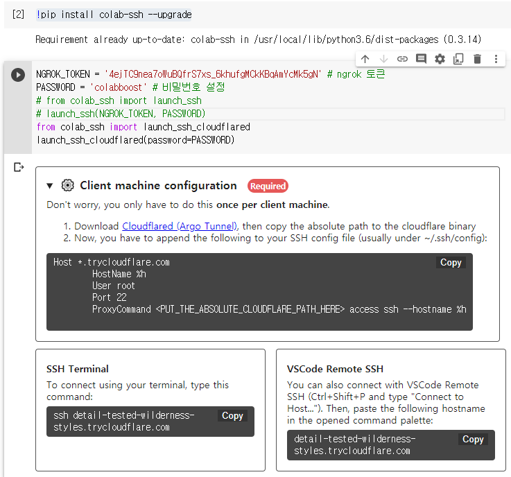

**[img 2-2. 초기 지시 사항]**

6. terminal에 `code ~/.ssh/config`로 연 뒤 다음과 같은 코드 입력

```
Host *.trycloudflare.com
	HostName %h
	User root
	Port 22
	ProxyCommand <PUT_THE_ABSOLUTE_CLOUDFLARE_PATH_HERE> access ssh --hostname %h
```

**[code 2-1. config 파일 내용]**

- <PUT_THE_ABSOLUTE_CLOUDFLARE_PATH_HERE> 의 경우, window의 경우 cloudflared.exe가 있는 장소 
- \대신 \\\\를 넣어야 작동한다.

7. VScode에 `Remote-SSH` Extension 설치

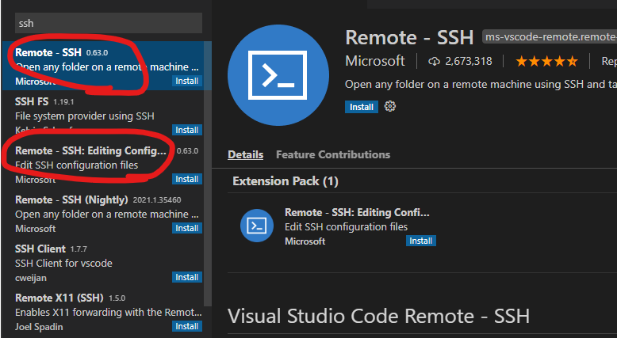

**[img 2-3. 2개를 설치해야하지만 맨위의 익스텐션을 설치하면 자동 설치된다.]**

8. SSH 연결

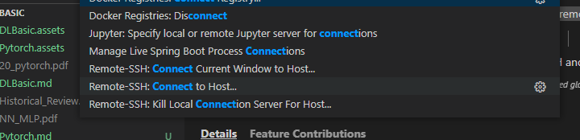

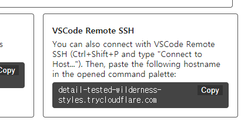

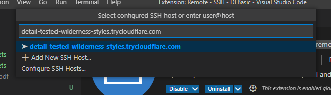

- 이후 **Linux**를 선택한 후, yes, colab에서 설정한 비밀번호 입력 후, Open Folder를 통하여

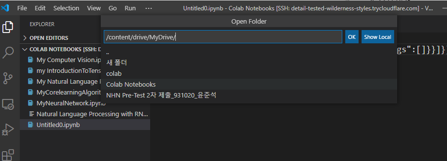

- 해당 디렉토리로 들어가면 내 구글 드라이브로 들어갈 수 있다.

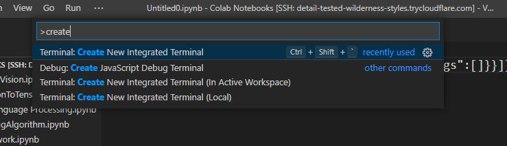

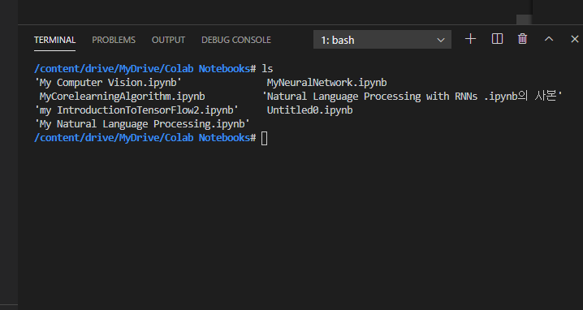

- `Terminal: Create New Integrated Terminal`을 통해 google colab의 terminal 환경을 열 수 있다.

- 이런식으로 연 colab 파일은 작업하는 동안 닫지 말자.

### pytorch basic

#### PyTorch Tensor 연산

```python
import numpy as np
import torch # 보통 alias 사용하지 않음
n_array = np.arrange(10).reshape(2,5)
t_array = torch.FloatTensor(n_array)
print(t_array) # tensor([[0., 1., 2., 3., 4.],[5., 6., 7., 8., 9.]])
print(t_array.shape) # torch.Size([2, 5])
print(t_array.ndim) # 2
print(t_array.size()) # torch.Size([2, 5]), element 갯수인 numpy와 달리 shape가 나옴
t_array[:2, :3] # tensor([[0., 1., 2.],[5., 6., 7.]]) 슬라이싱 가능
```

**[code 3. 모듈 import 및 array to tensor]**

```python
n1 = np.arange(10).reshape(2,5)
n2 = np.arange(10).reshape(5,2)
t1 = torch.FloatTensor(n1)
t2 = torch.FloatTensor(n2)
print(t1.matmul(t2)) # tensor([[ 60., 70.],[160., 195.]]) numpy와 달리 좀더 직관적이다.
# n1.dot(n2) : 같은 결과, 
```

**[code 3-1. 기초 tensor operation - 행렬곱셈]**

```python
n1 = np.arange(4).reshape(2,2)
n2 = np.arange(4).reshape(2,2)
t1 = torch.FloatTensor(n1)
t2 = torch.FloatTensor(n2)
print(t1 * t2) # tensor([[0., 1.],[4., 9.]])
# t1.mul(t2) : 같은 결과 
# t1 * 5 : tensor([[ 0.,  5.], [10., 15.]]), 원소들에게 적용되는 곱셈 
```

**[code 3-2. 기초 tensor operation - 행렬 원소간 곱셈]**

```python
n1 = np.arange(10)
t1 = torch.FloatTensor(n1)
print(t1.mean()) # tensor(4.5000) # 전체 평균
n1 = np.arange(10).reshape(5,2) 
t1 = torch.FloatTensor(n1)
print(t1.mean(dim=0)) # tensor([4., 5.]) # 0차원 평균
print(t1.mean(dim=1)) # tensor([0.5000, 2.5000, 4.5000, 6.5000, 8.5000]) # 1차원 평균
```

**[code 3-2. 기초 tensor operation - tensor 평균]**

```python
n1 = np.arange(10)
t1 = torch.FloatTensor(n1)
print(t1.view(-1, 2)) # tensor([[0., 1.], [2., 3.], [4., 5.], [6., 7.], [8., 9.]])
# numpy의 reshape 기능
print(n1.reshape(-1, 2))# 같은 결과

print(t1.view(-1, 10).squeeze())# tensor([0., 1., 2., 3., 4., 5., 6., 7., 8., 9.])
# 차원을 줄인다, 자주쓰는 기능

print(t1.view(-1, 10).squeeze().unsqueeze(dim=0))# tensor([0., 1., 2., 3., 4., 5., 6., 7., 8., 9.])
# 차원을 반대로 늘린다.
```

**[code 3-2. 기초 tensor operation - tensor reshape와 squeeze]**

#### Tensor operations for ML/DL formula

