[TOC]

# Graph

> 네이버 boostcamp AI Tech의 강의를 정리한 내용입니다

정점 집합과 간선 집합으로 이루어진 수학적 구조로, 다양한 복잡계(Complex Network)를 분석할 수 있는 언어

## Graph Introduction

### Graph란 무엇이고 왜 중요할까?

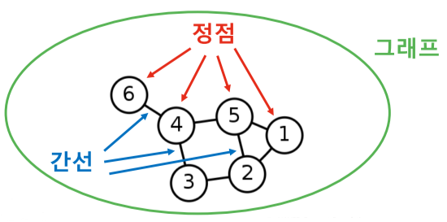

**[img. 정점과 간선, 그래프의 그림]**

- 정점(Vertex) : 노드(Node)라고도 불림. 관계를 가지거나 가지지 않는 하나의 객체
- 간선(Edge): 링크(Link)라고도 불림. 두 개의 정점을 연결하는 선
- 그래프(Graph): 네트워크(Network)라고도 불림. 정점 집합과 간선 집합으로 이루어진 수학적 구조

우리의 주변에는 친구관계, 통신, 인터넷과 같은 *많은 구성 요소 간의 복잡한 상호작용*인 *복잡계(Complex System)*이 있으며, *그래프는 이 복잡계를 표현하고 분석하기 위한 언어*이다.

### 그래프 관련 인공지능 문제

1. 정점 분류(Node Classification) 문제 : 정점의 특성, 연결에 따라 분류할 수 있는가?
   - 트위터의 공유 관계를 분석하여 사용자의 정치적 성향 판단
2. 연결 예측(Link Prediction) 문제: 앞으로 그래프의 성장이 어떻게 될 것인가?
   - 페이스북 소셜 네트워크는 어떻게 진화할까?
3. 추천(Recommendation) 문제: 한 정점이 어떠한 경향으로 간선을 만드는가?
   - 상품, 영화 추천
4. 군집 분석(Community Detection) 문제: 연결 관계로부터 사회적 무리(Social Circle)을 찾아낼 수 있을까?
   - 연결 관계를 통한 가족 관계, 친구 관계, 대학 동기 들의 무리를 찾아내기
5. 랭킹(Ranking) 및 정보 검색(Information Retrieval) 문제: 그래프 내부에서 찾고 싶은 정점 찾기
   - 웹이라는 거대한 그래프로부터 찾고자 하는 웹페이지를 찾아내는 법
6. 정보 전파(Information Cascading) 및 바이럴 마케팅(Viral Marketing) 문제: 어떻게 최대한 간선을 통하여 전파 시킬 수 있는가?
   - 마케팅, 홍보 문제

### 그래프 관련 필수 기초 개념

#### 그래프의 유형 및 분류

| 명칭 | 무방향 그래프(Undirected Graph)                              | 방향 그래프(Directed Graph)                                  |
| ---- | ------------------------------------------------------------ | ------------------------------------------------------------ |
| 설명 | 간선엔 방향이 없는 그래프                                    | 간선엔 방향이 있는 그래프                                    |
| 예시 | 협업 관계 그래프, 페이스분 친구 그래프 등                    | 인용 그래프, 트위터 팔로우 그래프                            |
| 그림 | 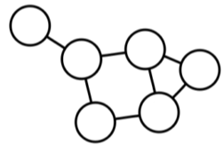 | 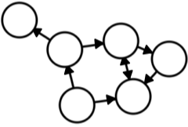 |

**[fig. 방향성에 따른 그래프 분류]**

| 명칭 | 가중치가 없는 그래프(Unweighted Graph)                       | 가중치 그래프(Weighted Graph)                                |
| ---- | ------------------------------------------------------------ | ------------------------------------------------------------ |
| 설명 | 간선에 가중치가 없는 그래프                                  | 간선에 가중치가 있는 그래프                                  |
| 예시 | 웹 그래프, 페이스북 친구 그래프                              | 전화 그래프, 유사도 그래프                                   |
| 그림 |  | 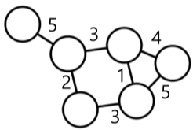 |

**[fig. 가중치 여부에 따른 그래프 분류]**

| 명칭 | 동종 그래프(Unpartite Grpah)                                 | 이종 그래프(Bipartite Graph)                                 |
| ---- | ------------------------------------------------------------ | ------------------------------------------------------------ |
| 설명 | 동종 그래프는 단일 종류의 정점만 포함                        | 두 종류의 정점을 가지는 그래프, 다른 종류의 정점 사이에만 간선이 연결됨. |
| 예시 | 웹 그래프, 페이스북 친구 그래프                              | 전자 상거래 구매 내역(사용자, 상품), 영화 출연 그래프(배우, 영화) |
| 그림 |  | 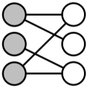 |

**[fig. 정점의 종류에 따른 그래프 분류]**

**[fig. 방향성이 없고 가중치가 있는 이종 그래프의 예시]**

#### 그래프 관련 필수 기초 개념

**[img. 그래프]**

보통 정점들의 집합을 V, 간선들의 집합을 E, 그래프를 G = (V,E)로 표현

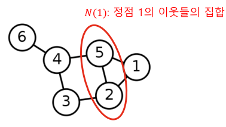

**[img. 정점 1의 이웃 집합]**

정점의 이웃(Nieghbor)은 그 정점과 연결된 다른 정점을 의미하며 v의 이웃 집합을 보통 N(v) 혹은 $N_v$로 표기, 위 그림의 경우 N(1) = {2,5}

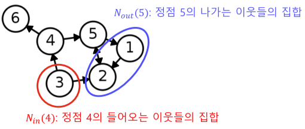

**[img. 방향 그래프에서의 이웃]**

방향성이 있는 그래프에서는 나가는 이웃과 들어오는 이웃을 구분하며,

- 정점 v에서 간선이 나가는 이웃(Out-Neighbor)의 집합을 보통 $N_{out}(v)$로 표기
- 정점 v에서 간선이 들어오는 이웃(In-Neighbor)의 집합을 보통 $N_{in}(v)$로 표기
- 그림의 경우, $N_{out}(5)=\{1,2\},\ N_{in}(4)=\{3\}$

### 그래프의 표현 및 저장

- NetworkX 그래프 Vis 코드 + 간선 저장 코드의 경우 LAB의 [Graph-1]Grpah_Basic.ipynb 참조

1. 간선 리스트(Edge List) : 그래프를 간선들의 리스트로 저장
   - 정점 간의 간선 유무를 알아보기 위해 모든 리스트를 다 확인해봐야함, 성능상 비효율적임.

| 무방향성                                                     | 방향성                                                       |
| ------------------------------------------------------------ | ------------------------------------------------------------ |
| 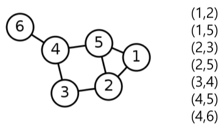 | 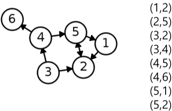 |
| 간선이 연결하는 두 정점들의 순서쌍(Pair)로 저장              | 방향성이 있는 경우에는 (출발점, 도착점) 순서로 저장          |

**[fig. 간선리스트의 예시]**

2. 인접 리스트(Adjacent list) : 정점들의 이웃들을 리스트로 저장
   - 간선 리스트에 비해 성능상 효율적임

| 그래프    | 도식                                                         | 설명                                                         |
| --------- | ------------------------------------------------------------ | ------------------------------------------------------------ |
| 무 방향성 | 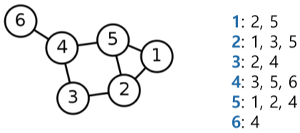 | 각 정점의 이웃들을 리스트로 저장                             |
| 방향성    | 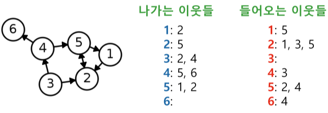 | 각 정점의 나가는 이웃들과 들어오는 이웃들을 각각 리스트로 저장 |

**[fig. 인접리스트의 예시]**

3. 인접 행렬(Adjacency Matrix)
   - 연산 성능 상 문제 없고 구현이 쉽지만 메모리 낭비가 심하다.

| 무방향성                                                     | 방향성                                                       |
| ------------------------------------------------------------ | ------------------------------------------------------------ |
| 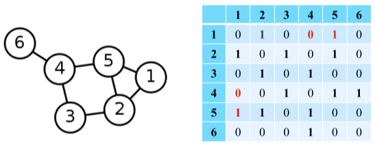 | 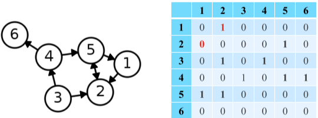 |
| 정점 수 $\times$ 정점 수 크기의 행렬                         | 정점 수 $\times$ 정점 수 크기의 행렬                         |
| 정점 i 와 j 사이에 간선이 있는 경우, 행렬 (i, j) 그리고 (j, i) 원소가 1 없는 경우 0 | 정점 i 에서  j 로 가는 간선이 있는 경우, 행렬 (i, j)가 1 없는 경우 0, 반대로, 정점 j에서 i로 가는 간선이 있는 경우, 행렬 (j,i)가 1 없는 경우 0 |

**[fig. 인접 행렬의 예시]**

## 그래프를 이용한 기계학습

### 실제 그래프 vs 랜덤 그래프

실제 그래프(Real Graph)란 다양한 복잡계로 부터 얻어진 그래프를 의미

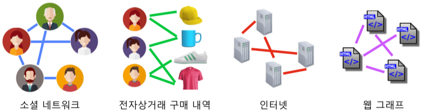

**[img. 실제 그래프의 예]**

랜덤 그래프(Random Graph)는 확률적 과정을 통해 생성한 그래프를 의미

- 에되스-레니 랜덤 그래프(Erdos-Renyi Random Graph) : $G(n,p)$
  - n 개의 정점을 가짐
  - 임의의 두 개의 정점 사이에 간선이 존재할 확률은 p, 모든 정점 사이가 동일함
  - 정점 간의 연결은 서로 독립적(Independent)

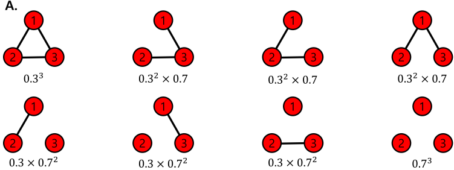

**[img. $G(3,0.3)$일때 생성될 수 있는 그래프와 확률]**

### 작은 세상 효과

| 개념                       | 설명                                                         |
| -------------------------- | ------------------------------------------------------------ |
| 경로(Path)                 | 첫번째로 u에서 시작해서 정점 v에서 끝나야 하며, 두번째로, 순열에서 연속된 정점은 간선으로 연결되어 있어야 함. |
| 경로의 길이                | 경로 상에 놓이는 간선의 수로 정의됨                          |
| 정점 사이의 거리(Distance) | u와 v 사이의 최단 경로의 길이                                |
| 최단 경로(Shortest Path)   | u와 v사이의 거리가 최소가 되는 경로                          |
| 그래프 지름(Diameter)      | 정점 간 거리의 최댓값                                        |

**[fig. 그래프의 개념 설명]**

|     그래프     | 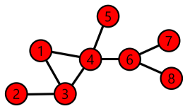 |
| :------------: | :----------------------------------------------------------: |
|   경로 예시    | 정점 1과 8사이의 경로는 [1,4,6,8], [1,3,4,6,8],[1,4,3,4,6,8] |
| 경로 길이 예시 |                 경로 [1,3,4,6,8]의 길이는 4                  |
|   거리 예시    |      정점 1과 8 사이의 최단 경로는 [1,4,6,8]로 거리는 3      |
|   지름 예시    |                      정점 2에서 8까지 4                      |

**[fig. 그래프의 개념 예시]**

*작은 세상 효과(Small-world Effect)* : 실제 그래프의 임의의 두 정점 사이의 거리는 생각보다 작다.

- 여섯 단계 분리(Six Degrees of Separation) 실험에서 6단계 만에 오마하에서 보스턴까지 편지를 전달 
- MSN 메신저 사용자의 평균 거리는 7
- 랜덤 그래프에도 존재하지만 체인(Chain), 사이클(Cycle), 격자(Grid) 그래프에서는 작은 세상 효과가 존재 하지 않음.

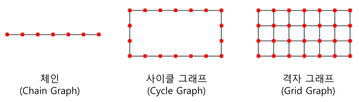

**[img. 작지 않은 세상들]**

### 연결성의 두터운-꼬리 분포

*정점의 연결성(Degree)*은 그 정점과 연결된 간선의 수, 해당 정점의 이웃들의 수를 의미

-  $d(v),\ d_v,\ |N(v)|$로 표기함.

|                      연결성                      |                            그래프                            |
| :----------------------------------------------: | :----------------------------------------------------------: |
| $d(1)=2\\d(2)=3\\d(3)=2\\d(4)=3\\d(5)=3\\d(6)=1$ | 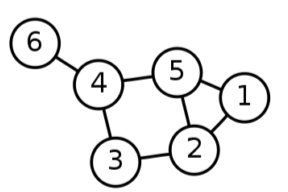 |

**[fig. 연결성(이웃)의 예시]**

- 정점의 나가는 연결성(Out Degree)은 그 정점에서 나가는 간선의 수를 의미
  -  $d_{out}(v), |N_{out}(v)|$로 표시

- 정점의 들어오는 연결성(In Degree)은 그 정점에서 들어오는 간선의 수를 의미.
  -  $d_{in}(v), |N_{in}(v)|$로 표시

|                            연결성                            |                            그래프                            |
| :----------------------------------------------------------: | :----------------------------------------------------------: |
| $d_{in}(1)=1,\ d_{out}(1)=1\\d_{in}(2)=3,\ d_{out}(1)=1\\d_{in}(3)=0,\ d_{out}(3)=2\\d_{in}(4)=1,\ d_{out}(4)=2\\d_{in}(5)=2,\ d_{out}(5)=2\\d_{in}(6)=1,\ d_{out}(6)=0\\$ | 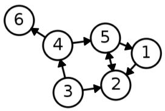 |

**[fig. 방향 그래프의 연결성(이웃)의 예시]**

실제 그래프의 연결성 분포는 두터운 꼬리(Heavy Tail)를 가짐 (ex)BTS와 강사님의 트위터 팔로워 수)

- 이는 연결성이 매우 높은 허브(Hub) 정점이 존재함을 의미.

반면에 랜덤 그래프의 연결성 분포는 정규분포와 유사함(ex) 인간의 키 분포).

- 허브 정점이 존재할 확률이 아주 적음.

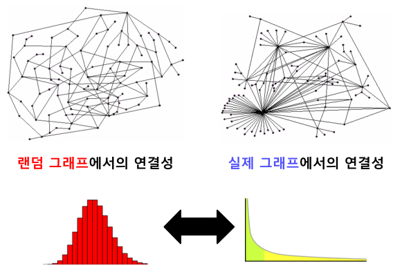

**[img. 랜덤 그래프와 실제 그래프의 차이]**

### 거대 연결 요소

연결 요소(Connected Component)는 다음 조건들을 만족하는 정점들의 집합을 의미합니다.

1. 연결 요소에 속하는 정점들은 경로로 연결될 수 있습니다.
2. 1.의 조건을 만족하면서 정점을 추가할 수 없습니다.

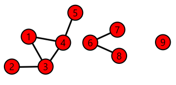

**[img. {1,2,3,4,5}, {6,7,8}, {9} 총 3개의 연결 요소가 있다.]**

실제 그래프에는 거대 연결요소(Giant Connected Component)가 존재하며, 대다수의 정점을 포함함.

랜덤 그래프에도 높은 확률로 거대 연결요소가 존재함.

- 단, Random Graph Theory에 의해 정점들의 평균 연결성이 1보다 충분히 커야함.

|                         실제 그래프                          |                         랜덤 그래프                          |
| :----------------------------------------------------------: | :----------------------------------------------------------: |
| 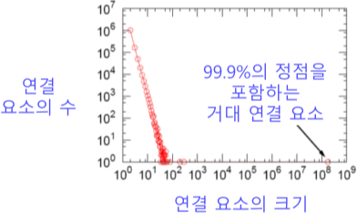 | 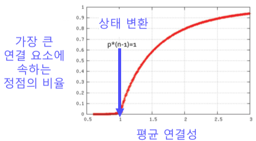 |

**[fig. 실제 그래프 vs 랜덤 그래프에서의 거대 연결 요소]**

### 군집 구조

군집(Community)이란 다음과 같은 조건을 만족하는 정점들의 집합.

1. 집합에 속하는 정점 사이에는 많은 간선이 존재함
2. 집합에 속하는 정점과 그렇지 않은 정점 사이에는 적은 수의 간선이 존재

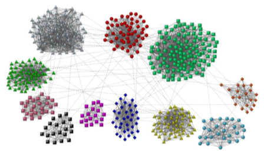

**[img. 군집 그래프]**

*지역적 군집 계수(Local Clustering Coefficient)*는 한 정점에서 군집의 형성 정도를 측정 가능

- 정점 $i$의 지역적 군집 계수($C_i$)는 정점 $i$의 이웃들의 쌍 중 간선으로 직접 연결된 것의 비율을 의미
- 연결성(이웃)이 0인 정점에서는 지역적 군집 계수 정의가 안됨.

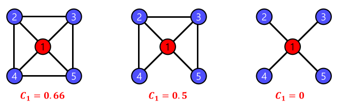

**[img. 지역적 군집 계수의 예시]**

*전역 군집 계수(Global Clustering Coefficient)*는 전체 그래프에서 군집의 형성 정도를 측정

- 그래프 G의 전역 군집 계수는 각 정점에서의 지역적 군집 계수의 평균
  - 단, 지역적 군집 계수가 정의되지 않는 정점은 제외

실제 그래프에서 군집 계수가 높은(=군집이 많은) 이유

1. 동질성(Homophily) : 서로 유사한 정점끼리 간선으로 연결될 가능성이 높음
   - 같은 인종간 관계 그래프
2. 전이성(Transitivity) : 공통 이웃은 간선 연결이 생길 확률이 높음
   - 친구에게 친구를 소개

반면 랜덤 그래프는 간선 연결 확률이 독립적(Independent)이므로 지역적, 전역 군집 계수가 높지 않음.

### 군집 계수 및 지름 분석

- [Graph-2]Graph_Property.ipynb 참조

|           | 균일 그래프(Regular Graph) | 작은 세상 그래프(Small-world Graph) | 랜덤 그래프(Random Graph) |
| --------- | -------------------------- | ----------------------------------- | ------------------------- |
| 군집 계수 | 큼                         | 큼                                  | 작음                      |
| 지름      | 큼                         | 작음                                | 큼                        |

## 페이지 랭크 알고리즘

### 페이지 랭크의 배경

웹은 웹페이지와 하이퍼링크로 구성된 거대한 방향성 있는 그래프.

- 웹페이지 : 정점 + 키워드 정보
- 하이퍼링크: 간선

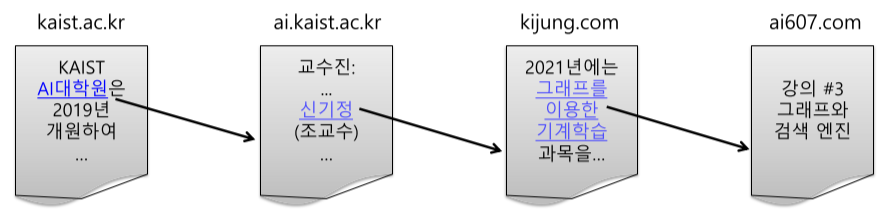

**[img. 웹은 그래프이다.]**

#### 검색엔진의 발전

1. 웹을 거대한 디렉토리로 정리
   - 웹페이지의 수가 증가하며 카테고리의 수와 깊이가 무한정 커짐
   - 카테고리 구분이 모호하고 저장과 검색이 어려움
2. 웹페이지에 포함된 케워드에 의존한 검색엔진
   - 사용자가 입력한 키워드에 대해 키워드를 여럿 포함한 웹페이지를 반환
   - 악의적인 웹페이지에 취약하다는 단점(축구라는 단어가 여러번 포함된 성인 사이트)

사용자 키워드와 관련성이 높고 신뢰할 수 있는 웹페이지를 찾기 위해 PageRank 알고리즘을 활용함.

- 래리 페이지와 세르게이 브린이 발표

### 페이지랭크의 정의

*하이퍼링크를 통한 웹페이지의 투표*를 통해 사용자 키워드와 관련성이 높고 신뢰할 수 있는 웹페이지를 찾을 수 있음

- 웹페이지 u가 v를 하이퍼링크로 연결(투표)한다면, v는 관련성이 높고 신뢰하고 있다는 것을 의미.(논문과 비슷)
- 즉, 들어오는 간선이 많을 수록 신뢰할 수 있다.
  - 단, 악의적인 인용 등이 있으며 이를 막기위해 *가중 투표*를 도입

가중 투표: 관련성이 높고 신뢰할 수 있는 웹사이트의 투표에 더 높은 점수를 주는것

- 그러한 웹사이트가 높은 관련성과 신뢰성을 얻으려면, 투표를 많이 받아야함. => 재귀 구조

이러한 웹페이지의 관련성 및 신뢰도를 *페이지랭크 점수*라고 함.

- 웹페이지는 각각의 나가는 이웃에게 $\frac{자신의\ 페이지랭크\ 점수}{나가는\ 이웃의\ 수}$만큼의 가중치로 투표를 함
- 웹페이지의 페이지랭크 점수는 받은 투표의 가중치 합으로 정의됨.

$$
r_j=\sum_{i\in N_{in}(j)}\frac{r_i}{d_{out}(i)}
$$

**[math. 페이지랭크 점수의 정의]**

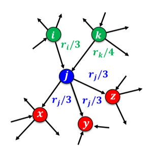

**[img. $r_j$가 웹페이지 j의 페이지랭크의 점수일 때, 예시]**

- 위 그림에서 웹페이지 j의 투표시 가중치는 $r_j$/3

- 웹페이지 j의 페이지랭크 점수 $r_j=r_i/3+r_k/4$

| 정점 별 페이지랭크                          | 웹페이지 그래프                                              |
| ------------------------------------------- | ------------------------------------------------------------ |
| $r_y=r_y/2+r_a/2\\r_a=r_y/2+r_m\\r_m=r_a/2$ | 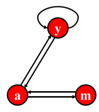 |

**[fig. 웹페이지 별 페이지랭크 점수 연립 방정식]**

페이지 랭크는 임의 보행(Random Walk)의 관점에서도 정의 가능.

- 웹서퍼가 t번째 방문한 웹페이지가 웹페이지 i일 확률을 $p_i(t)$

- 웹서퍼가 무한히 방문해 t가 무한히 커지면, 다음이 성립

$$
확률분포\ p(t) = p(t+1) = 정상분포\ p\ (Stationary\ Distribution)\\
p_j(t+1)=\sum_{i\in N_{in}(j)}\frac{p_i(t)}{d_{out}(i)}\rightarrow p_j=\sum_{i\in N_{in}(j)}\frac{p_i}{d_{out}(i)}
$$

**[math. 임의 보행 관점에서의 페이지랭크]**

$$
r_j=\sum_{i\in N_{in}(j)}\frac{r_i}{d_{out}(i)}: 투표\ 관점에서\ 정의한\ 페이지랭크\ 점수\ r\\
p_j=\sum_{i\in N_{in}(j)}\frac{p_i}{d_{out}(i)}:임의\ 보행\ 관점에서\ 정의한\ 정상\ 분포\ p
$$

**[math. 투표 관점의 페이지 랭크 점수 == 임의 보행 관점에서의 정상 분포]**

### 페이지랭크의 계산

반복곱(Power Iteration)을 이용해 페이지 랭크 점수 가능

1. 각 웹페이지 i의 페이지랭크 점수 $r_i^{(0)}$를 동일하게 $\frac{1}{웹페이지의\ 수}$로 초기화
2. 아래 식을 이용하여 각 웹페이지의 페이지랭크 점수를 갱신

$$
r_j^{(t+1)}=\sum_{i\in N_{in}(j)}\frac{r_i^{(t)}}{d_{out}(i)}
$$

**[math. 페이지랭크 점수 갱신 식]**

3. 페이지랭크 점수가 수렴($r^t와\ r^{t+1}이\ 유사해질때\ 까지$)하였으면 종료, 아닌 경우 2로 회귀 

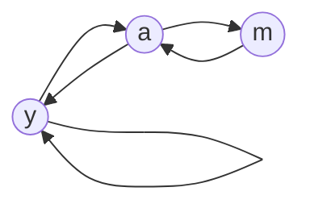

| 반복  | 0    | 1    | 2    | 3     |      | 수렴 |
| :---: | ---- | ---- | ---- | ----- | ---- | ---- |
| $r_y$ | 1/3  | 1/3  | 5/12 | 9/24  |      | 6/15 |
| $r_a$ | 1/3  | 3/6  | 1/3  | 11/24 | ...  | 6/15 |
| $r_m$ | 1/3  | 1/6  | 3/12 | 1/6   |      | 3/15 |

**[fig. 페이지랭크 점수 갱신의 예시]**

단, 언제나 수렴하지 않을 수도 있으며, 합리적인 점수로 수렴하는 것도 보장하지 않는다.

1. 수렴하지 않는 예시

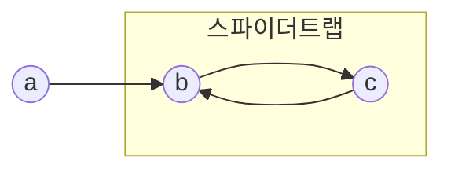
스파이더 트랩(Spider Trap) : 들어오는 간선은 있지만 나가는 간선은 없는 정점 집합

| 반복  | 0    | 1    | 2    | 3    |      | 수렴 |
| :---: | ---- | ---- | ---- | ---- | ---- | ---- |
| $r_a$ | 1/3  | 0    | 0    | 0    |      | X    |
| $r_b$ | 1/3  | 2/3  | 1/3  | 2/3  | ...  | X    |
| $r_c$ | 1/3  | 1/3  | 2/3  | 1/3  |      | X    |

**[fig. 수렴하지 않는 스파이더 트랩의 예시]**

- 반복 1, 2, 1, 2,가 무한히 반복

2. 합리적인 점수로 수렴하지 않는 예시(0으로 수렴함)

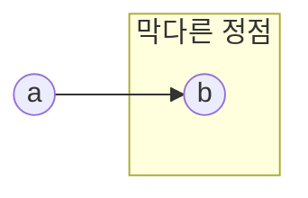
들어오는 간선은 있지만 나가는 간선은 없는 막다른 정점(Dead End) 문제
| 반복  | 0    | 1    | 2    | 3    |      | 수렴 |
| :---: | ---- | ---- | ---- | ---- | ---- | ---- |
| $r_a$ | 1/2  | 0    | 0    | 0    |      |  0  |
| $r_b$ | 1/2  | 1/2  | 0    | 0    | ...  |  0  |

**[fig. 막다른 정점의 예시]**

- 전부 0으로 수렴

****

위와 같은 문제를 해결하기 위해 *순간이동(Teleport)* 도입

수정된 웹서퍼의 순간이동 행동

1. 현재 웹페이지에 하이퍼링크가 없으면, 전체 웹페이지 중, 균일 확률로 임의의 웹페이지로 순간이동
2. 현재 웹페이지에 하이퍼링크가 있다면, 앞면이 나올 확률이 $\alpha$인 동전을 던집니다.
   - $\alpha : 감폭 비율 (Dampling\ Factor)$, 보통 0.8 정도임.
3. 앞면이라면, 하이퍼링크 중 하나를 균일한 확률로 선택해 클릭 (이전 웹서퍼와 동일)
4. 뒷면이라면, 전체 웹페이지 중, 균일 확률로 임의의 웹페이지로  순간이동

순간이동의 도입으로 인해 페이지 랭크 점수 계산은 다음과 같이 변한다.

1. 각 막다른 정점에서 (자신을 포함) 모든 다른 정점으로 가는 간선을 추가
2. 아래 수식을 사용하여 반복곱을 수행

$$
r_j=\left(\sum_{i\in N_{in}(j)}\left( \alpha\frac{r_i}{d_{out}(i)}\right)\right)_{가}+\left((1-\alpha)\frac{1}{|V|}\right)_나\\|V|: 전체\ 웹페이지의\ 수\\
식\ 가:하이퍼링크를\ 따라\ 정점\ j에\ 도착할\ 확률\\식\ 나: 순간이동을\ 통해\ 정점\ j에\ 도착할\ 확률
$$
**[math. 순간이동에 의한 새로운 페이지랭크 점수 계산식]**

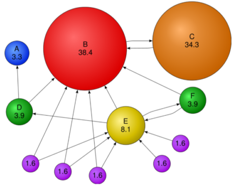

**[img. 수정된 페이지랭크 점수 예시]**

- C는 1표만 받지만 B의 귀중한 한표라서 점수가 큼
- 1.6 보라색 들은 들어오는 간선이 없지만 Teleport에 의해서 점수 획득

### 페이지 랭크 실습

[Graph-3]PageRank.ipynb 참조

## 그래프를 이용한 바이럴 마케팅

### 그래프를 통한 전파의 예시

1. SNS를 이용한 마케팅, 정보, 단체 행동 등이 전파됨.
2. 컴퓨터 네트워크 장비의 고장, 파워 그리드의 정전 전파
3. 사회에서의 질병 전파

이러한 전파 과정을 체계적으로 이해하고 대처하기 위해서 수학적 모형화가 필요함.

1. 의사 결정 기반 전파 모형
2. 확률적 전파 모형

### 의사 결정 기반 전파 모형

주변 정점(사람)들의 의사결정을 고려하여 각자 의사결정을 내리는 경우에 사용하는 모형

- 각 국가별 주요 사용 SNS, 비디오 테이프 표준화 등이 있음

간단한 형태의 의사결정 기반의 전파 모형으로, *선형 임계치 모형(Linear Threshold Model)*이 있음

|   사용 기술   |                              A                               |                              B                               |                             A,B                              |
| :-----------: | :----------------------------------------------------------: | :----------------------------------------------------------: | :----------------------------------------------------------: |
|     도식      | 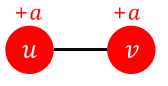 | 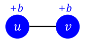 | 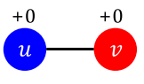 |
| 증가하는 행복 |                             +2a                              |                             +2b                              |                              0                               |

**[fig. u, v 두 사람이 A, B라는 호환되지 않는 기술을 사용시 얻는 행복]**

- 위 두 사람은 행복이 증가하지 않는 0보다, +2a, +2b를 비교하여 더 이득이 되는 방향으로 바꿀 것이다.

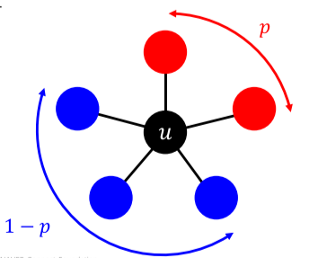

**[fig. 임계치 q를 구하기 위한 모형]**

p 비율의 u의 이웃이 A를 , 1-p 비율의 u의 이웃이 B를 선택했을 때,

- A를 골랐을 때의 u의 행복이 ap, B를 골랐을 때의 u의 행복이 b(1-p)라고 할 때
- u는 ap > b(1-p)일 때, A를, ap < b(1-p)일 때, B를 고를 것이다.
- 이 식을 바꾸어 $p > \frac{b}{a+b}$일 때 A를 고르며 이를 임계치 q$(=\frac{b}{a+b})$라고 한다.

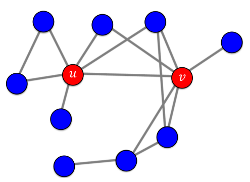

**[img. u와 v가 처음으로 A 기술를 사용한 얼리어 답터(시드집합)일 때의 상황]**

만약 A기술과 B 기술의 행복 a, b가 같고, u와 v가 해당 기술을 처음 사용한 얼리어답터(시드집합, Seed Set)이라고 가정하면, 해당 모형의 경과는 다음과 같다.

|                              1                               |                              2                               |                              3                               |                              4                               |
| :----------------------------------------------------------: | :----------------------------------------------------------: | :----------------------------------------------------------: | :----------------------------------------------------------: |
| 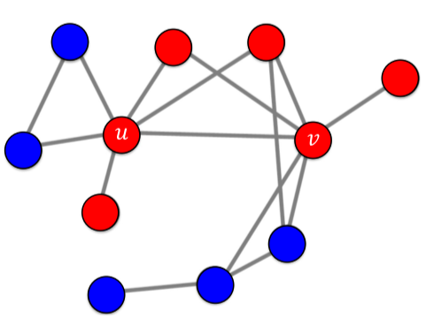 | 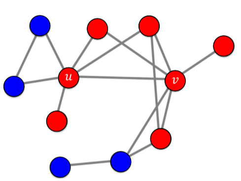 | 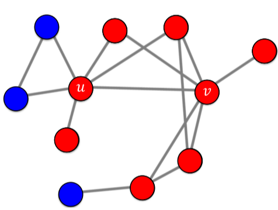 | 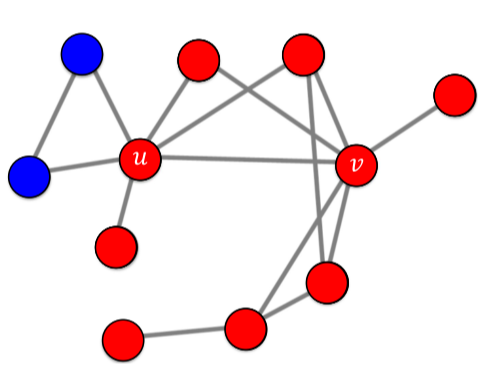 |

**[fig. A기술의 선형 임계치 모형 전파, 4번 이후로 더이상 전파는 없다.]**

- 4번 이후로 2개의 파란 정점은 A기술을 사용하는 간선이 u 하나 뿐이며, 이는 33%으로 50%를 넘기지 못하므로 전파되지 않는다.

### 확률적 전파 모형

질병, 정전 등의 모형에서는 위의 의사결정 기반 모형이 어울리지 않다.

- 누구도 질병에 걸리도록 의사결정을 내리는 사람은 없기 때문이다.

질병에 걸리는 것은 확률적 과정이므로 확률적 전파 모형을 고려해야 한다.

그 예시로 *독립 전파 모형(Independent Cascade Model)*이 있다.

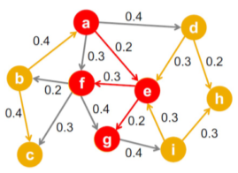

**[img. 독립 전파 모형은 보통 방향성이 있고 가중치가 있는 그래프를 가정한다.]**

간선 (u, v)의 가중치 $p_{uv}$는 u가 감염자, 이웃 v가 감염자가 아닐 때, u가 이웃 v를 감염시킬 확률을 의미한다.

이때 서로 다른 이웃이 전염될 확률은 독립적이다.

-  예를 들어, u가 감염되었을 때 u가 v를 감염시킬 확률은 u가 w를 가염시킬 확률과 독립적이다.

이전 모형과 마찬가지로 첫 감염자들을 시드 집합(Seed Set)이라고 부르며, 더이상 새로운 감염자가 없을 때까지 감염시킨다.

감염자의 회복을 가정하는 SIS, SIR 등의 다른 전파 모형도 있음

### 바이럴 마케팅과 전파 최대화 문제

바이럴 마케팅은 소비자들로 하여금 상품에 대한 긍정적인 입소문을 내게 하는 기법이다.

소문의 시작점(시드 집합, Seed Set)이 중요하며, 누굴 고르냐에 따라 전파되는 범위가 크게 영향을 받는다.

- 소셜 인플루언서(Social Influencer)들이 높은 광고비를 받는 이유
- 영국 윌리엄 왕자 부인 케이트 미들턴의 이름을 딴 미들턴 효과 라는 용어도 있음

|            시드 집합의 선택에 따른 전파 크기 비교            |
| :----------------------------------------------------------: |
| 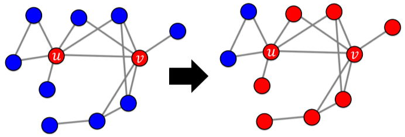 |
|                 2 정점을 제외하고 모두 전파                  |
| 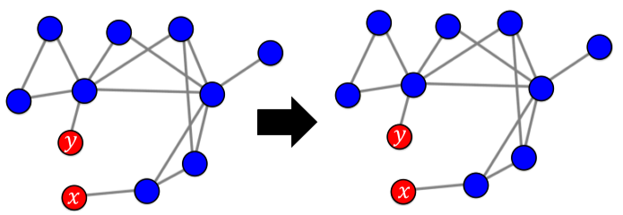 |
|              첫 2명을 제외하고 전파되지 않았음.              |

**[img. 이전 선형 임계치 모형의 시드집합 선택에 따른 결과 비교]**

이러한 이유로 그래프, 전파 모형 그리고 시드 집합의 크기가 주어졌을 대 전파를 최대화하는 시드 집합을 찾는 문제를 *전파 최대화(Influence Maximization) 문제*라고 부름.

- 하지만 최고 효율의 시드 집합을 찾는 이 문제는 아주 어려운 문제이다.
- |V|개의 정점의 그래프에서 시드 집합의 크기를 k개로 제한하여도 경우의 수가 $(\frac{|V|}{k})$개이다.
  -  사람이 10000명, 찾을 인플루언서가 10명이어도 약 $2.75\times 10^{33}$개 정도의 수
- 이론적으로 NP-hard 문제임이 증명됨
  - NP-난해(NP-hard) : 적어도 NP(푸는 시간이 $O(n)$ 이상 드는 문제) 문제 이상은 어려운 문제를 의미

너무나도 어려운 문제이므로 최고의 시드 집합을 찾는 것은 불가능하며, 휴리스틱 위주로 정답에 가까운 시드 집합을 찾아야한다.

- 휴리스틱으로 찾은 답은 최적의 답임이 보장되지 않는다.

휴리스틱 방법

1. 정점의 중심성(Node Centrality)

   - 시드 집합의 크기가 k개로 고정되어 있을시, 정점의 중심성이 높은 순으로 k개 정점을 선택
   - 페이지랭크 점수, 연결 중심성, 근접 중심성, 매개 중심성 등이 있음

2. 탐욕 알고리즘(Greedy Algorithm)

   - 시드 집합의 원소, 즉 최초 전파자를 한번에 한 명씩 선택하는 방법

   - 최초 전파자 간의 조합의 효과를 고려하지 않고, 근시안적으로 최초 전파자를 선택하는 과정을 반복함.

   - 즉, 정점의 집합을 {1,2, ..., |V|}라고 할 때

     1) 집합 {1},{2},...,{|V|}를 비교하여, 전파를 최대화하는 시드 집합을 찾는다.

     	- 이때, 전파의 크기 비교 방법은 시뮬레이션을 반복하여 생긴 평균 값을 사용함.

     2) 집합 {x}가 뽑히면, 집합 {x, 1}, {x, 2}, ..., {x, |V|}를 비교하여 전파를 최대화 하는 시드 집합을 찾음.

     3) 집합 {x, y}가 뽑히면 또 집합 {x, y, 1}, {x, y, 2}, ..., {x, y, |V|}를 비교하여 전파 최대화 집합을 찾음

     4) 위 과정을 목표하는 크기의 시드 집합에 도달할 때까지 반복

   - 독립 전파 모형일 시, 이론적으로 최저 성능 정확도가 보장됨
     $$
     r_{greedy}\geq (1-\frac{1}{e}) * r_{optimal} \\
     where\ (1-\frac{1}{e})\approx0.632\\
     r_{greedy}:\ 탐욕\ 알고리즘으로\ 찾은\ 시드\ 집합의\ 의한\ 전파의\ (평균)크기\\
     r_{optimal}:\ 이론상\ 최고의\ 시드\ 집합에\ 의한\ 전파의\ (평균)크기
     $$
     **[math. 탐욕 알고리즘의 최저 성능]**

### 전파 모형 시뮬레이터 구현

[Graph-4]Influence_Model.ipynb 참조

