# Lightweight

> Naver AI boostcamp 내용을 정리하였습니다.

## Lightweight model 개요

**1. 결정 (Decision making)**

**연역적 (deductive) 결정**

이미 참으로 증명(Axiom)되거나 정의를 통하여 논리를 입증하는 것

삼단 논법과 조합 $\begin{pmatrix}
 n\\r
\end{pmatrix}=\frac{n!}{r!(n-r)!}$ 증명 등이 있다.

- 삼단 논법 예시 : 소크라테스는 사람이다. 사람은 모두 죽는다. 소크라테스는 죽는다.

$$
Definition:\begin{pmatrix}
 n\\r
\end{pmatrix}=\frac{n!}{r!(n-r)!}\\
n!=n\cdot(n-1)\cdot(n-2)\dots\cdot2\cdot1라면,\\
Theorem:1+2+\dots+(n-1)=\begin{pmatrix}
 n\\r
\end{pmatrix}이다.
$$

**[math. 조합의 가정]**

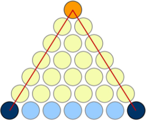

**[img. 조합의 증명]**

**귀납적 (inductive) 결정**

반복된 관찰과 사례를 통하여 논리를 입증

많은 통계학적 기법의 증명이 속한다.

예시: 몇만년동안 해는 동쪽에서 떠서 서쪽에서 진다 -> 고로 내일도 그럴 것이다.

단점으로, 100% 보장하지 않는다. (ex) 만약, 내일 태양이 폭발한다면?)

**2. 결정기 (Decision making machine)**

이전의 기계들은 사람이 결정을 하면 해당 결정의 목적 달성을 위해 도움을 주는 형태였다.

최근의 인공지능이 포함된 기기는 이때의 결정 또한 해주거나, 결정에 도움을 제공.

(ex) 공기질이 나빠지면 자동으로 켜지는 공기청정기)

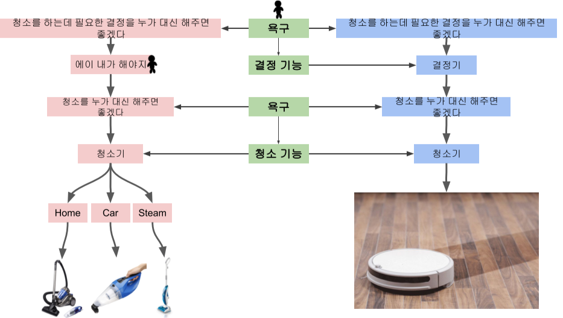

**[img. 청소기를 예시로 든 결정기]**

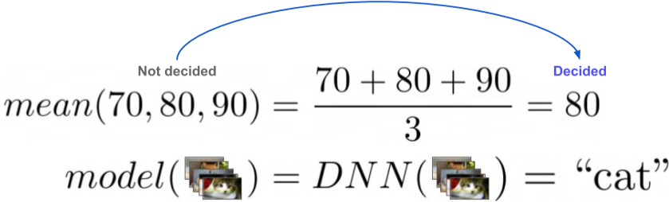

**[img. 가장 간단한 통계학적 결정기인 평균]**

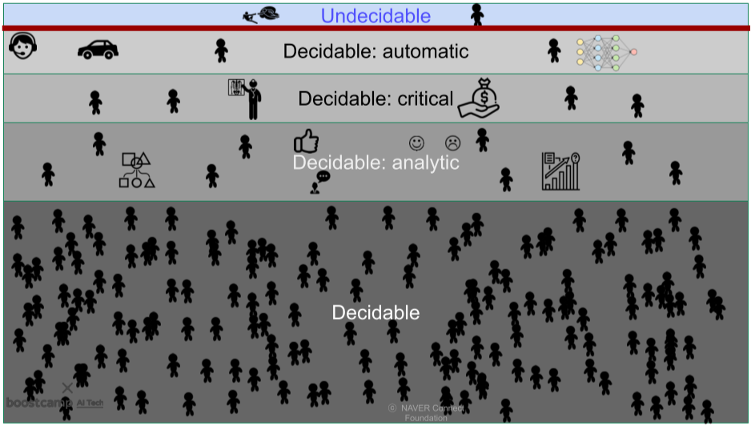

**[img. 세상에는 중요한 결정과 쉬운 결정, 그리고 결정할 수 없는것이 있다]**

- 근본적 가치에 관계된 일, 예측할 수 없는 일, 책임질 수 없거나 책임이 너무 큰일 등은 결정하기 힘들거나 결정할 수 없다.

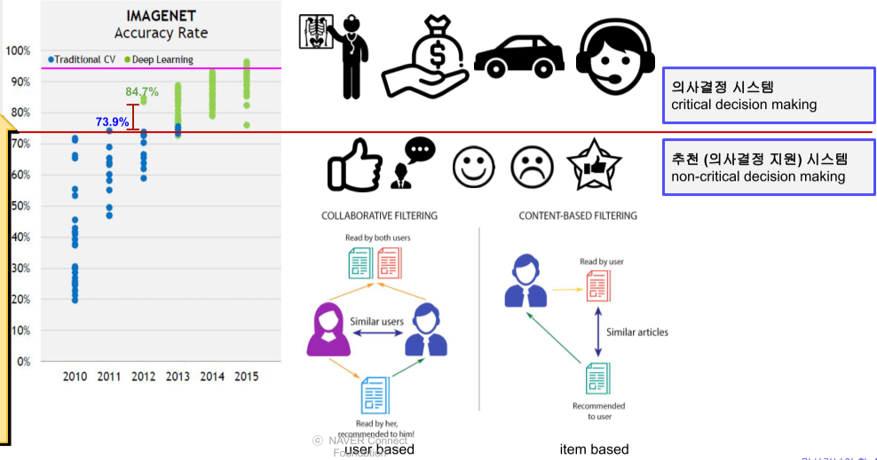

**[img. 과거에는 성능 부족으로 추천 정도만 했지만 최근에는 의사결정에 관여 가능한 수준]**

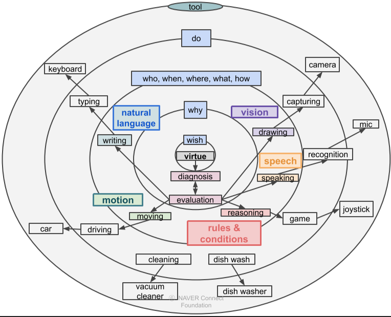

**[img. 현재 기술로는 잘해봐야 Rules & conditions 까지만 결정 가능, 가치와 중요 결정은 불가]**

**3. 가벼운 결정기 (Lightweight decision making machine)**

경량화(Lightweight)는 성능이나 가치가 차이가 없거나 적게 희생하고 규모와 비용 등을 줄이는 것이 것

소형화(Miniaturization)은 말 그대로 물건의 크기를 줄이는 것

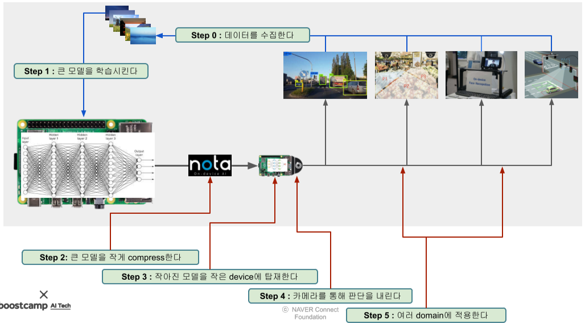

**[img. 소형 기기에 ML 모델을 넣기 위한 Cycle]**

최근에는 TinyML이라 하여 칩 수준의 소형기기를 위한 메모리 사용량과 연산량이 적은 Project 또한 진행되고 있다.

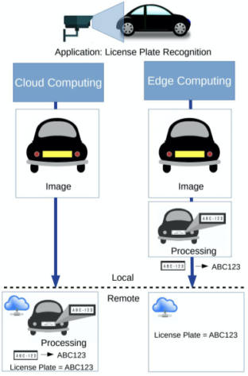

**[img. Edge Computing의 장점 시나리오]**

Edge Computing은 네트워크에서 끝 부분에 해당하는 보통 소형기기에서의 연산하는 서비스를 의미하며, 많은 장점을 가지고 있다

예를 들어, 자율주행의 연산을 Cloud Computing으로 처리할 시, 보안 문제, 연결안전성 문제, 대규모 연산에 의한 전력과 기기 소모 등이 필요하지만

Edge Computing은 이러한 문제를 해결할 수 있다.

**4. Backbone & dataset for model compression**

성능좋고 안정성 있는 Pre-trained 모델이 많이 나와있다.

이러한 Pre-trained 모델을 경량화하여 사용하면, 검증된 성능과 문제 해결, 빠른 개발 등의 장점이 있다.

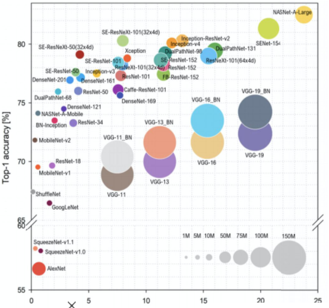

**[img. 최근에는 다양한 pretrained model이 많다.]**

MiB(메비바이트) : 2진법 기준 용량 계산법, 2^20 바이트 

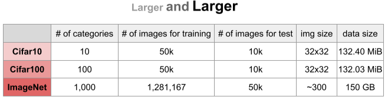

**[img. Classification을 위한 Dataset들, 점점 커진다]**

**5. Edge devices**

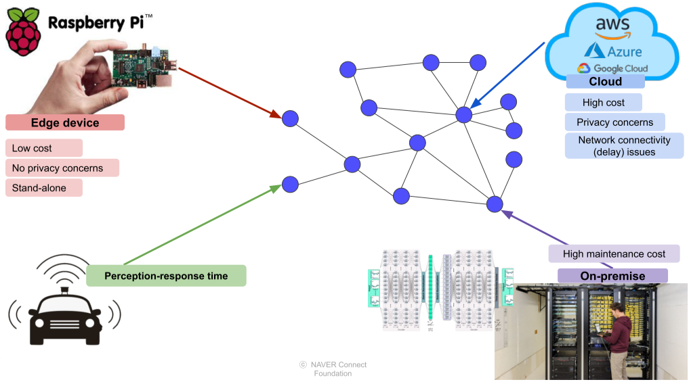

**[img. 각종 computing 방법]**

Cloud는 높은 가격과 보안 문제, 네트워크 연결이 필수이며, 연결이 불안전하거나 부하가 걸리면 사용하기 힘들다.

On-premise는 직접 서버를 두는 방식으로, 법적으로 정보가 네트워크에 누출 되지 않은 경우나, 대규모로 구현할 수 있는 회사등에서만 사용 가능하며, 유지보수 비용이 크다.

Edge device는 저비용, 높은 보안성, stand-alone 동작과 네트워크 연결 여부를 선택할 수 있지만, 연산량이나 전력 소모, 메모리가 제한된다는 단점이 있다.(Dumb and fast)

최근에는 Rasberry Pi, Jetson nano 처럼 합리적인 가격으로 사용해 볼 수 있다.

**6. Edge intelligence**

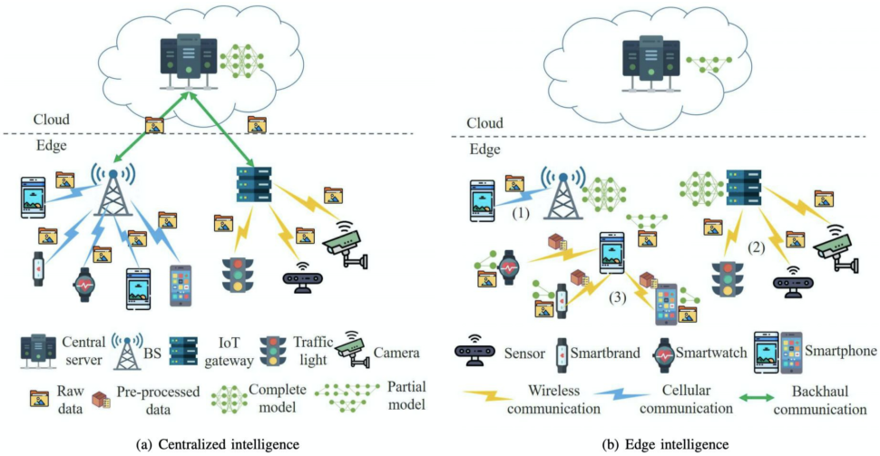

**[img. Cloud intelligence vs edge intelligence]**

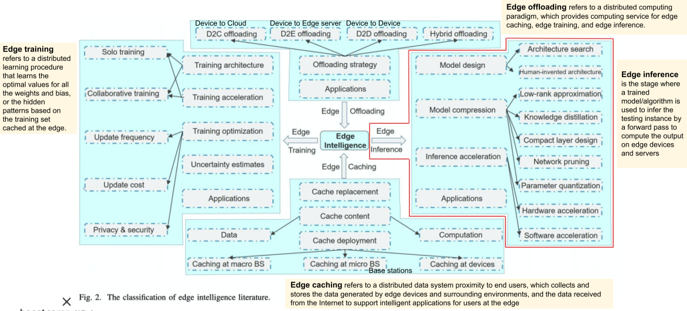

**[img. edge intelligence의 내부 분류]**

1) Edge training

Edge device에서 모델을 학습하는 것,

아직 Edge device 들의 성능이 떨어져 산업에서 사용하진 않는다.

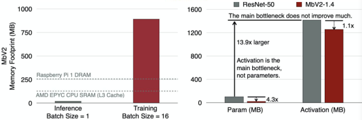

**[img. Inference vs Training에 드는 비용 비교]**

2) Edge caching

Edge가 처리하기 힘들지만 외부에서 연결을 통해 가져오기 힘든 정보를 연결없이 저장공간에 저장, 또는 불러오기 

이번 강의에서 다루진 않음

컴퓨터 구조에서 메모리에서 hit과 miss에 대한 개념을 비슷하게 사용

3) Edge offloading

Edge와 가까운 곳에 있는 Edge 서버(클라우드와 Edge의 중간 형태)로부터 연결하여 정보를 가져옴, 하드웨어와 비슷한 개념

4) Edge Inference

수업에서 주로 다룰 분야, Edge에서 Output을 출력

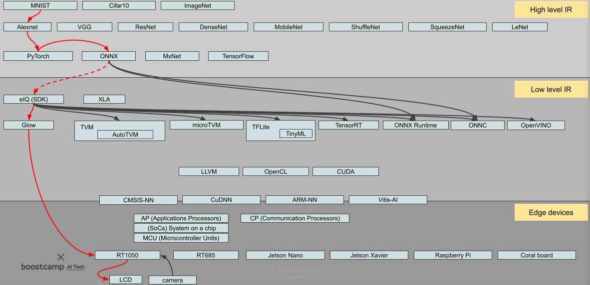

**[img. model 설계의 컴파일 수준]**

## 동전의 뒷면(The flip-side of the coin: on-device AI)

```bash
top
nvidia-smi # Gpu 상황
watch -n 0.5 nvida-smi
vmstat -h
# sudo apt-get install lm-sensors
sensors # 발열 체크
# sudo apt-get install atop
atop
# sudo apt install sysstat
mpstat
sar 3
sar 3 4
```

**[code. system resource monitoring 방법 (Ubuntu 환경)]**

AI 모델은 입력에 대해 정확한 출력을 보장하지 않음

Underspecification : 모델의 학습 결과가 매번 다름, 잘 결과를 내는 데이터가 다름

모델링 뿐만 아니라 여러가지 모두 중요하다.

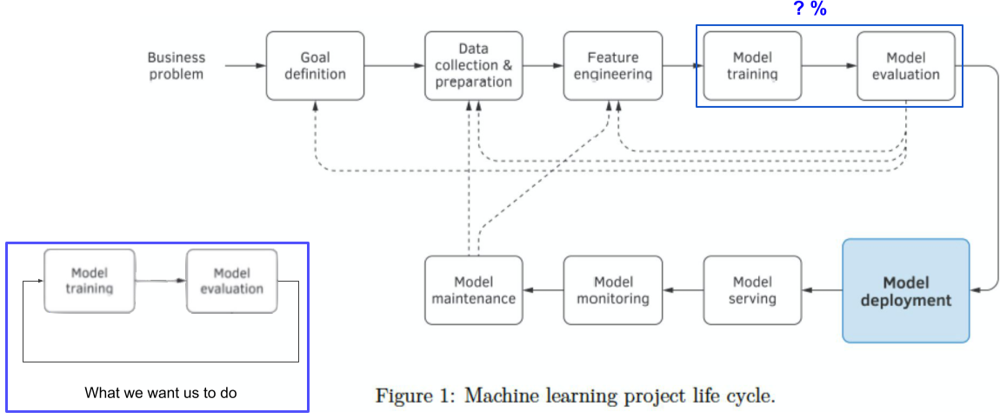

**[img. 실제 ML project cycle vs 우리가 상상하던 것]**

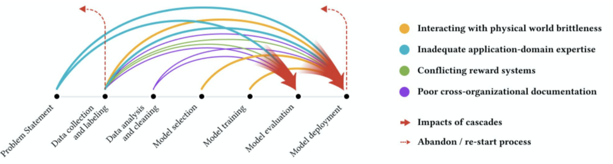

**[img. 모두 모델링을 하고 싶어하고 데이터 작업은 피해요 - ML project에서의 문제는 모두 하기싫어하고 천시하는 부분에서 터진다.]**

## 가장 적당하게 (Optimization)

제약조건 하에서의 의사결정(Decision-making under constraints)

사용가능한 자원 내에서 목적 달성 해야함 

```python
from scipy.spatial import distance
distance.euclidean([1,0,0], [0,1,0]) # euclidean 거리
distance.hamming([1, 0, 0], [0, 1, 0]) # hamming 거리
distance.cosine([1, 0, 0], [0, 1, 0]) # cosine 거리
# loss 구할 때 필요하곤 함
```

**[code. scipy를 이용한 거리 제기]**

문제란, 바라는 것과 인식하는 것 간의 차이


**[img. 문제에 대한 그림]**

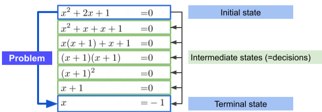

**[img. 문제의 해결 과정 예시]**

계산(Compute)이란, 유한한 자원과 시간 안에 decision을 통하여 Initial state부터 Terminal state까지 진행하는것 .

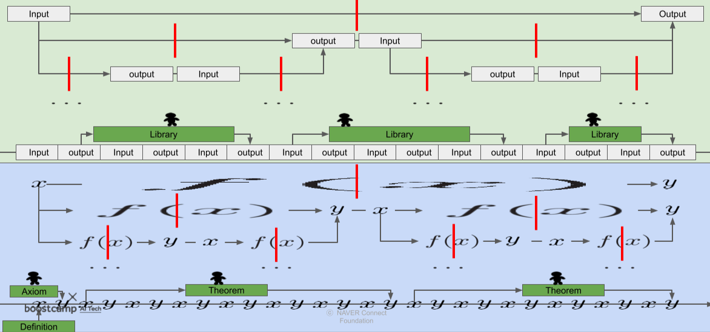

**[img. 수학적 증명과 IT project의 해결과정은 비슷하다]**

Decision problem : 목적만 존재 (어떻게 MST를 만드는가?)

Opitmization problem : 자원과 step에 제한이 걸린 상태에서 목적을 달성하는 법(최소 가중치의 MST를 어떻게 만드는가?)


## 모델의 시공간(Timespace of ML model)

search space: 답이 될 수 있는 decision, state들의 집단, state들의 합, solution space라고도 함

ex) 바둑의 기보, 알고리즘 step

problem space: 처음 문제가 정의되어 있는 공간, state, initial state라고도 함

ex) 비어있는 바둑판, 알고리즘 Input

또한, 시간을 희생해서 공간 사용량을 줄이거나 공간 사용량을 늘려 시간을 줄일 수 있는 경우가 많다.

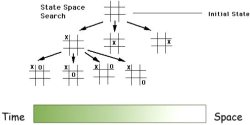

**[img. Time과 space의 trade off]**

Time Complexity : Input size에 따라 얼마나 Problem solving Time이 늘어나는가?

기존의 알고리즘은 P 문제까지 손쉽게 해결 가능하다.

NP 문제부터는 머신러닝으로 해결할 수 있다.

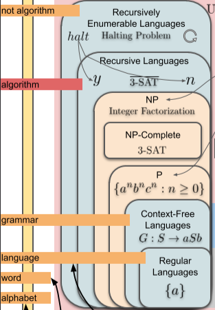

**[img. 시간 복잡도에 따른 문제 분류]**

entropy : 무질서도 그리고 정보, 놀라움, 불확실성의 레벨

문제 해결은 높은 entropy의 상태를 에너지를 투자하여 낮은 entropy로 바꾸는 것,

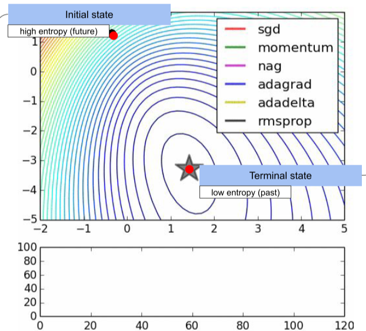

**[img. ML에서 Loss값을 줄이는 행위 또한 entropy를 낮추는 것이다.]**

**parameter search**

과거의 도구는 인간이 직접 설계하고, 제작하여, 사용하여야 했다.

공학과 에너지의 발전으로 인간이 직접 설계하고 제작하면, 자동으로 사용되는 기계가 생겨났다

이후 프로그래밍의 발전으로 인간이 프로그램을 설계하면 프로그램의 제작과 사용이 자동화되는 시대가 되었다

머신러닝을 통하여 Parameter Search를 통하여 프로그램의 로직을 자동으로 설계할 수 있게 되었고,

앞으로 딥러닝과 먼 미래에는 Hyperparameter와 Architecture 또한 자동으로 설계가 되어, 완벽한 자동화가 이루어질 것이다. 

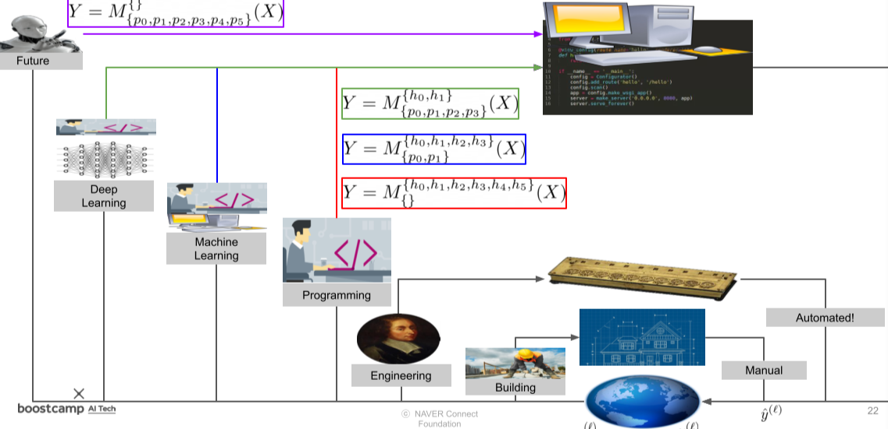

**[img. 도구의 역사]**

딥러닝에서 데이터는 벡터나 다차원 array 등으로 다양하게 표현할 수 있다.

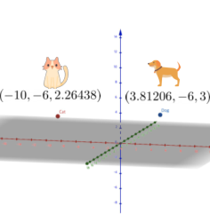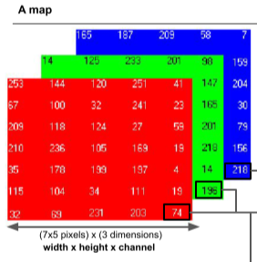

**[img. Data의 Vector 표현과 map 표현]**

Classification task의 경우 위에서 표현한 데이터들의 차원상의 Decision boundary를 결정하기 위해, layer를 통하여 차원에서의 표현을 바꾸는 과정을 거친다.

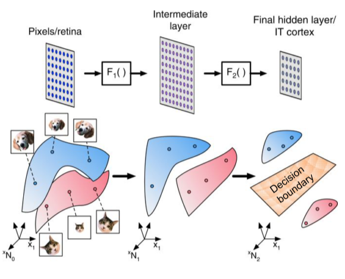

**[img. Decision boundary를 결정하기 위한 geomerty 변경]**

**Hyperparameter search**

Hyperparameter search의 경우 parameter search와 다르게 하나의 weight가 아닌 전체적인 구조에 영향을 주는 경우가 많아 parameter search 보다 더욱 리스크와 cost가 크다. (ex) 레이어의 수, learning rate 등)

이를 해결하기 위해 다양한 연구가 진행되고 있다.

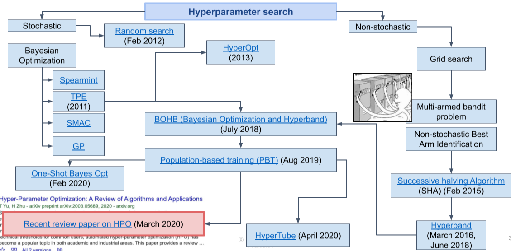

**[img. Hyperparameter seach에 대한 연구]**

Hyperparameter 탐색 시마다 간격을 일정하게 주는 Grid search와 random한 값을 주는 Random search가 있으며, 기존의 Manual search와 비교해서 다음과 같은 장단이 있다.

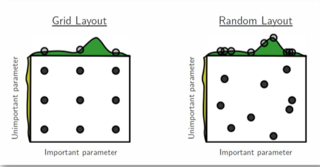

**[img. hyper parameter search 방법]**

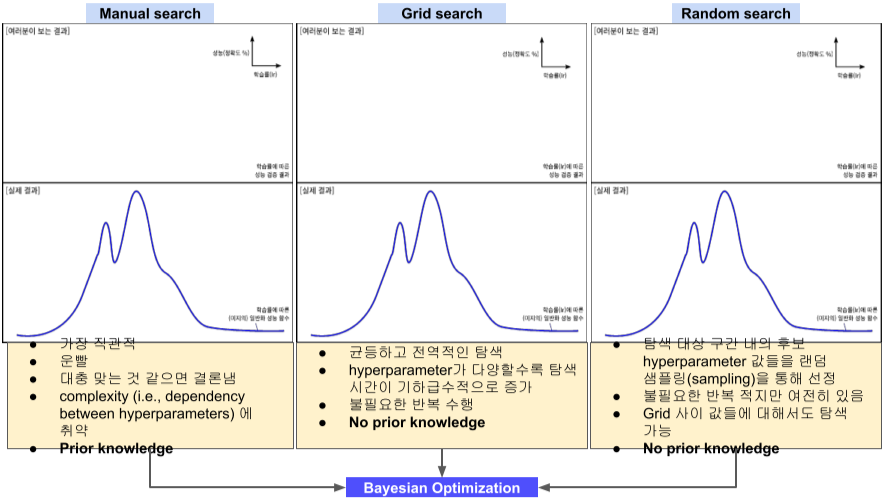

**[img. search 방법에 따른 성능 차이]**

또한 단순한 Random search 말고도, Hyperparameter에 따른 결과를 예측하는 모델을 만드는 방법인 Surrogate model이라는 방법이 있다.

- Gaussain Process가 대표적인 방법
- 조금더 적은 비용으로 많은 탐색이 가능하다.

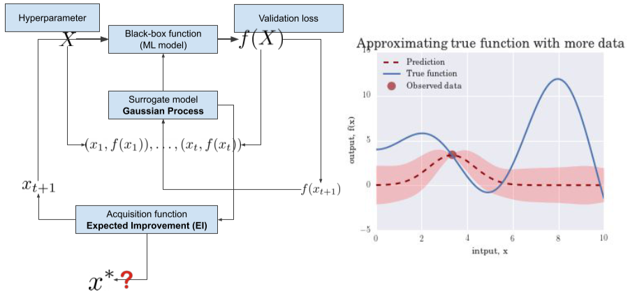

**[img. Surrogate model 도식]**

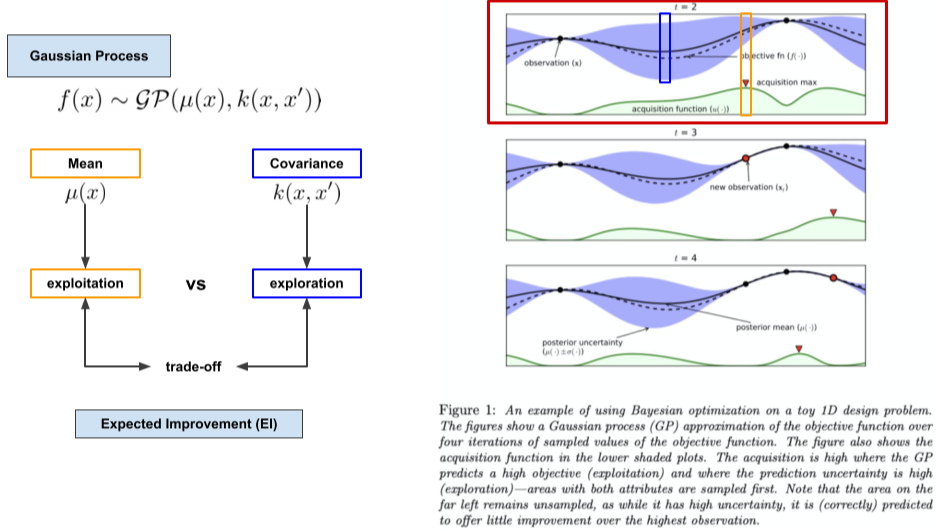

**[img. Gaussian model 예시]**

**Neural Architecture search(NAS)**

NAS는 보통 사람이 직접 만든는 것도 포함하는 개념이지만 좁은 의미에서는 마치 parameter를 찾는 것 처럼, 효율적인 ML구조를 Neural Archtecture 또한 탐색을 통하여 찾는 방법이다.

Multi-objective NAS의 경우, 성능 뿐만 아니라 최적화도 신경쓰므로, Optimization에도 뛰어나다.

결과물은 사람이 이해할 수 없지만 괴상한 구조인 경우가 많다.

이 때, 단순히 완전 탐색을 통하여 Search 하는 것이 아니라, NAS 전략을 위한 머신러닝 모델을 만들 수도 있다.

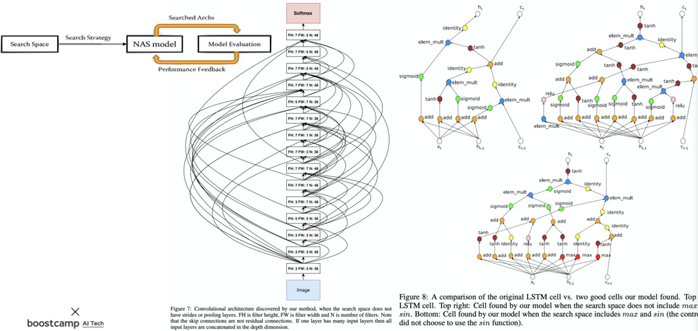

**[img. Automatic Neural Architecture Search]**

**NAS for edge device**

1. MnasNet

edge device를 위한 NAS

model들을 샘플로, 실제 Mobile phone환경에서 실험한 결과를 reward로 하는 강화학습을 통하여 기존의 모델 보다 성능과 latency 를 개선함.

Hyperparameter search를 하듯 Block 별로 layer의 종류와 parameter를 지정하고 search함.

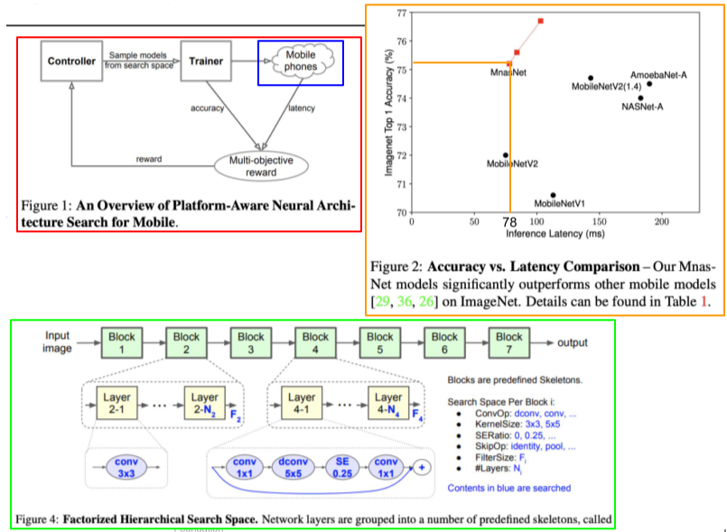

**[img. MnasNet 논문 내부의 figure]**

2. PROXYLESSNAS

과거에는 Proxy를 이용해 NAS를 하였지만 이 방법의 결과가 실제 결과와 괴리가 있는 경우가 많으므로 ,PROXY를 사용하지 않은 NAS 방법

- Proxy는 직접적으로 실제 모델을 학습하면서 NAS를 돌리면 너무나도 비용이 크므로 일종의 간략화된 가짜 모델을 이용해 학습하는 방법

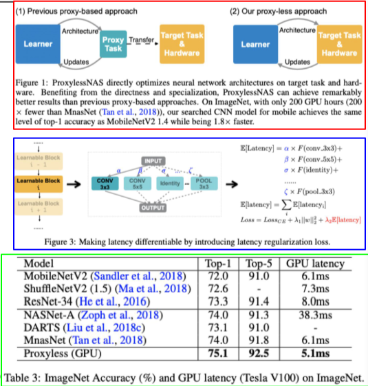

**[img. PROXYLESSNAS의 figure]**

3. ONCE-FOR-ALL

Training한 모델을 단순히 한 Device 뿐만 아니라 조금의 구조 변경을 통해 여러 Platform에 적용

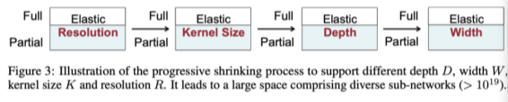

**[img. ONCE-FOR-ALL의 비결, Pruning 방법과 비슷함]**

4. MobileNet 시리즈


CV 시간에 배운 Depth-wise Separable Convolution에 대한 내용

나중에 또 나온다고함 

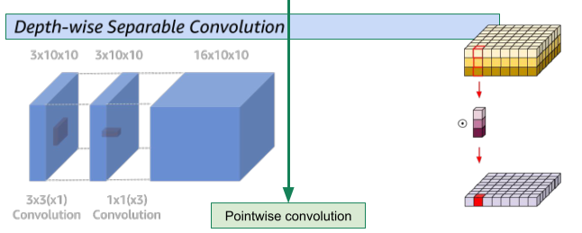

**[img. Depth-wise Separable Convolution]**

## 압축

###  압축 (Compression)

$$
Compression\ rate =\frac{size\ before\ compression}{size\ after\ compression}
$$

**[math. 압축율(Compression rate)의 정의]**

1. **손실 압축**

데이터를 눈치채지 못하는 수준의 손실시켜 압축

압축률이 상당한 경우가 많으며, 손상되도 문제 없는 경우에 사용됨

- 예를 들어, 화질, 음질의 저하는 눈치 못채는 경우가 많다.
- jpg, mp3, mp4, avi, gif 등이 있다.
- MP3는 일반 WAV보다 약 12% 이하의 크기
  - 가청주파수 이외의 음은 잘라내버리는 방식

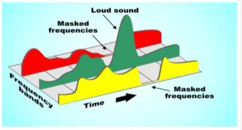

**[img. audio data의 손실 압축]**

2. **비손실 압축**

복원 시, 데이터가 손실되지 않은채로 완벽하게 복원됨

압축률은 데이터마다 다르겠지만, 보통 손실 압축보다 덜압축됨

- 비손실 압축의 예시로 Run-length encoding (RLE)가 있다

$$
AAAAAAAAAABBBBBBTTTTPPPPPP(27byte) = 10A6B5T6P(9byte),\\ compression\ rate : \frac{27}{9} ==3\\
ABC(3byte)=1A1B1C(6byte)\\
compression\ rate :\frac{3}{6}==0.5
$$

**[img. RLE의 압축 방법]**

- zip, 7-zip, wav, flac, png 등이 있다.

**Huffman coding**

압축 알고리즘 중 하나

문자에 대한 코드 map을 생성하여 문자대신 해당 코드로 압축, 이때 많이 등장한 단어에는 짧은 코드를, 적게 등장한 단어에는 긴 코드를 할당하여 압축률을 극대화

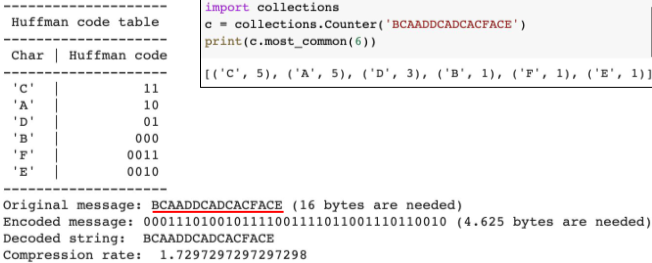

**[img. Huffman coding 중 하나]**

### 부호 (Coding)

압축은 특정 정보를 인코딩(enCODING)하고 또, 그것을 디코딩(deCODING)하여 원본 크기로 바꿀 수 있을 때, 압축 크기가 원본크기가 작으면 압축이라고 정의한다.

즉 압축은 Coding의 일부

**Finite State Machine(FSM)**

상태를 의미하는 정점과 상호작용을 의미하는 간선들로 객체의 상태와 변화, 동작을 표현하는 방법

각 정점 또한 초기 상태, 중간 상태, 종료 상태로 나뉜다. 

컴퓨터 그 자체와, 그와 관련된 개념들이 이를 이용한다.

ex) Client-Sever 관계(Client의 Request와 Server의 Response)

DB의 데이터에 대한 CRUD 로직

알고리즘 문제의 Input state, Step, Output state 

등이 존재함

부호화(EnCoding)한다는 공통점이 존재

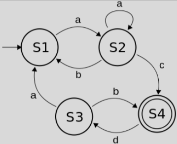

**[img. FSM의 그림]**

머신러닝 또한 Input data를 encoding 해서 output을 만드는 Coding 이다.

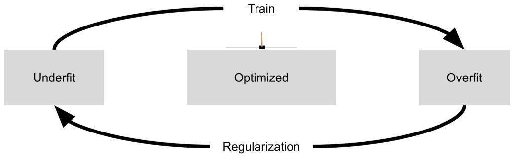

**[img. 머신러닝 모델 생성의 FSM 표현]**

### 부호화 (Encoding)

KL divergence는 Loss를 많이 구하는데 사용하지만, 엄밀히 말하면 entropy의 차이를 측정할 수 있는 방법이며, 압축 등의 효율을 구하는 데도 사용한다.

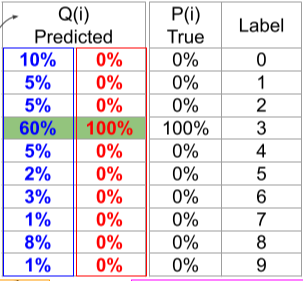

**[img. Mnist Model의 예측 결과]**
$$
D_{KL}(P\|Q)=\mathbb{KL}(P\|Q) = -\mathbb{E}_{x\sim P(x)}[logQ(x)] + \mathbb{E}_{x\sim P(x)}[logP(x)]\\
=-\sum^9_{i=0}P(i)\ln\frac{Q(i)}{P(i)}=\sum^9_{i=0}[(-P(i)\ln Q(i))-(-P(i)\ln P(i))]
\\ 크로스\ 엔트로피: -\mathbb{E}_{x\sim P(x)}[logQ(x)], 엔트로피:\mathbb{E}_{x\sim P(x)}[logP(x)]\\\\
파란\ 예측 : D_{KL}(P\|Q)=0.5108\\
빨간\ 예측: D_{KL}(P\|Q)=0
$$
**[img. KL divergence를 통한 Loss값 측정 및 결과]**

머신러닝이 Loss값을 줄이는 행위 또한 Encoding이라고 함

압축에서의 Cross-entropy의 의미는 q의 분포 코드 북으로 p 코드북을 사용하는 문장을 해석 했을 때의 평균 길이

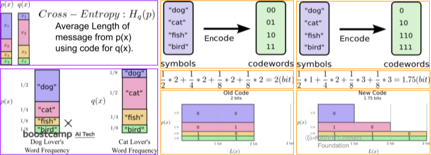

**[img. 압축에서의 Cross-Entropy의 의미]**

### 압축률(Compression rate)

머신러닝의 압축에서 다음과 같이 정의할 때

|                              | Original Model | Compressed model |
| :--------------------------: | :------------: | :--------------: |
|            Models            |      $M$       |      $M^*$       |
| The number of the parameters |      $a$       |      $a^*$       |
|       The running time       | $\mathcal{s}$  | $\mathcal{s}^*$  |

**[img. 압축된 모델의 정의]**

각 성능을 의미하는 지표를 구하는 방법은 다음과 같다.
$$
Compression\ rate: \alpha(M,M^*)=\frac{a}{a^*}\\
Space\ saving\ rate: \beta(M,M^*)=\frac{a-a^*}{a^*}\\
Speedup\ rate: \delta(M,M^*)=\frac{\mathcal{s}}{s^*}
$$
**[img. 성능 비교용 지표 ]**

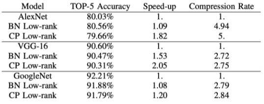

**[img. 각 모델과 ILSVRC와의 비교 ]**