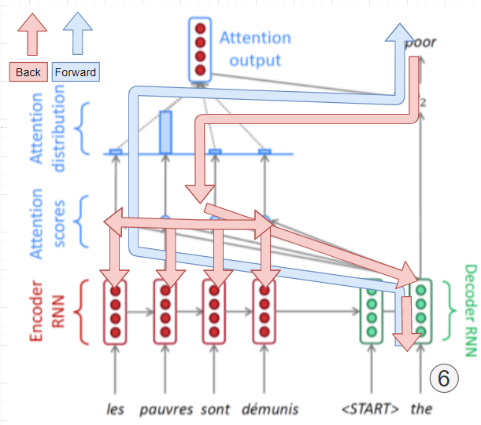

[TOC]

# NLP

## Intro to Natural Language Processing(NLP)

- 컴퓨터가 주어진 단어나 문장, 문단, 글을 이해하는 NLU(Natural Language Understading)
- 이런 한 글을 생성할 수 있는 NLG(Natural Language Generation)로 이루어짐

- NLP의 영역(ACL, EMNLP, NAACL 등에서 연구)
  - 우리가 주로 다룰 분야
  - Low-level parsing 
    - Tokenization: 문장을 이루는 각 단어를 정보 단위(Token)로 쪼개나가는 것
    - stemming: 단어의 다양한 표현 변형을 없애고 의미만 남기는 것
      - 맑고, 맑지만, 맑았는데, 맑은 = 맑다.
  - word and phrase level
    - Named entity recognition(NER) : 고유 명사 인식 
      - (Newyork times는 newyork + times가 아니다)
    - part-of-speech(POS) tagging : 단어의 품사, 성분이 무엇인가?(명사, 목적어, 형용사 등)
  - Senetence level
    - 문장의 감정분석, 기계번역
  - Multi-sentence and paragraph level
    - Entailment prediction : 두 문장의 모순관계, 논리적 내포를 확인
      - 문장이 앞서 했던 말과 다른가?
    - 질의 응답, 문서 요약
    - dialog systems: 챗봇

- Text mining의 영역(KDD, WSDM, WWW 등에서 연구중)
  - 트랜드 분석, 상품 반응 분석, SNS 사회과학 분석 등

- Information retrieval(검색 기술)
  - 많이 성숙해진 상태, 상대적으로 느림,
  - 추천 시스템, 개인화 광고 등

### NLP의 트랜드

- 문장의 단어들을 vector로 표현하여 그래프 내의 점으로 바꾸어 처리하게 됨(Word Embedding).
- 자연어 처리에서 RNN 모델을 위한 LSTM, GRU 유닛이 사용되다 최근 구글의 attention module과 Transformer model의 발표로 성능이 크게 늘어남.
- 더이상 rule base 기계 번역은 딥러닝 base 기계번역에 성능으로 뒤쳐지고 있음.
- 최근에는 자가 지도 학습 또는 pretrained model을 통하여 더 이상 labeling이 필요하지 않은 BERT, GPT-3 같은 기술이 나타남.
- 다만 이러한 기술 들은 대규모의 컴퓨팅 능력과 데이터가 필요함.

### Bag-of-Words and NaiveBayes Classifier

- Bag-of-Words는 딥러닝 기반 이전 시대 때, 단어와 문서를 숫자형태로 나타내는 표현 기법
- NaiveBayes Classifier : Bag-of-Words 방식을 이용한 전통적인 문서 분류 기법

#### Bag-of-Words Representation

- Bag-of-Words의 과정

  1. 주어진 문장의 단어가 각각 포함되어있는 사전(vocabulary) 생성
     - "Jon really really loves this movie", "Jane really likes this song"에서
     - Vocabulary: {"John", "really", "loves",  "this","movie","Jane","likes","song"} 생성

  2. 사전에 포함된 유일한 단어들을 one-hot vector로 인코딩
     - Vocabulary: {"John", "really", "loves",  "this","movie","Jane","likes","song"} 
     - 차례대로 one-hot vector 형식으로 인코딩
       - 예를 들어  John:[1 0 0 0 0 0 0 0], really: [0 1 0 0 0 0 0 0] ... song: [0 0 0 0 0 0 0 1]
       - word- embedding 방법과의 차이점
     - 모든 vector쌍의 거리는 $\sqrt 2$, cosine similarity 는 0으로 계산된다.

- 이렇게 구성된 문장이나 단어는 one-hot vector들의 합으로 표현할 수 있다.

  - 예시 1. "John really really loves this movie"
    - John + really + really + loves + this + movie: [1 2 1 1 1 0 0 0]
  - 예시 2. "Jane really likes this song"
    - Jane + really + likes + this + song: [0 1 0 1 0 1 1 1]

#### NaiveBayes Classifier for Document Classification

- NaiveBayes Classifier란, Bag of words 방법으로 표현된 문서를 구분할 수 있는 전통적인 방법
- d개의 문서와 C의 문서분류 집합이 있다고 가정하고, c 분류는 C 문서분류 집합의 원소일 때, 각각의 클래스에 d문서가 속할 확률 분포는 아래와 같이 표현된다.

$$
C_{MAP}=argmax\ P(c|d) :"maximum\ a\ posteriori" = most\ likely\ class \\ = argmax\ \frac{P(d|c)P(c)}{P(d)}: Bayes\ Rule \\ = argmax\ P(d|c)P(c):Dropping\ the\ denominator\\
where\ c \in C
$$

**[math. Bayers' Rule Applied to Documents and Classes ]**

- P(d)는 d document가 뽑힐 확률 이며, 고정된 값으로 볼 수 있어서 무시할 수 있음

- 단어들 w로 이루어진 c 분류의 d 문서에서 특정 분류 c가 고정일 때, 문서 d가 나타날 확률은
  - $P(d|c)P(c) = P(w1,w2,\dots,w_n|c)P(c)\rightarrow P(c)\prod_{w_i\in W}P(w_i|c)$
  - 각 단어(w~1~,w~2~,...,w~n~)가 나타날 확률을 독립적이라고 가정

##### NaiveBayes 분류 예시

|          | Doc(d) | Document(words, w)                                   | Class(c) |
| -------- | ------ | ---------------------------------------------------- | -------- |
| Training | 1      | Image recognition uses convolutional neural networks | CV       |
|          | 2      | Transformer can be use for image classification task | CV       |
|          | 3      | Language modeling uses transformer                   | NLP      |
|          | 4      | Document classification task is language task        | NLP      |
| Test     | 5      | Classification task uses transformer                 | ?        |

**[fig. NaiveBayes 예시]**

- 위 표의 상황에서 class의 속할 확률은
  - $P(c_{cv})=\frac{2}{4}=\frac{1}{2}$
  - $P(c_{NLP}) = \frac {2}{4}=\frac {1}{2}$
- 이며, 이때 각 단어가 나타날 확률은
-  $P(w_k|c_i)=\frac {n_k}{n}$, where n~k~ is occurreneces of w~k~ in documents of topic c~i~

| Word                             | Prob            | Word                              | Prob            |
| -------------------------------- | --------------- | --------------------------------- | --------------- |
| $P(w_{"classification"}|c_{CV})$ | $\frac {1}{14}$ | $P(w_{"classification"}|c_{NLP})$ | $\frac {1}{10}$ |
| $P(w_{"task"}|c_{CV})$           | $\frac {1}{14}$ | $P(w_{"task"}|c_{NLP})$           | $\frac {2}{10}$ |
| $P(w_{"uses"}|c_{CV})$           | $\frac {1}{14}$ | $P(w_{"uses"}|c_{NLP})$           | $\frac {1}{10}$ |
| $P(w_{"transformer"}|c_{CV})$    | $\frac {1}{14}$ | $P(w_{"transformer"}|c_{NLP})$    | $\frac {1}{10}$ |

**[fig. 각 단어가 class 내에 나타날 확률들]**

- document d~5~="Classification task uses transformer"를 통하여 class에 속할 확률을 구해보면
  - $P(c_{CV}|d_5)=P(c_{CV})\prod_{w\in W}P(w|c_{CV})=\frac{1}{2}\times \frac{1}{14}\times \frac{1}{14}\times \frac{1}{14}\times \frac{1}{14}\times = 0.000013$
  - $P(c_{NLP}|d_5)=P(c_{NLP})\prod_{w\in W}P(w|c_{NLP})=\frac{1}{2}\times \frac{1}{10}\times \frac{2}{10}\times \frac{1}{10}\times \frac{1}{10} = 0.0001$
- 여기서 가장 높은 확률인 분류를 뽑아 확정하게 된다(argmax).
- 다만 학습 데이터에 없는 단어가 포함될 경우 다른 단어들이 있더라도 확률이 0이 되버리므로 regularization 같은 다른 방법을 강구해야함.

### Word Embedding: Word2Vec, GloVe

- Word2Vec과 GloVe는 하나의 차원에 단어의 모든 의미를 표현하는 one-hot-encoding과 달리 단어의 distributed representation을 학습하고자 고안된 모델.
- 문장을 단어라는 단위 정보로 이루어진 sequence data라고 가정했을 때, 각 단어들을 공간상의 한 점이나 벡터로 표현하는 기술을 Word Embedding이라고 한다.
  - 예를 들어 cat과 kitty는 비슷한 의미를 가지므로 비슷한 좌표값이나 벡터를 가지고 있겠지만, hamburger는 전혀 다른 좌표나 벡터에 있을 것이다.

#### Word2Vec


**[img. Word2Vec 의 예시]**

- 같은 문장에 자주 포함되는 단어들은 관련성이 많다는 가정 하에  Word Embedding을 진행하는 알고리즘
  - 예를 들어 "The furry cat hunts mice." 에서 cat은 furry하고 mice를 hunts 하므로 연관이 있다.

- 문장 내의 단어 w가 나타날 때, 그 주위에 각각의 단어가 나타날 확률분포를 구하여 이용한다.
- Skipgram 방법과 CBOW 방법 두가지로 나뉨 (실습 2_word2vec.ipynb) 참조

##### Word2Vec Algorithm과 예제

1. 주어진 문장을 Tokenization한 후, 사전(Vocabulary) 생성하고 단어별 one-hot 벡터 생성
   - Sentence: "I study math."
   - Vocabulary: {"I", "study", "math"}
   - Input: "study" [0, 1, 0]
   - Output: "math" [0, 0, 1]
2. Sliding Window 기법을 이용해 앞 뒤로 나타난 단어들의 쌍들로 학습 데이터 구성.


**[img. Window size가 1인 Sliding Window 기법의 그림]**

3. 2 layer 구성의 심층 신경망을 통해 word embedding 한다.

   - Input layer, output layer 차원 수 : vocabulary 단어 수(one-hot vector 차원)

   - hidden layer 차원 수 : hyper parameter(word embedding 차원 수)

   

   **[img. 2 layer 신경망의 word embedding 원리]**

   - input vector "study"의 경우, [0,1,0]의 벡터를 가지고 있으며, hidden layer의 차원수가 2라고 가정할 때.
   - linear transform matrix W~1~의 경우 3차원의 벡터를 2차원의 벡터로 바꿔야 하므로 2X3 차원을 가진다.
     - W~1~의 input vector가 one-hot vector 이므로 내적을 구하기 보단 one-hot vector의 인덱스에 해당하는 W~1~의 Column을 가져오는 형식으로 계산한다.
   - linear transform matrix W~2~의 경우 다시 3차원의 벡터를 가져야 하므로 3X2 차원을 가진다.
     - softmax 함수를 통과시키기 전의 이상적인 logic값은 ground-truth의 내적값은 $\infin$, 그 이외의 내적 값은 $-\infin$이 되어야 결과값도 one-hot vector의 형태로 나온다. 

4. softmax 함수를 통과시켜 word embedding 값을 가져온다.

****

- 이를 통하여 의미론적 관점에서 단어간의 유사도를 알 수 있는 word vector를 구할 수 있다.


**[img. 단어 간의 관계가 비슷하면 두 단어의 벡터의 방향도 유사하다.]**

- https://ronxin.github.io/wevi/ 에서 Word2Vec을 시연해볼 수 있다.
- https://word2vec.kr/search/ 에서 한국어 Word2Vec 결과값을 알아볼 수 있다.
- Word2Vec으로 문맥에 어색한 단어를  찾아내는 Intrusion Detection 또한 가능하다.
- Word2Vec을 이용해 다음과 같은 분야에 활용해 성능을 향상시킬 수 있다.
  - 기계번역
  - PoS tagging
  - 고유명사 태깅
  - 감정 분석
  - Image Captioning
  - 기타 등등

#### GloVe: Another Word Embedding Model

- Global Vectors for Word Representation

- Word2Vec과 함께 많이 쓰이는 Word Embedding 방법
- 카운트 기반 방법론(LSA)과 예측 기반의 방법론(Word2Vec) 두 가지를 모두 사용하는 방법론
  - (입력어의 임베딩 벡터와 출력어의 임베딩 벡터의 내적값)과 (윈도우에서 두 단어 i, j의 동시 출연 빈도에 log를 씌운 것)을 loss 함수로써 fitting하여 word embedding 값을 구하는 방식
  - $u_i$: 입력어의 임베딩 벡터, $v_j$: 출력어의 임베딩 벡터, $P_{ij}$: 윈도우 기반 두 단어 i, j의 동시 등장 빈도

$$
J(\theta)=\frac{1}{2}\sum^w_{i,j=1}f(P_{ij})(u_{i}^Tv_j-logP_{ij})^2
$$

​		**[math. GloVe의 손실함수]**

- 윈도우 기반 동시 등장 빈도($P_{ij}$)는 전체 단어 집합 들의 단어들이 윈도우 크기 내에서 단어가 등장한 횟수를 의미하며, 보통 전체 단어들의 등장 빈도를 행렬로 다음과 같이 표현한다.
  - "I like deep learning", "I like NLP", "I enjoy flying" 세 문장이 주어지고 윈도우 크기가 1일 때,

| 카운트   | I    | like | enjoy | deep | learning | NLP  | flying |
| :------- | :--- | :--- | :---- | :--- | :------- | :--- | :----- |
| I        | 0    | 2    | 1     | 0    | 0        | 0    | 0      |
| like     | 2    | 0    | 0     | 1    | 0        | 1    | 0      |
| enjoy    | 1    | 0    | 0     | 0    | 0        | 0    | 1      |
| deep     | 0    | 1    | 0     | 0    | 1        | 0    | 0      |
| learning | 0    | 0    | 0     | 1    | 0        | 0    | 0      |
| NLP      | 0    | 1    | 0     | 0    | 0        | 0    | 0      |
| flying   | 0    | 0    | 1     | 0    | 0        | 0    | 0      |

**[fig. 예제의 윈도우 기반 동시 등장 행렬(Window based Co-occurrence Matrix) https://wikidocs.net/22885]**

- 중복 되는 계산이 적어 상대적으로 빠를 수 있고, 적은 데이터로도 성능이 좋다.(실제 성능은 비등비등)
- https://nlp.stanford.edu/projects/glove/ 오픈소스 glove 모델

## Recurrent Neural Networks(RNNs)

### Basics of Recurrent Neural Networks(RNNs)


**[img. RNN의 구조, 좌측은 Rolled RNN, 우측은 UnRolled RNN이다.]**

- Sequence 입력 벡터 X과 이전 time step의 RNN 모듈에서 계산한 $h_{t-1}$을 입력으로 받아, 현재의 $h_t$를 출력하는 구조.

  | 수식과 구조                                                  | 구성                                                         |
  | ------------------------------------------------------------ | ------------------------------------------------------------ |
  |  | $$h_{t-1}:\ 이전\ hidden-state\ vector\\x_t:\ 해당 모듈의\ input\ vector\\h_t:\ 생성된\ hidden-sate\ vector\\\cdot 최종\ output(y_t)\ 출력시\ h_t를\ 바탕으로 계산  \\f_W:\ 파라미터\ W를\ 포함한\ RNN 함수\\y_t:\ 해당\ 모듈의\ output\ vecotr$$ |

  **[fig. RNN에서의 hidden state 계산과 구성 요소]**


- 매 time step 마다 같은 함수와 Parameter 구성을 공유함

$$
h_t = f_W(h_{t-1},x_t)\\
\downarrow\\
h_t=tanh(W_{hh}h_{t-1}+W_{xh}x_t)\\
y_t =W_{hy}h_t
$$

**[math. RNN의 자세한 $f_W$함수]**

- Hidden State Vector($h_t$)의 차원수는 Hyper parameter이다.

  - 즉, 개발자 판단하에 주어져야 함.

  
**[img. $W$의 차원 수는 $h_{t-1}$ 차원수 X ($h_{t-1}$ 차원수 + $x_t$ 차원수)가 된다.]**
  
- 마지막으로 output $y_t$의 경우 binary classification이면 1차원으로 바꾼 뒤 sigmoid 함수를 이용하며, Multi Class classification이면 n개의 차원으로 바꾼 뒤 SoftMax Layer를 통과 시킨다. 

### Types of RNNs


**[img. 여러 종류의 RNN 구조]**

- one-to-one 구조 

  - 키, 몸무게, 나이를 통해 저혈압, 정상혈압, 고혈압을 판단
  - Time Step이 존재하지 않음

- one-to-many 구조
  
  - Input이 첫 time step에 한번, 출력은 매번,
  - 나머지 Input은 무의미한 같은 차원의 zero vector가 들어간다.
  - Image Captioning
  
- many-to-one 구조
  
  - Input은 매번, Output은 마지막 한번
  
  -  감정 분석
  
- sequence-to-sequence 구조 1
  
  - Input이 일부 time step에, output이 또 일부 time step에 존재
  - 기계번역
  
- sequence-to-sequence 구조 2
  
  - Input과 Output이 매번 존재
  - video classification per frame

### Character-level Language Model

- Language Model이란, 문자열이나 단어를 입력받고, 그 다음에 나올 문자나 단어를 출력하는 모델

#### RNN 예시(hello Language Model)

1. 사전(Vocabulary) 구축 및 one-hot vector 생성

- 사전(Vocabulary)
  - 주어진 문장에서 정보 단위(단어 또는 여기서는 글자)들이 유일하게 이루어진 사전을 구축한다.
  - 예시의 "hello"의 경우 "[h, e, l, o]"라는 Vocabulary가 구축됨.
- one-hot vector 생성
  - index 부분이 1인 사전의 갯수 만큼의 dimension을 가지는 one-hot vector 생성
  - 마지막 "o"의 경우 그 뒤로 예측해야할 필요 없으므로 생성하지 않아도 좋다. 


**[img. hello의 one-hot vector]**

2. 선형결합과 비선형 함수 tanh를 이용한 $h_t$ 학습

   

   **[img. $h_t$의 dimension이 3이라고 가정하고 학습]**

   - $h_t=tanh(W_{hh}h_{t-1}+W_{xh}x_t+b)$ b: bias
   - 최초의 RNN 모델의 경우 $h_{t-1}$입력이 없으므로 h와 같은 차원의 zero vector를 채워준다.
   - 자세한 방법은 위의 RNN의 구조 참조

3. output 출력


**[img. output vector 출력]**

- 각 RNN 모듈의 output은 hidden state($h_t$)에 $W_{hy}$를 곱한 후 bias를 더해서 구하게 된다. 
  - $Logit = W_{hy}h_t+b$
- 이후 Output을 softmax 함수에 통과 시켜 가장 큰 값을 결과값으로 확정한다.
- 이후 ground-truth(실제 값)의 one-hot vector와 비교하여 loss를 줄이는 방향으로 학습시킨다. 

4. 학습이 끝난 뒤 Test inference 시행

   - 최초의 Time step에만 입력을 넣어주고, 이후 Time step 부터는 이전 모듈의 output을 Input으로 넣어주어 추론한다.

   - 다음날 주식을 예측하는 RNN 모델이 그 다음날, 다음 다음날에도 예측 가능한 이유


**[img. 출력을 다음 모듈의 input으로 넣어주는 Inference 구조]**

#### RNN 예제


**[img. 셰익스피어 희곡 생성]**


**[img. 영화 대본 생성]**


**[img. C언어 code 생성]**

#### Backpropagation through time (BPTT)

-  모든 RNN Time step에 대해 Backpropagtion 또는 ForwardPropagtion을 진행하는 것은 성능상 한계가 있다. 


**[img. RNN에서의 Forward와 backpropagation]**

- Truncation : 전체를 propagation 하면 너무 느리므로 구간 별(chunks of the sequence)로 잘라서 한다.


**[img. Truncation  : 구간별로 잘라서 propagation]**

- Hidden state Vector($h_t$)는  이전 처리 결과, 문맥 등의 필요한 정보를 포함하고 있다.
  - 이러한 Hidden State Vector의 변화를 분석하는 것으로 RNN의 특성을 알 수 있다.


**[img. Hidden state의 변화를 시각화한 것.]**

#### Vanishing/Exploding Gradient Problem in RNN

- RNN에는 Long-term problem과 Vanishing/Exploding Gradient Problem을 가지고 있다.
  - 가중치가 계속 곱해져서 Gradient가 기하급수적으로 커지거나 작아지는 문제

| math                                                         | propagation                                                  |
| ------------------------------------------------------------ | ------------------------------------------------------------ |
| $h_t = tanh(w_{xh}x_t+w_{hh}h_{t-1}+b), t=1,2,3\\For\ w_{hh}=3,w_{xh}=2,b=1\\h_3=tanh(2x_3+3h_2+1)\\h_2=tanh(2x_2+3h_1+1)\\h_1=tanh(2x_1+3h_0+1)\\\dots\\h3=tanh(2x_3+3tanh(2x_2+3h_1+1)+1)$ |  |

**[fig. hidden state 중첩에 따른 $W_{hh}$의 중첩 ]**


**[gif. LSTM과 RNN의 cell 진행에 따른 gradient 감소 비교]**

### Long Short-Term Memory(LSTM) and Gated Recurrent Unit(GRU)

- 기존의 RNN 모델에 비해 Vanishing/Exploding gradient 문제를 해결하고, 성능 상에 더 좋은 결과를 보인다.

#### Long Short-Term Memory(LSTM)

\

**[img. LSTM 구조의 도식화]**

- 정보를 좀 더 오래 남기게 하고 기존의 RNN 모델을 개선한 모델.
- Vanishing/Exploding  Gradient Problem, Long-Term dependency 문제를 해결한 모델
- Hidden state vector($h_t$)를 기억 소자로 보고, 단기 기억을 길게 기억하도록 개선하여 LSTM이라고 이름 붙임.
- 이전 Time step에서 넘어오는 정보(Cell state($C_t$),  Hidden state($h_{t-1}$) )가 2개이며, 총 Input은 3개이다. 
  - $\{C_t, h_t\}= LSTM(x_t,C_{t-1},h_{t-1})$
  - $C_t$ : Cell state vector, 핵심 정보
  - $h_{t-1}$: Hidden state vector, Cell state 정보를 필요한 것만 Filtering 한 정보.

#### Long short Term Memory의 구성과 동작 과정

- 입력을 받은 후 선형 변환 후 나온 결과물에 4개의 activation 함수를 통과 시켜 gate값들을 만든다.
- 이렇게 나온 gate 들은 Cell state 및 Hidden State를 계산할 때의 중간 결과물 역할을 한다.

| LSTM 구성                                                    | 수식                                                         |
| ------------------------------------------------------------ | ------------------------------------------------------------ |
|  | $\begin{pmatrix}i \\f\\o\\g \end{pmatrix}=\begin{pmatrix}\sigma \\\sigma\\\sigma\\tanh \end{pmatrix}W\begin{pmatrix}h_{t-1}\\x_t\end{pmatrix}\\c_t=f\odot c_{t-1}+i\odot g\\h_t=o\odot tanh(c_t)$ |

**[fig. LSTM 내부의 연산, $x_t, h_t$의 dimension을 h라고 가정]**

- i: Input gate, Whether to write to cell
- f: Forget gate, Whether to erase cell
- o: Output gate, How much to reveal cell
  - sigmoid를 통해 나오는 Input gate, Forget gate, Output gate는 0~1사이를 가지며 다른 벡터와 곱해져 0~1 사이의 일부로 축소해주는 역할을 함(gate)
- g: Gate gate, How much to write to cell

#### Gate 들의 구체적인 예시

- gate들은 이전의 $c_{t-1}$을 적절하게 가공하는 역할을 함

1. Forget gate

| 수식                                      | 도식                                                         |
| ----------------------------------------- | ------------------------------------------------------------ |
| $f_t=\sigma(W_f \cdot [h_{t-1},x_t]+b_f)$ |  |

**[fig. forget gate 수식과 그림]**

- forget gate는 sigmoid 함수를 통해 $h_{t-1}$과 $x_t$의 일부 데이터를 축소하는 역할

2. Gate gate & Input gate

| 수식                                                         | 도식                                                         |
| ------------------------------------------------------------ | ------------------------------------------------------------ |
| $i_t=\sigma(W_i\cdot [h_{t-1},x_t]+bi)\ (input\ gate) \\\widetilde{C_t}=tanh(W_c\cdot [h_{t-1},x_t]+b_C)\  (gate\ gate)\\C_t=f_t\cdot C_{t-1}+i_t\cdot \widetilde{C_t}\  (input\ gate \times gate\ gate)$ |  |

**[fig. Input gate와 Gate gate의 수식과 그림]**

- Input gate와 Gate gate의 결과물을 곱한 뒤, 해당 결과물을 Forget gate와 이전 Cell state를 곱한 것을 더하여 현재의 Cell state를 만들게 된다.
  - 2번의 선형변환를 거친 현재 입력정보($h_{t-1}, x_t$)를 이전 Cell state와 합쳐 새로운 state를 만드다는 의미이다.

3. Output gate

| 수식                                                         | 도식                                                         |
| ------------------------------------------------------------ | ------------------------------------------------------------ |
| $o_t=\sigma(W_o[h_{t-1},x_t]+b_o) \\ h_t=o_t\cdot tanh(C_t)$ |  |

**[fig. Output gate의 수식과 그림]**

- 생성한 Output gate의 결과를 tanh함수를 통과시켜, 현재 필요한 정보만 filtering한 뒤, 현재 Cell state와 곱하여  Hidden state를 만든다.
- tanh 함수를 미분할 시 미분값이 sigmoid에 비해 커서 vanishing/exploding gradient problem을 해결할 수 있다.

#### Gated Recurrent Unit(GRU)


**[img. GRU 구조]**

- LSTM을 간소화하여 더욱 적은 메모리 요구량과 빠른 계산 시간을 가능하게 한 모델
- LSTM과 달리 Cell state가 존재 하지 않고, hidden state 벡터 하나만 다음 Time step으로 보낸다.
- LSTM과 더불어 많이 사용되며 성능상 뒤지지 않으면서 빠르게 계산이 가능하다.

- GRU의 $h_{t-1}$이 LSTM의 Cell state 이전 time step 들의 정보와 결과값을 함께 포함한다.
  - $z_t=\sigma(W_z\cdot [h_{t-1},x_t])$ (Input gate)
  - $r_t=\sigma(W_r\cdot [h_{t-1},x_t])$
  - $\widetilde{h_t}=tanh(W\cdot[r_t\cdot h_{t-1},x_t])$ (LSTM의 Gate gate 역할)
  - $h_t=(1-z_t)\cdot h_{t-1}+z_t\cdot \widetilde{h_t}$
  - c.f) $C_t=f_t\cdot C_{t-1}+i_t\cdot \widetilde{C_t}$ in LSTM, 
    - Input gate와 Forget gate의 대신인 1 - Input gate한 값으로 hidden state를 구한다.(가중 평균의 형태)
    - 내부적으로 1개의 gate로 통합하면서 계산량을 줄임

##### Backpropagation in GRU


**[img. GRU propagation]**

- 곱셈이 아니라 덧셈으로 연산해서 Vanishing/Exploding gradient problem을 해결함
  - $h_t=(1-z_t)\cdot h_{t-1}+z_t\cdot \widetilde{h_t}$
- Long term dependency 문제 해결

#### Summary on RNN/LSTM/GRU

- RNN은 다양한 길이를 가질 수 있는 Sequence data에 특화된 유연한 형태의 딥러닝 모델 구조
- Vanilla RNN은 간단한 구조지만 학습시 문제가 많고 학습이 잘 안된다.
- LSTM과 GRU는 long term problem과 vanishing\exploding gradient 문제를 해결했음
- 중첩되는 가중치를 곱셈이 아닌 덧셈으로 처리하여 문제 해결

## Sequence to Sequence with Attention

### Seq2Seq & Encoder-decoder & attention

#### Sequence to Sequence & Encoder-decode

Sequence to Sequence는 Sequence data를 입력으로 받은 후 Sequence data를 출력하는 many to many 모델을 말한다.

자연어 처리, 기계 번역 등이 이에 해당한다.


**[img. 챗봇의 LSTM Encoder Decoder 예시 ]**

Encoder-Decoder 모델이 대표적이며, Encoder는 입력 문장을 받아 처리하는 모델이며, Decoder는 출력 문장을 처리하며, 서로 가중치를 공유하지 않는다.

Encoder의 입력 처리 정보가 담긴 마지막 $h_t$(hidden state)는 Decoder 모델의 첫번째 Input $h_t$(hidden state) vector가 된다.

Decoder는 첫번째 Input으로 Start Token(미리 정의된 특수 문자, <SoS>)과 마지막 hidden state을 입력 받은 뒤, 순차적으로 결과를 출력하고 해당 결과들Output Token, $h_t$)은 다음 Time step의 Input이 된다.

Decoder의 출력이 끝나면 End Token(미리 정의된 특수 문자2, <EoS>)을 내보내게 된다.

#### Attention

기존의 Seq2Seq model의 단점은 다음과 같다.

- Hidden state($h_t$)의 차원이 고정되어 있어, 여러 정보를 우겨넣어야 하는 점
- Time step이 지나갈 수록 내포하고 있는 정보가 소실 되거나 유실되는 점

이러한 문제를 해결하기 위해 Input Sequence를 거꾸로 주는 방법 등이 제시되었다.

이를 해결하기 위해 Attention 모듈의 아이디어는

​	마지막 Hidden state($h_t$) 하나만 전달해주는 것이 아니라, 매 Time step에서 계산한 $h_0\dots h_t$까지 전체적으로 Decoder에 전해준 뒤, Decoder의 각 Time step에서 선별적으로 필요한 Hidden state를 가져간다.


**[img. Attention 모듈 동작 과정]**

##### 자세한 Attention 모듈 동작 과정

기계번역 예시를 통해 Attention 모듈 동작 과정을 알아보자.


**[img. Attention 모듈 예시 1~5 ]**

1. Encoder 모듈이 모든 과정을 끝내고 마지막 Hidden state와 Start Token을 Decoder의 첫번째 모듈이 Input으로 받는다, 이때, Encoder 각 Time step에서의 hidden state($h_0,\dots,h_{t-1}$)들 또한 기억되어 있다.
2. 첫번째 Decoder Hidden state의 결과값 $h_{y0}$를 Encoder의 각 Time step의 Hidden state들과 내적하여 Attention scores를 구한다.
   -  예시를 들자면 무작위의 정수 값이 나온다.{7,1,-1,2}
   - 이때 Attention scores를 구하는 방법은 내적뿐만 아니라 다른 방법도 있다. 아래의 Attention Mechanism 참조
3. 해당 Attention Scores를 softmax 함수를 통과시켜 Attention distribution으로 바꿔준다.
   - 합이 1인 같은 차원의 결과값이 나온다. {0.83,0.05,0.02,0.1}
   - 이 값은 일종의 어떤 가중치이며, 어느 시점의 hidden state를 얼만큼 참조해야하는가? 의 의미를 가진다.
4. Attention distribution의 가중 평균을 구하여 하나의 Encoder Hidden state vector, Attention output을 구한다.
   - Attention output은 Attention distribution 만큼 정보를 사용해 만든 정보이며, Context vector라고도 부른다.
   - 2번부터 4번까지 과정을 실시하는 부분을 Attention module이라 부른다.
5. 이렇게 나온 Attention Output과 원본 Output를 Concatenation하여 예측 값($\hat{y_1}$)을 출력한다.


**[img. Input을 이전 예측값이 아니라 실제값에서 가져오면 Teacher forcing이다. ]**

6. 1번부터 5번까지의 과정을 다음 Time step에서도 반복한다.
   - 이때, 이전 예측 결과값을 Input으로 넣어주지 않고, Ground Truth에서 가져온 실제값을 넣어주는 사진에서의 방식을 Teacher forcing이라고 한다.
   - 첫 예측부터 틀리고, 틀린 예측 값을 다음 Input으로 넣어주면 무더기로 틀리면서 시간낭비를 하기 때문에 보통은 초반 학습에는 Teacher forcing을 이용하고, 예측 정확도가 올라가면 이전 예측값을 넣어주는 원래 방식으로 돌린다. 

##### 다양한 Attention 메커니즘

$$
score(h_t,\overline{h}_s)=\begin{cases}h_t^\top \overline{h}_s&dot\\h_t^\top W_a\overline{h}_s&general\\v_a^\top \tanh(W_a[h_t;\overline{h}_s]) & concat\end{cases}\\\overline{h}_s : Encoder에서의\ Hidden\ state,\\ h_t^\top: Decoder\ Hidden\ state가\ 행렬\ 연산을\ 위해\ 행과\ 열이\ 뒤바뀐\ 형태\\ (a \times b \rightarrow b \times a)
$$

**[math. attention의 score를 구하는 3가지 방법 ]**

- Dot ($h_t^\top \overline{h}_s$)
  - 기본적인 방식, 두 Hidden state를 내적한다.

- General($h_t^\top W_a\overline{h}_s$)
  - 학습가능한 파라미터 $W_a$를 넣어 score 계산 방법 또한 Back propagation을 통해 학습되게 한다.
- Concat($v_a^\top \tanh(W_a[h_t;\overline{h}_s])$)
  - 두 벡터를 Concatenation하여 하나의 벡터로 만들고, $W_a$와 tanh 함수, Scalar 값으로 바꿔줄 벡터 $v_a^\top$을 통하여 작은 Multi Layer Network를 만들어 학습되게 한다.

General이나 Concat 방식 처럼 학습 가능한 파라미터가 포함되면 다음 그림과 같은 Propagation을 진행되게 된다.



**[img. Attention 모듈이 포함된 model의 propagation 진행]**

##### Attention의 장점

1. hidden기계 번역 분야(NMT)에서 성능 향상
2. bottleneck(병목) 문제 해결
   - Bottleneck 현상: 고정된 크기의 벡터에 너무 많은 벡터 정보를 압축시키면서 정보가 손실, 변형 되며 성능이 악화되는 현상
3. Vanishing gradient Problem 완화
   - Back Propagation 시, 먼 거리를 거치지 않고, 특정 Time step에 도달하므로 가중치 중첩이 적다. 
4. 가중치의 변경 해석을 통해 예측방법을 해석할 수 있게 해줌.


**[img. x축 프랑스 단어, y축 해석한 영단어를 토대로 얼마나 정보를 참조했는 가를 그래프로 표현 가능]**

### Beam search

- 자연어 처리를 위한 Seq2Seq 모델의 Test에서 더욱 좋은 성능을 나오게 하는 알고리즘 

#### Decoding 결과값 예측 방법 및 문제점

Decoder가 예측값을 생성할 때, 3가지 방법이 있다.

1. Greedy algorithm(탐욕 알고리즘)

가장 확률이 높은 예측을 예측값으로 바로 내보내는 방법이다.

가장 빠르다는 장점이 있지만, 한번 예측이 틀리면 그 뒤로 정정할 방법이 없다.

즉, 가장 높은 확률의 단어 뒤로는 가장 낮은 확률인 틀린 단어 들만 존재할 경우를 방지할 수 없다.

2. Exhaustive search(완전 탐색)

레퍼런스 길이가 T인 문장에 단어들의 정답 확률을 $y_0,\dots,y_{t-1}$이라 할 때, 
$$
P(y|x)=P(y_1|x)P(y_2|y_1,x)P(y_3|y_2,y_1,x)\dots P(y_T|y_1,\dots,y_{T-1},x)=\prod^T_1P(y_t|y_1,\dots,y_{t-1},x)
$$

**[math. 레퍼런스 길이가 T인 문장의 정답 확률  ]**

$P(y|x)$가 가장 높은 값이 되도록 하기위해, 가능한 모든 단어쌍을 확인해보는 방법이 있다.

하지만 이 방법의 경우 사전(Vocabulary size)가 V이고, 문장의 길이가 t라고 할때 무려 $O(V^t)$의 시간이 걸리며, 성능상 불가능한 경우가 많다.

*****

위 두가지 방법을 절충안 방안이 세번째 방안인

3. Beam search

가장 확률이 높은 beam size k개 만큼의 가지치기를 하여 가장 확률이 높은 단어(또는 hypothese)을 선택하는 방법이다.
$$
score(y_1,\dots,y_t)=logP_{LM}(y_1,\dots,y_t|x)=\sum_{i=1}^tlogP_{LM}(y_i|y_1,\dots,y_{i-1},x)
$$

**[math. 가치치기로 생성된 경우의 수의 확률을 구하는 수식]**

- 0~1 사이인 확률 값에 log 함수를 씌워 덧셈으로 계산하게 하여 계산 용이 + 너무 작은 수로 수렴하는 것 막음
- 또한 hypothesis의 확률 값이 0~1사이 이므로 음수들이 나오게 되며, 이값들의 합이 가장 큰 값이 가장 좋은 값이다.

beam size인 k를 조절하여 원하는 성능에 타협할 수 있다는 장점이 있지만, 이 방법은 최적의 결과를 보장하지 않는다는 단점이 있다.

#### Beam search의 예시

k가 2일 때, Reference가 "<SoS> he hit me with a pie<EoS>" 인 문장의 경우


**[img. Beam Searching 과정]**

- [he, hit, me]까지 진행한 -2.5가 최고 점수임을 확인할 수 있다.

#### Beam search의 종료와 점수 평가

Greedy Algorithm의 경우 <END> 토큰이 나올 경우, 예측의 종료임을 알 수 있었다.

하지만 beam search의 경우, k가 1 초과일 경우, 가지치기로 <END>가 나오지 않는 가지(hypothesis)가 계속 뻗게 된다. 

그러므로, 예측의 종료를 위해 최대 Time step(또는 문장의 길이) T를 정하고, 그 이상 부터는 예측 하지 않거나, 또는 n개의 종료된 가지(hypothesis), 즉 n개의 <END> 토큰이 나올때 까지만 예측을 진행하게 한다.

- 여기서 T와 n은 predefined, 즉 미리 정의해 줘야한다.
- 종료될 때까지, <END> 토큰이 나와 종료된 가지는 따로 마련한 저장공간에 점수와 내용을 저장해 놓고, 종료된 후, 점수를 비교하게 된다.

이때, 그저 점수를 비교하면, 상대적으로 문장의 길이가 짧은 경우가 유리하게 되므로, 문장의 길이로 나누어 주어, 전체 단어의 평균 확률이 높은 가지를 고르게 한다.

$$
score(y_1,\dots,y_t)=\frac{1}{t}\sum_{i=1}^tlogP_{LM}(y_i|y_1,\dots,y_{i-1},x)\\where\ t = number\ of\ hypothese
$$
**[math. 길이 Normalize가 적용된 score 계산법]**

### BLEU score

- 자연어 생성 결과의 품질의 척도를 구하는 방법에 대해 알아보자.

단순히 문장의 Index끼리 비교를 하면, 문장의 길이가 다를 경우 0점으로 평가될 수 있다.

|           | 문장                                          |
| --------- | --------------------------------------------- |
| Reference | I love you baby, and it's a quite alright     |
| Predicted | oh, I love you baby, and it's a quite alright |

**[fig. "oh" 한 단어가 들어가 Index가 뒤로 밀린 경우의 문장]**

이를 위해 단순비교 이외의 평가방법들을 사용해야 한다.

#### 정밀도(precision), 재현율(recall), 조화평균(F-measure)

주어진 문장이

```
Reference: Half of my heart is in Havana ooh na na

Predicted: Half as my heart is in Obama ooh na, 
```

일때,
$$
precision=\frac{\#(correct\ words)}{length\_of\_prediction}=\frac{7}{9}=78\%\\
recall=\frac{\#(correct\ words)}{length\_of\_reference}=\frac{7}{10}=70\%\\
F-measure=\frac{precision\times recall}{\frac{1}{2}(precision+recall)}=\frac{0.78\times0.7}{0.5\times(0.78+0.7)}=73.78\%
$$
**[math. 주어진 문장에 대한 정밀도, 재현율, 조화평균 ]**

- **정밀도(precision)**는 검색된 결과들 중 관련 있는 것으로 분류된 결과물의 비율이고, **재현율(recall)**은 관련 있는 것으로 분류된 항목들 중 실제 검색된 항목들의 비율이다.
- 산술 평균 $\geq$ 기하 평균 $\geq$ 조화 평균이 성립하므로, 오류에 좀더 가중을 주기 위해 조화평균을 사용한다.
  - 산술 평균 : (a + b) / 2
  - 기하 평균: $(a*b)^\frac{1}{2}$
  - 조화 평균: $\frac{1}{\frac{\frac{1}{a}+\frac{1}{b}}{2}}$

하지만 이 척도는 Sequence data의 순서의 오류를 고려하지 않아 부적절하다.

예를 들자면, 주어진 문장이

```
Reference: Half of my heart is in Havana ooh na na

Model 1 Predicted: Half as my heart is in Obama ooh na, 

Model 2 Predicted: Havana na in heart my is Half ooh of na, 
```

일때,

| Metric    | Model 1 | Model 2 |
| --------- | ------- | ------- |
| Precision | 78%     | 100%    |
| Recall    | 70%     | 100%    |
| F-measure | 73.78%  | 100%    |

**[fig. 세가지 척도로 평가 시 잘못되는 예시]**

적절하지 못한 결과를 보여줌을 알 수 있다.

#### BLEU score 

BiLingual Evaluation understudy(BLEU)는 자연어 처리 결과를 평가하기 위해 만들어졌다.


$$
BLEU=min(1,\frac{length\_of\_prediction}{length\_of\_reference})(\prod^4_{i=1}precision_i)^\frac{1}{4}
$$
**[math.  BLEU 계산 수식]**

- 기하평균을 이용하여 조화평균 보다는 오류에 관대하게 하였다.
- N-gram overlap을 이용하여 단어의 순서 또한 평가에 반영하게 하였다.
-  recall 대신 precision을 평가에 사용하는 이유는, 기계 번역 등에서는  단어의 수, 문장의 길이 등이 정확히 맞지 않아도 올바른 결과인 경우가 있기 때문에, reference의 길이에 강요받지 않기 위해서 이다. 
  - ex) 나는 정말 니가 많이 좋아 , 난 정말 니가  좋아 :arrow_right: 길이가 다르지만 둘다 옳은 번역이다.
- 문장의 길이가 짧은 경우 의미를 모두 담지 않은 경우가 있으므로 brevity penalty를 주지만, 그렇다고 해서 결과값이 길수록 점수가 높아지는 것을 막기위해 min 함수를 씌워 1이 최대값으로 주게 하였다.

#### BLEU 계산 예시

주어진 문장이
```
Reference: Half of my heart is in Havana ooh na na

Model 1 Predicted: Half as my heart is in Obama ooh na, 

Model 2 Predicted: Havana na in heart my is Half ooh of na, 
```

일때,

| Metric             | Model 1                                       | Model 2 |
| ------------------ | --------------------------------------------- | ------- |
| Precision (1-gram) | 7/9                                           | 10/10   |
| Precision (2-gram) | 4/8                                           | 0/9     |
| Precision (3-gram) | 2/7                                           | 0/8     |
| Precision (4-gram) | 1/6                                           | 0/7     |
| Brevity penalty    | 9/10                                          | 10/10   |
| BLEU               | $0.9\times (1/54)^{\frac{1}{4}} \approx 33\%$ | 0       |

**[fig. BLEU 계산 예시]**

