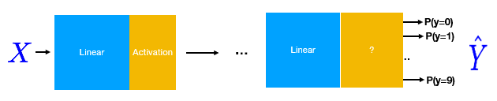

# Lesson 1

1) Machine Learning이란?

- 머신러닝은 어떠한 규칙을 우리 대신 알고리즘이 찾아주는 것.

- 기존의 프로그래밍은 프로그래머가 룰과 데이터를 이용해 답을 냈다
- 머신러닝은 데이터와 답을 이용해서 룰을 찾아내는 것이다

2) AI, 머신러닝, 딥러닝의 차이점


- **AI (Artificial Inteligence, 인공지능) **
  - 인간이 하는 모든 지성적 일들을 자동화하는 노력
  - 사람이 할 수 있는 지성적인 일을 시뮬레이션 하는 것
  - 가장 커다란 대분류이며,
- **ML(Machine Learnig, 기계학습)**
  - 인공지능을 이용하여 어떠한 규칙을 대신 찾아내는 알고리즘
  - 기존의 프로그래밍과 달리 룰과 데이터를 이용해 답을 찾아내는 방식이 아닌, 데이터와 답을 이용해 룰을 찾아내는 방식
- **NN(Neural Network, Deep Learning, 심층학습)**
  - ML의 내부 소분류 중 하나
  - 여러 층으로 된 데이터를 사용하는 머신 러닝의 한 형태
  - 뇌 세포의 생물학적 구조에서 따온 형태이며, 실제 원리를 따라한 것은 아님 (실제 뇌의 생각의 원리는 아직 아무도 모름)

3) 공통점과 현황

- 데이터셋이 중요함.

- 각광받은 지 얼마 안되어 어렵지 않으며, 기본으로 필요한 지식(기본 코딩, 확률, 수학 지식)이 상대적으로 적다.
- 머신러닝을 쉽게 해줄 여러 프레임워크가 무료로 제공되며, 교육자료 또한 잘 되어있다.
- 재미있다. 

4) **파이토치**에 대하여

​	

- 파이썬 패키지 기반 머신러닝 프레임워크

- GPU 가속을 이용한 Tensor 계산 지원
- tape-based autograd 시스템에 의해 심층 신경망 구현 가능

- 유연하고 깔끔한 코드로 구현가능 하며, 디버깅이 쉽다
- 좀더 심층신경망 구현이 쉽다.

5) **파이토치** 설치(과제)

1. Anaconda installer 다운로드


2. Anaconda 설치

   

- Just Me로 설치

  

- 아래만 체크한 뒤 설치

2. VScode 터미널에 source 추가

```bash
conda -V # conda 설치 확인, 생략 가능
set PATH=%PATH%;<your_path_to_anaconda_installation>\Scripts
source <your_path_to_anaconda_installation>c/profile.d/conda.sh
conda init <사용하는 터미널>
```

- 설치 경로가 다르면 경로를 다르게 바꾸어야한다.
- 이래도 안될경우 anaconda3 prompt에서 해당 경로에서 "code"를 쳐서 들어간 뒤 해보자.

3. conda 가상 환경 설정 후, pytorch 및 추가 모듈 설치

```bash
conda create --name <가상환경명>
conda activate <가상환경명>
conda install pytorch, matplotlib # 기타 추가 모듈
conda deactivate # 가상환경 나가기
```

# Lesson 2

1) supervised learning 그리고 다른 학습들에 대하여

- **비지도 학습(Unsupervised Learning)**
  - 오직 features만 가지고 있을 경우 어떻게 할까? (결과값은 모름)
  - 예를 들어 x,y값(features)을 가지고 있는 여러가지 점들의 그래프를 가까이 모여있는 것들끼리 그룹으로 만들어 (Clustering)해당 그룹(label)을 결과값으로 만든다.
- **지도 학습(Supervised Learning) **
  - features 라는 정보를 받아서 label을 얻어내는 것
  - 그러므로 둘 모두의 정확한 정보를 대량으로 가지고 있어야한다.
  - 정확도가 높아질 때까지 학습,
  - 다른 학습법에 비해 쉽다고 알려져 있지만 그렇지 않다. 특히 데이터 부분
- **강화 학습(Reinforcement Learning)**
  - 어떠한 데이터도 필요 없다, 환경(environment), agent, 보상(reward) 만 있으면 된다.
  - 어떤 로봇을 깃발에 있는 곳까지 보내려면 어떡해 하는가? 
    - 로봇 (agent), 로봇과 깃발이 있는 곳(환경), 점수(보상)
    - 로봇이 깃발에 가까워 질수록 점수를 주고, 멀어지면 점수를 빼게 하고, 점수가 높아지는 방식을 택하게 만들면 된다.
    - 환경에 따라 시간이나 성능차이가 많이 나기도 한다.

2) **Linear Regression (선형회귀)**에 대하여

- 데이터와 결과의 관계가 주로 2차원을 가진, 선형 모습을 보인다고 생각할 때 사용

- **y = mx + b 형태 (b는 시작점, x, y, 주어지는 정보, m 은 기울기(가장 중요!))**

  - 우리는 이 형태에서 간단하게 하기 위해 b(bias)를 제외한 형태를 이용한다.

  

- x,y를 알아내면 z를 알아낼 수 있는 방식으로 3차원에서도 사용할 수 있다. 

3) **Loss function과 MSE(Mean Squared Error)**

- **결과치(y)와 예측치(y^)간의  차이를 Loss**라고 한다
- 해당 차이가 클수록 현재 모델이 잘못된 것이므로 Loss 값은 얼마나 모델을 고쳐야하는 가에 대한 척도가 된다.

- Loss 율이 가장 낮은, 즉 정확도가 높은 모델을 만드는게 목적.

- 음의 차와 양의 차를 같게 만들고 추가로 많이 틀릴수록 더욱 크게 고치게(주로 bias와 wieght) 하기 위하여 제곱을 하여 활용한다.

  

- loss를 구하는 방법을 **Loss function(손실 함수)**라고 하며 우리가 쓰는 방법은 **MSE(Mean Squared Error)**라고 한다.

  

- 이외에도 제곱을 하지 않고 절대값을 이용하는 MAE(Mean Absolute Error), Hinge Loss 등이 있다.

4) 과제 리뷰

- **선형 모델 문제 탐색**

  - kaggle에서 제공하는 **뉴욕 주택 가격 문제**를 선정하였으며, 그중에서도 **가격 대비 집 넓이를 데이터**로 삼았다.
  - 우리의 모델은 bias 값이 0으로 설정되어 있는데, 이 뜻은 X값이 0이면 Y값이 0인 문제를 다뤄야한다는 것이다.
  - 집의 넓이가 0인 집(즉, 집이 없음)을 돈을 주고 사는 사람이 없을것이므로 bias가 0일 것이라 예상하여 선정하였다.

- **선형 모델 데이터셋 탐색 및 cost graph 그려보기**

  - 데이터셋의 크기를 200개로 제안하였다.

    

  - 예상했던 그래프와 달리 w(weight)가 0으로 갈수록 Loss율이 줄었다.

  - 즉, 집의 넓이(X) 데이터에 가중치가 적을 수록(=집넓이 영향이 적다.) 모델이 정확하다는 의미이다.

  - 이상하게 여기어 고민해본 결과, **집의 넓이(제곱피트) 단위가 가격 단위에 비해 너무 작아서 일어난 일이었다.**

  - 그리하여 **집의 넓이에 500을 곱한 값으로 전처리**를 하여 다시 학습시켰다.

    

  - 그러자 위와 비슷한 결과가 나왔다.
  - **데이터의 전처리가 정말 중요하다는 교훈을 얻었다.**

# Lesson 3

1) **Optimizer와 Gradient Descent algorithm(경사 하강법)**

- 저번 Lesson에서는 최적의 w를 찾기위해 0부터 4까지 0.1씩 늘리는 방법을 사용했다.
- 하지만 실제로는 그런식으로 최적의 가중치를 찾기 힘들다.
  - 설정한 범위에 최적의 가중치가 없을 수도 있다.
  - 움직이는 범위가 너무 넓으면 최적치를 지나칠 것이다.
  - 움직이는 범위를 줄이면 엄청나게 오래걸릴 수도 있다.

- 이를 위해 **Loss function을 통해 얻은 Loss 값을 줄이는 방향으로 가중치와 bias를 조절해주는 함수가 필요하며 그것이 Optimizer** 이다.

-  이러한 알고리즘도 여러가지가 있으며 우리가 사용할 알고리즘은 **Gradient Descent algorithm(경사 하강법)**이다.

  

- **랜덤한 값으로 시작하고, 해당 지점의 기울기(Gradient)를 구하여 해당 방향으로 가중치를 변경한다.**
- **α값(Learning rate)**은 얼마나 그 방향으로 크게 움직일 것인가를 정하며, 보통 작은 값으로 시작한다.
  
- 최적의 값을 구하는 알고리즘 또한 존재한다.
  
- optimizer는 이외에도 여러가지 존재한다.
  - Stochastic Gradient Descent
  - Mini-Batch Gradient Descent
  - Momentum
  - Nesterov Accelerated Gradient
  - 기타 등등..
- 미분을 위한 사이트 정보(https://www.derivative-calculator.net/)

2) 과제 리뷰

​	

- 2개의 가중치를 가지는 모델의 기울기 구하기
$$
\frac{\partial loss}{\partial w_1} =  \frac{\partial}{\partial w1}(x^2w_2 + xw_1 + b - y)^2 = 2(x)(x^2w_2 + xw_1 + b -y) = 2x(\widehat{y}-y)
$$
$$
\frac{\partial loss}{\partial w_2} = \frac{\partial}{\partial w2}(x^2w_2 + xw_1 + b - y)^2 = 2(x^2)(x^2w_2 + xw_1 + b -y) = 2x^2(\widehat{y}-y)
$$

$$
\frac{\partial loss}{\partial b} = \frac{\partial}{\partial b}(x^2w_2 + xw_1 + b - y)^2 = 2(1)(x^2w_2 + xw_1 + b -y) = 2(\widehat{y}-y)
$$


- 해당 모델의 Optimizer 구현

  ```python
  # compute gradient
  def gradient_w1(x, y):  # d_loss/d_w
      return 2 * x *(x**2 * w2 + x * w1 + b - y)
  def gradient_w2(x, y):  # d_loss/d_w
      return 2 * x**2 * (x**2 * w2 + x * w1 + b - y)
  def gradient_b(x, y):  # d_loss/d_b
      return 2 * 2 * x * (x**2 * w2 + x * w1 + b - y)
  ```

# Lesson 4

1) Back-propagation(역전파)

- 여러 parameter를 가진 모델의 경우 Loss 값을 구한 뒤, 각 parameter를 Optimizer 결과값에 따라 바꿔줘야한다.
- **각 paramete의  비용함수를 구하기 위한 방법을 역전파(Back-propagation) 알고리즘**이라고 한다.
- 심층 신경망의 핵심 개념으로, 60년 전에 발표됬다가 XOR 문제를 해결하지 못하여 사장되었던 머신러닝 이론을 다시 부흥시킨 알고리즘이다.
  - XOR 문제 : A XOR B의 값은 A,B 값이 서로 달라야 1이 된다, 과거 머신러닝은 둘 중 하나만 true여야 true, A, B 둘다 true면 0이 되는 문제를 이해하지 못했다.
- 순전파(feed forward, 입력한 파라미터를 신경망 순서에 따라 가공)의 반대방향으로 진행하기에 역전파라는 이름이 붙여졌다.

2) 역전파 알고리즘 실습

- 역전파 알고리즘의 핵심은 **미분의 연쇄법칙**이다.

  - $$
    f = f(g);\ \ \ g = g(x); \\
    \frac{df}{dx} = \frac{df}{dg}\frac{dg}{dx}
    $$

- 각 parameter x, y의 gradient 값을 local gradient와의 연쇄법칙을 이용하여 구할 수 있다.


1. 먼저 순전파를 이용해 Loss 값을 구한다.

   

2. 그다음 각 parameter의 Gradient 값과 연쇄법칙을 이용해 역전파 알고리즘을 구현한다.


2) autograd

- pytorch의 tensor를 사용하면 requires_grad=True로 놓아 자동으로 gradient를 구할 수 있다.

  

3) 과제 리뷰

​	Ex 4-1 : 


​	Ex 4-2 : 


​	Ex 4-3 : 	

​	Ex 4-4: Lesson 3 참고


​	Ex 4-5:

​	


# Lesson 5

## 파이토치 딥러닝 과정

### 1. class와 ~~Variables 함수~~를 이용하여 모델 디자인

- ~~Variables 함수는 deprecated 됬으며 이제 torch의 tensor 객체에 requires_grad=True를 줌으로써 바로 활용할 수 있다.~~
- 그냥 Tensor  만으로 사용 가능

```python
import torch

x_data = torch.Tensor([[1.0], [2.0], [3.0]])
y_data = torch.Tensor([[2.0], [4.0], [6.0]]) # Variable 함수는 deprecated 되었다.
# 대신 requires_grad를 True로 줌으로써 활용 가능 -> 이것도 deprecated 된듯하다.
# requires_grad에 해당하는 argument가 존재하지 않음

class Model(torch.nn.Module): # 이름은 아무거나 정할 수 있지만 여기서는 Model
    def __init__(self): # 기타 추가 element 생성 가능
        super(Model, self).__init__()
        self.linear = torch.nn.Linear(1, 1) # 선형 모델 생성 y = x 그래프이므로 1, 1


    def forward(self, x): # x를 넣어준 뒤 예상한 y를 리턴 
        y_pred = self.linear(x)
        return y_pred

model = Model() # 모델 객체 생성
```

### 2. PyTorch API를 통하여 loss 함수와 optimizer 구현

```python
# 2. PyTorch API를 통하여 loss 함수와 optimizer 구현
criterion = torch.nn.MSELoss(size_average=False) # MSE Loss function 설정
optimizer = torch.optim.SGD(model.parameters(), lr=0.01) #  SGD 설정 lr = learning rate

for epoch in range(500):
    y_pred = model(x_data)# x_data = metrics

    loss = criterion(y_pred, y_data) # 결과 값을 통해 loss 값 계산
    print(epoch, loss.item()) # 결과값이 0 dimension 이므로 data[0]를 할 수 없다는 결과가 나옴. loss.item()으로 확인가능

    optimizer.zero_grad() # 모든 gradient 값 0으로 초기화
    loss.backward() # back propagation
    optimizer.step() # back propagation 값으로 parameters 값을 업데이트해줌
    # 수많은 데이터에서는 비효율적인 방법이지만 지금 과정에서는 괜찮다.
```

### 3. Training cylce 형성

```python
# 3. 모델 테스트
hour_var =torch.Tensor([[4.0]]) # 학습을 tensor로 했으므로 input 또한 tensor로 줘야한다.
print("predict : ", 4, model.forward(hour_var).data[0][0])
```


- loss 값이 아주 작은 값으로 떨어지며 예상값 또한 답에 가까운 것을 알 수 있다.

### Exercise

- 여러가지 optimizer를 사용해보았다. (500 epoch)


# Lesson 6

## Logistic Regression

- 합/불합 또는 승리/패배 예측처럼 0 또는 1 즉 binary prediction을 위한 모델이 중요하다.
- Linear 모델이 sigmoid 함수를 적용하면 0 또는 1 값의 결과를 줄 수 있다.

$$
\sigma(z) = \frac{1}{1+e^{-z}}
$$


**[sigmoid 함수 예제]**

- 값을 이런식으로 0 또는 1로 바꾸어준다.

  


- 하지만 이렇게 출력값을 바꾸고 기존의  loss function에 넣으면 값이 달라지므로, 새로운 Loss fuction이 필요하다.
- (Binary) Meet Cross Entropy Loss

$$
loss = -\frac{1}{N}\sum^N_{n=1}y_nlog\hat{y}_n + (1-y_n)log(1-\hat{y}_n)
$$


- 이러한 형태의 loss 값을 가지게 된다.

```python
# 5강에서 만든 모델에서 일부만 바꿔주면 된다
import torch.nn.functional as F

class Model(torch.nn.Module):
    def __init__(self):
        super(Model, self).__init__()
        self.linear = torch.nn.Linear(1, 1)

    def forward(self, x):
        y_pred = F.sigmoid(self.linear(x)) # 모델에 sigmoid 함수를 씌우기만 하면 된다.
        return y_pred
    
model = Model()
criterion = torch.nn.BCELoss(size_average=False) # BCELoss로 바꿔준다.
```

**[sigmoid 함수의 코드 구현]**


**[학습 결과와 모델 예측]**

### Exercise

- 대부분 추가적인 조정이나 argument를 필요로 하였고 제대로 된 값이 나오지 않았다.
- 대부분 Non-linear Activations라고 한다.


# Lesson 7

## Wide & Deep

- 여러 input을 이용해 넓게, 여러 layer을 사용해 깊게 모델을 학습하여 더 정확한 모델을 얻을 수있다.

### 더 넓게

- 기존에 사용했던 모델은 x 하나의 0차원 데이터를 사용했지만 Matrix Multiplication을 이용해 여러 차원의 데이터를 학습에 이용할 수 있다.

$$
\begin{bmatrix} a_1& b_1  \\  a_2 & b_2 \\ \dots & \dots  \\ a_n&b_n \end{bmatrix} 
\begin{bmatrix}w_1 \\ w_2  \end{bmatrix} = \begin{bmatrix}y_1 \\ y_2 \\ \dots \\ y_n \end{bmatrix} \\
XW = \hat{Y}
$$

```python
linear = torch.nn.Linear(2,1)
y_prd = linear(x_data)
```

**[Matrix Multiplication 코드]**

### 더 깊게

- 여러 층의 layer를 활용하여 더욱 정확도 높은 모델을 만들 수 있다. (Multilayer deep learning)


```python
sigmoid = torch.nn.Sigmoid()

l1 = torch.nn.Linear(2, 4)
l2 = torch.nn.Linear(4, 3)
l3 = torch.nn.Linear(3, 1)

out1 = sigmoid(l1(x_data))
out2 = sigmoid(l2(out1))
y_pred = sigmoid(l3(out2))
```

**[여러 층을 이용한 신경망 코드]**

- 단, sigmoid 함수를 이용할 시, 결과값이 0~1로 제한되는 과정에 의해 backpropagation을 진행할수록 weight가 옅어지는 현상이 나타난다.


- 이를 Vanishing Gradient Problem이라고 하며 이를 해결하기 위해 다른 다양한  activation 함수들을 사용할 수 있다.

  

# Lesson 8

## PyTorch DataLodader

- 모든 데이터를 한꺼번에 학습에 이용하면 메모리와 속도와 같은 성능이 급격하게 저하된다.

### Batch(batch size)

- 전체 데이터를 batch size 별로 나누어 학습시킨 뒤 업데이트하는 방법을 쓴다.

| 용어                          | 설명                                                         |
| ----------------------------- | ------------------------------------------------------------ |
| 에포크(one epoch)             | 전체 트레이닝 데이터로 한번 forwarding과 backwarding이 진행되는 주기(one forward pass and one backward pass and one backward pass of all the training examples.) |
| 배치 사이즈 (batch size)      | (the number of training examples in one forward/backward pass. The higher the batch size, the more memory space you'll need.) |
| 연산 수(number of iterations) | 전체 학습 데이터를 배치사이즈로 나눈 것, 1 epoch 동안 일어나는 pass 의 수(number of passes, each pass using [batch size] number of examples. To be clear, one pass = one pass + one backward pass(we do not count the forward pass and backward pass as two different passes)) |

- 데이터를 큐에 집어 넣고 셔플 하는 행위는 torch의 dataloader에서 자동으로 해주므로, batch를 나누는 것에 신경쓰면 된다.

```python
class DiabetesDataset(Dataset):
    def __init__(self):
    # download, read data, etc.
    
    def __getitem__(self,index): # return one item on the index
        return
    
    def __len__(self): # return the data length
        return 
    
   
dataset = DiabetesDataset()
train_loader = DataLoader(dataset=dataset,
                         batch_size=32,
                          shuffle=True, # data sample 순서 랜덤으로
                          num_workers=2 # 사용할 cpu 코어 갯수
                         )   
```

**[custom dataset 만들기]**

- torch.vision을 통하여 기본 제공하는 데이터셋들을 가져올 수 있다.
  - torchvision.datasets의 데이터 셋들
    - CIFAR, FakeDATA, KMNIST, phototour 등

# Lesson 9

## Softmax Classifier



$$
\sigma(z)_j = \frac {e^{z_j}}{\sum^K_{k=1}e^{z_k}} for j = 1, \dots, K.
$$

$$
D(\hat{Y}, Y) = -Ylog\hat{Y}
$$


# Lesson 10

## Basic CNN

# Lesson 11

## Advanced CNN

# Lesson 12

## Basic RNN