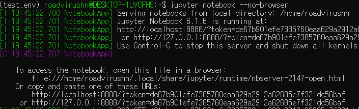
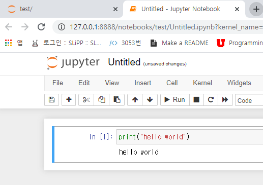
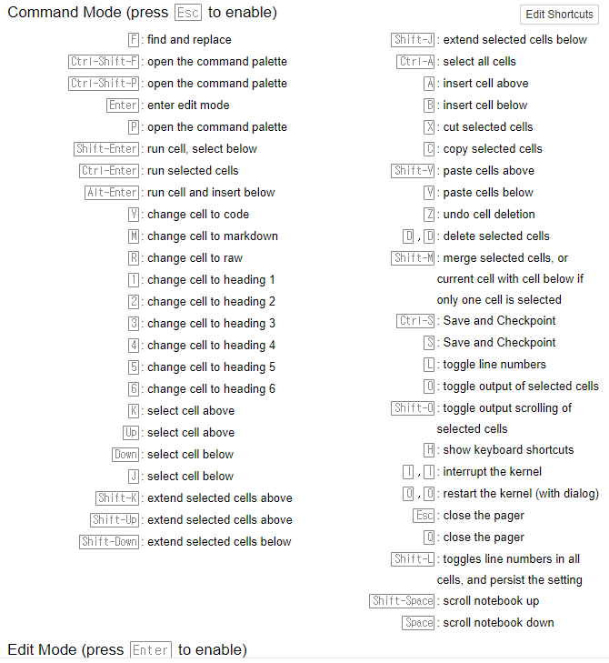
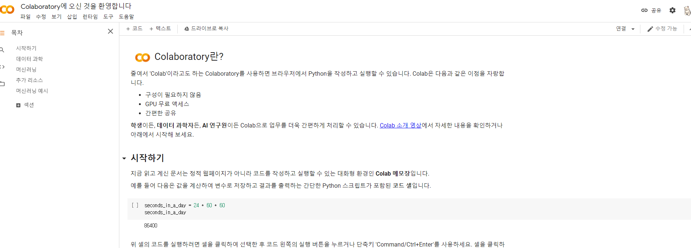
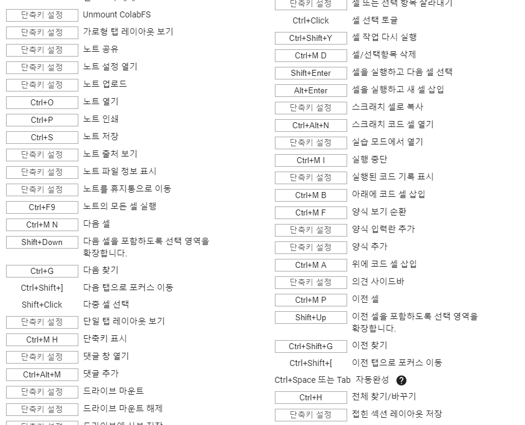

# Collab and Jupyter

## Jupyter

- IPython 커널 기반의 대화형 파이썬 셸
- 데이터 분석 Interactive Shell의 표준
- 터미널 셸 + 웹 기반 데이터 분석 Notebook 제공

### 설치법

```bash
conda activate [가상환경 이름]
conda install jupyter
jupyter notebook --no-browser
```

> conda 가상환경 내에서 설치


>conda 가상환경 내에서 jupyter notebook 실행



- **--no-browser** 를 붙이지 않으면 ubuntu 내에서 실행되는 것으로 인식하여 아무 창도 안뜬다.
- ubuntu wsi 처럼 가상환경 내에서 실행하는 게 아니라면 없어도 된다.

> 주소를 웹페이지에 입력한 실행 결과



### 사용법

- help의 shortcuts로 확인할 수 있다.



## Colab

- 구글의 클라우드 기반 Jupyter notebook
- 구글 드라이브와 연결 가능, 모듈 설치 등의 장점이 있음.
- 무료로 사용해도 V100 수준의 GPU를 지원해준다.

### 설치법

- 구글에 로그인 후, colab에 들어가면 OK!



### 사용법

- 도구 메뉴의 단축키와 도움말의 스니펫, 인트로 페이지가 잘되어있다.
https://colab.research.google.com/notebooks/intro.ipynb#scrollTo=5fCEDCU_qrC0

