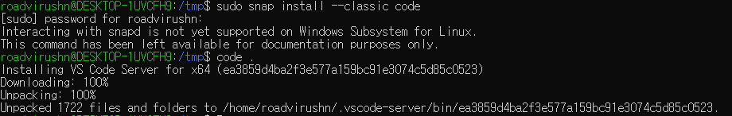

# Python DevEnv setting

- Window 내 WSL을 이용한 ubuntu 및 vscode 세팅

1. 윈도우 10 내의 VM과 WSL 기능 활성화
> Powershell에 입력할 명령어

```powershell
dism.exe /online /enable-feature /featurename:Microsoft-Windows-Subsystem-Linux /all /norestart

dism.exe /online /enable-feature /featurename:VirtualMachinePlatform /all /norestart
```
 

2. 윈도우 스토어에서 **우분투** 최신버전 설치 및 실행 


> '무료'를 눌러 설치, 이후 '실행'을 눌러 실행


> '실행' 시, 화면


3. 우분투 내 **apt** 업데이트 및 **curl** 설치

> sudo를 통해 root 권한으로 실행


```bash
sudo apt update
sudo apt-get install curl
```

 
 

4. 아나콘다 최신버전 설치

>anaconda 공식 페이지에서 linux 최신 배포판을 다운로드 (대문자 O), 원하는 다이렉토리에서 실행

```bash
sudo curl -O https://repo.anaconda.com/archive/Anaconda3-[최신버전]-Linux-x86_64.sh
```


> curl로 받은 설치파일이 있는 곳에서 명령어 입력
```bash
sudo sha256sum Anaconda3-[최신버전]-Linux-x86_64.sh
sudo bash Anaconda3-[최신버전]-Linux-x86_64.sh
```

> 배포판 파일의 설치를 확인하는 명령어


> 배포판 파일의 설치를 확인하는 명령어


> 'conda -version'으로 설치 결과를 확인


6. VScode 공식 홈페이지에서 Visual Studio code 다운로드

> 아쉽게도 윈도우 wsl판 ubuntu는 Linux 내부의 VSCode Editor를 아직 지원하지 않는다고 한다.



7. Remote -WSL Extension 다운로드


> Ctrl + ` 으로 VScode 내 terminal을 열고 code .으로 열 수 있다.


## 실행 화면


